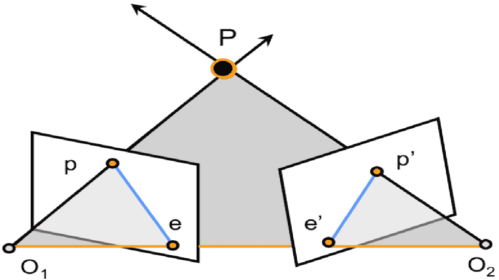
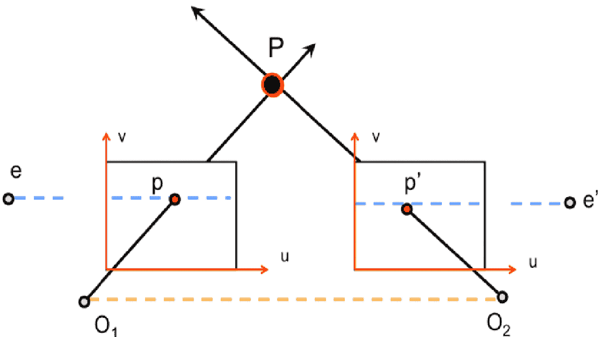
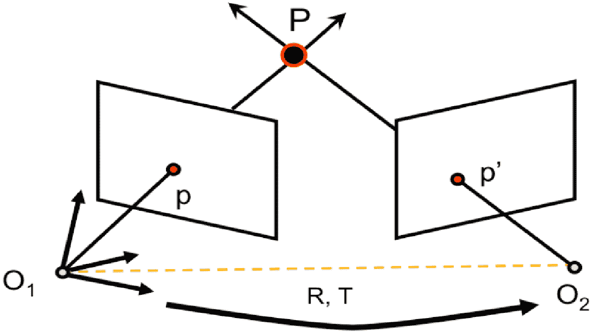
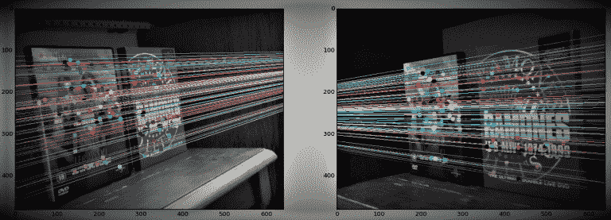

# Python OpenCV:极线几何

> 原文:[https://www . geesforgeks . org/python-opencv-极线-几何/](https://www.geeksforgeeks.org/python-opencv-epipolar-geometry/)

极线几何的一般结构。灰色区域是极线平面。橙色线是基线，而两条蓝色线是极线。



通常在多视图几何中，多个摄像机、一个 3D 点以及该点在每个摄像机图像平面中的投影之间存在有趣的关系。将摄像机、3D 中的点和相应的观察点联系起来的几何图形称为立体对的外极几何图形。

标准极线几何设置包括两个摄像机观察同一个 3D 点 P，其在每个图像平面中的投影分别位于点 P 和点 P’。摄像机中心位于 O1 和 O2，它们之间的线称为基线。我们称由两个摄像机中心和 P 定义的平面为极线平面。基线与两个图像平面相交的位置称为核线 e 和 e’。最后，由极线平面和两个图像平面的交点定义的线称为极线。核线具有在图像平面中的相应核处与基线相交的特性。


当两个像平面平行时，则核 e 和 e’位于无穷远处。请注意，核线平行于每个图像平面的 u 轴。

极线几何的一个有趣的例子如图 4 所示，它发生在图像平面相互平行的时候。当图像平面彼此平行时，由于连接中心 O1、O2 的基线平行于图像平面，所以核 e 和 e’将位于无穷远处。这种情况的另一个重要副产品是核线平行于每个图像平面的轴。这种情况特别有用，将在后续的图像校正部分详细介绍。

然而，在现实世界的情况下，我们没有得到 3D 位置 P 的确切位置，但是可以确定它在图像平面 P 之一中的投影。我们还应该能够知道相机的位置、方向和相机矩阵。我们能用这些知识做什么？有了摄像机位置 O1、O2 和图像点 p 的知识，我们就可以定义极线平面。有了这个极线平面，我们就可以确定极线 1。根据定义，P 到第二图像 p0 的投影必须位于第二图像的极线上。因此，对极线几何的基本理解允许我们在不知道场景的 3D 结构的情况下，在图像对之间创建强约束。


用于确定基本和基本矩阵的设置，这有助于在视图之间映射点和核线。

我们现在将尝试开发无缝的方法来绘制跨视图的地图点和核线。如果我们采用原始极线几何框架中给出的设置(图 5)，那么我们将进一步将 deneM 和 0 作为将 3D 点映射到它们各自的 2D 像平面位置的相机投影矩阵。让我们假设世界参考系统与第一个摄像机相关联，第二个摄像机首先通过旋转 R，然后通过平移 t。这种情况下，摄像机投影矩阵为:

```
M = K[I 0]   M' = K'[R T]
```

现在我们找到**基本矩阵(F)** 和**基本矩阵(E)** 。基本矩阵包含关于平移和旋转的信息，描述了第二个摄像机相对于第一个摄像机在全局坐标中的位置。

基本矩阵包含与基本矩阵相同的信息，此外还有关于两个摄像机的内在知识，以便我们将两个摄像机关联到像素坐标中。(如果我们使用校正后的图像，并通过除以焦距来归一化该点，F=E)。简而言之，基本矩阵 F 将一幅图像中的某个范围映射到另一幅图像中的一条线(核线)。这是从两张图片的匹配点计算出来的。至少需要 8 个这样的点来寻找元素矩阵(当使用 8 点算法时)。更多的点是首选，并使用 RANSAC 来敦促一个更稳健的结果。

所以首先我们需要在两幅图像之间找到尽可能多的匹配来找到基本矩阵。为此，我们使用 SIFT 描述符和基于 FLANN 的匹配器和比率测试。

```
import numpy as np
import cv2
from matplotlib import pyplot as plt

# Load the left and right images
# in gray scale
imgLeft = cv2.imread('image_l.png', 
                     0)
imgRight = cv2.imread('image_r.png',
                      0)

# Detect the SIFT key points and 
# compute the descriptors for the 
# two images
sift = cv2.xfeatures2d.SIFT_create()
keyPointsLeft, descriptorsLeft = sift.detectAndCompute(imgLeft,
                                                       None)

keyPointsRight, descriptorsRight = sift.detectAndCompute(imgRight,
                                                         None)

# Create FLANN matcher object
FLANN_INDEX_KDTREE = 0
indexParams = dict(algorithm=FLANN_INDEX_KDTREE,
                   trees=5)
searchParams = dict(checks=50)
flann = cv2.FlannBasedMatcher(indexParams,
                              searchParams)

# Apply ratio test
goodMatches = []
ptsLeft = []
ptsRight = []

for m, n in matches:

    if m.distance < 0.8 * n.distance:

        goodMatches.append([m])
        ptsLeft.append(keyPointsLeft[m.trainIdx].pt)
        ptsRight.append(keyPointsRight[n.trainIdx].pt)
```

**影像左**

**影像右**


让我们注意基本的矩阵。

```

ptsLeft = np.int32(ptsLeft)
ptsRight = np.int32(ptsRight)
F, mask = cv2.findFundamentalMat(ptsLeft,
                                 ptsRight,
                                 cv2.FM_LMEDS)

# We select only inlier points
ptsLeft = ptsLeft[mask.ravel() == 1]
ptsRight = ptsRight[mask.ravel() == 1]
```

接下来，我们找到了表线。对应于第一图像中的点的线被绘制在第二图像上。所以在这里提到正确的图像很重要。我们得到一系列线条。所以我们定义了一个新的函数来在图像上画这些线。

```
def drawlines(img1, img2, lines, pts1, pts2):

    r, c = img1.shape
    img1 = cv2.cvtColor(img1, cv2.COLOR_GRAY2BGR)
    img2 = cv2.cvtColor(img2, cv2.COLOR_GRAY2BGR)

    for r, pt1, pt2 in zip(lines, pts1, pts2):

        color = tuple(np.random.randint(0, 255,
                                        3).tolist())

        x0, y0 = map(int, [0, -r[2] / r[1] ])
        x1, y1 = map(int, 
                     [c, -(r[2] + r[0] * c) / r[1] ])

        img1 = cv2.line(img1, 
                        (x0, y0), (x1, y1), color, 1)
        img1 = cv2.circle(img1,
                          tuple(pt1), 5, color, -1)
        img2 = cv2.circle(img2, 
                          tuple(pt2), 5, color, -1)
    return img1, img2
```

现在，我们在两幅图像中找到并画出了线。

```
# Find epilines corresponding to points
# in right image (second image) and
# drawing its lines on left image
linesLeft = cv2.computeCorrespondEpilines(ptsRight.reshape(-1,
                                                           1,
                                                           2),
                                          2, F)
linesLeft = linesLeft.reshape(-1, 3)
img5, img6 = drawlines(imgLeft, imgRight, 
                       linesLeft, ptsLeft,
                       ptsRight)

# Find epilines corresponding to 
# points in left image (first image) and
# drawing its lines on right image
linesRight = cv2.computeCorrespondEpilines(ptsLeft.reshape(-1, 1, 2), 
                                           1, F)
linesRight = linesRight.reshape(-1, 3)

img3, img4 = drawlines(imgRight, imgLeft, 
                       linesRight, ptsRight,
                       ptsLeft)

plt.subplot(121), plt.imshow(img5)
plt.subplot(122), plt.imshow(img3)
plt.show()
```

**输出:**
