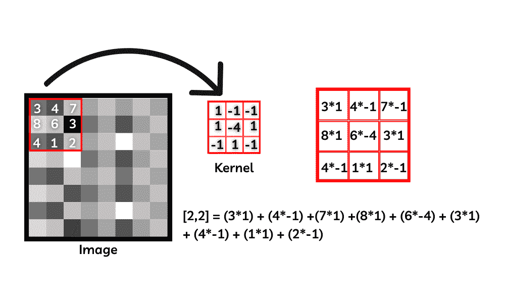
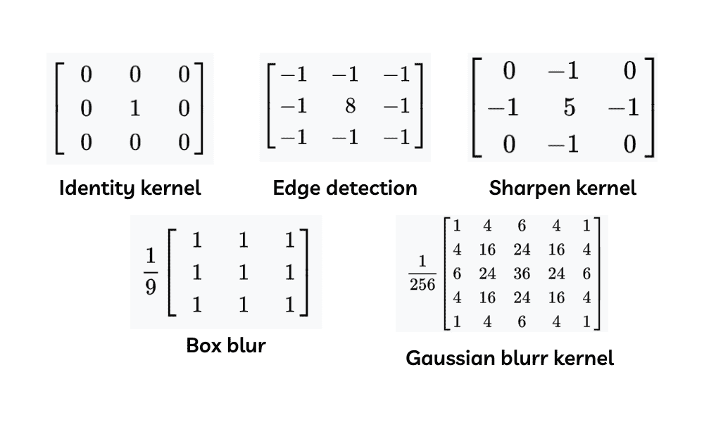
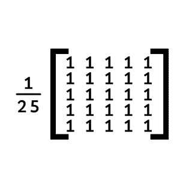
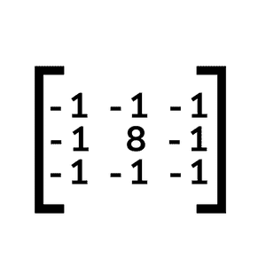
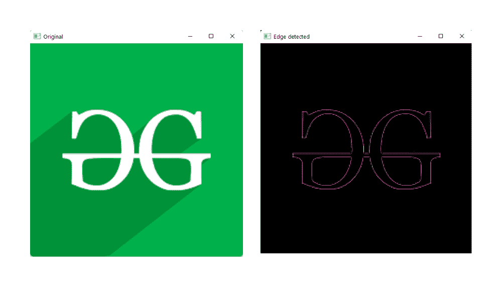

# Python OpenCV–filter 2d()函数

> 原文:[https://www . geesforgeks . org/python-opencv-filter 2d-function/](https://www.geeksforgeeks.org/python-opencv-filter2d-function/)

在本文中，我们将看到来自 OpenCV 的 filter2d()函数。简而言之，使用这个函数，我们可以将图像与内核(通常是 2d 矩阵)进行卷积，从而对图像应用滤镜。

> **语法:** filter2D (src、dst、ddepth、kernel)
> 
> **参数:**
> 
> *   **Src–**要应用滤镜的源图像。
> *   **Dst–**应用滤镜后输出图像的名称
> *   **Ddepth–**输出图像的深度[ -1 将给出与输入图像相同的输出图像深度]
> *   **内核–**我们希望图像与之卷积的 2d 矩阵。

使用这个函数，我们可以在图像和给定的内核之间创建一个卷积，用于在图像中创建平滑和模糊、锐化和边缘检测等过滤器。该函数将简单地将 2d 矩阵与像素级的图像进行卷积，并产生输出图像。为了理解这个概念，我们将首先浏览内核的概念。

**内核:**卷积或卷积矩阵中使用的简单 2d 矩阵或用于模糊、锐化和边缘检测图像的遮罩。

**内核的工作方式:**那么，这个内核是如何工作的呢？让我们看看，我们都知道图像在 OpenCV 中表示为像素值。这些像素被排列成矩阵以形成图像，正如我们所知，核是一个简单的 2d 矩阵，其中具有基于核函数的特定值，就像如果核用于模糊和锐化图像是不同的一样。

让我们举个例子，在这个图像中，像矩阵一样取前 3 行和列，我们有一个 3 乘 3 矩阵的核。如图所示，图像中的每个像素都具有像素值(即像素强度)。现在，卷积是通过将每个像素值的值与相应位置的核值相乘，并通过相乘和形成一个像素(在这种情况下是[2，2]的中心像素)将核刚刚加权的所有值相加来完成的。并且对图像中的其余像素值矩阵重复该方法。



卷积运算

**注意:**我们有特定的核[2d 卷积矩阵]来完成特定的任务，如模糊、锐化和边缘检测。图中所示的内核只是一个例子，并不是任何特定的内核。

### 一些常见的内核是，

*   身份核
*   边缘检测核
*   锐化内核
*   盒子模糊核
*   高斯模糊核



不同的内核

利用这些核，我们可以通过简单地卷积图像的像素值和核中的值来形成滤波后的图像。

## 用 2d 卷积矩阵模糊图像

我们正在通过 NumPy 创建一个内核，看起来像这样，并将内核作为 filter2d 函数的参数传递。

> **np.ones()** 将创建一个所需形状的数组，并填充所有的 one



模糊内核

### 示例 1:使用 2d 卷积矩阵模糊图像

## 蟒蛇 3

```
# importing the modules needed
import cv2
import numpy as np

# Reading the image
image = cv2.imread('image.png')

# Creating the kernel(2d convolution matrix)
kernel1 = np.ones((5, 5), np.float32)/30

# Applying the filter2D() function
img = cv2.filter2D(src=image, ddepth=-1, kernel=kernel1)

# Shoeing the original and output image
cv2.imshow('Original', image)
cv2.imshow('Kernel Blur', img)

cv2.waitKey()
cv2.destroyAllWindows()
```

**输出:**


用 2d 卷积矩阵模糊图像

### 示例 2:使用 2d 卷积矩阵对图像进行边缘检测

我们正在通过 NumPy 数组创建一个内核，看起来像这样，并将内核作为 filter2d 函数的参数传递。



边缘检测核

## 蟒蛇 3

```
# importing the modules needed
import cv2
import numpy as np

# Reading the image
image = cv2.imread('image.png')

# Creating the kernel(2d convolution matrix)
kernel2 = np.array([[-1, -1, -1],
                    [-1, 8, -1],
                    [-1, -1, -1]])

# Applying the filter2D() function
img = cv2.filter2D(src=image, ddepth=-1, kernel=kernel2)

# Shoeing the original and output image
cv2.imshow('Original', image)
cv2.imshow('Kernel Blur', img)

cv2.waitKey()
cv2.destroyAllWindows()
```

**输出:**



用 2d 卷积矩阵对图像进行边缘检测