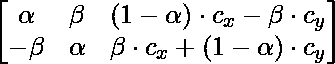

# python opencv–getremotion matrix 2d()函数

> 哎哎哎:# t0]https://www . geeksforgeeks . org/python-opencv-getremotion matrix 2d-function/

**cv2 . getrotationmatrix2d()**函数用于生成变换矩阵 M，该矩阵将用于旋转图像。

**语法:**

> cv2.getRotationMatrix2D(中心、角度、比例)
> 
> **参数:**
> 
> *   **中心:**旋转中心
> *   **角度(θ):** 旋转角度。逆时针方向的角度为正，顺时针方向的角度为负。
> *   **比例:**缩放图像的比例因子
> 
> **返回:** 2×3 旋转矩阵 M

M = 

哪里，


这是一种**仿射变换。**仿射变换是保持直线和平行度的变换。warpaffine()函数将这些变换矩阵作为参数，并返回旋转后的图像。

**使用的图像:**


**例 1:**

## 蟒蛇 3

```
import cv2

# Reading the image
image = cv2.imread('image.jpeg')

# Extracting height and width from 
# image shape
height, width = image.shape[:2]

# get the center coordinates of the
# image to create the 2D rotation
# matrix
center = (width/2, height/2)

# using cv2.getRotationMatrix2D() 
# to get the rotation matrix
rotate_matrix = cv2.getRotationMatrix2D(center=center, angle=90, scale=1)

# rotate the image using cv2.warpAffine 
# 90 degree anticlockwise
rotated_image = cv2.warpAffine(
    src=image, M=rotate_matrix, dsize=(width, height))

cv2.imshow("rotated image:", rotated_image)
cv2.imwrite('rotated_image.jpg', rotated_image)
```

**输出-**


**例 2:**

## 蟒蛇 3

```
import cv2

# Reading the image
image = cv2.imread('image.jpeg')

# Extracting height and width from 
# image shape
height, width = image.shape[:2]

# get the center coordinates of the 
# image to create the 2D rotation matrix
center = (width/2, height/2)

# using cv2.getRotationMatrix2D() to get
# the rotation matrix
rotate_matrix = cv2.getRotationMatrix2D(center=center, angle=-90, scale=1)

# rotate the image using cv2.warpAffine 90 
# degree clockwise
rotated_image = cv2.warpAffine(
    src=image, M=rotate_matrix, dsize=(width, height))

cv2.imshow("rotated image:",rotated_image)
cv2.imwrite('rotated_image.jpg', rotated_image)
```

**输出-**


## 蟒蛇 3

```
import cv2

# Reading the image
image = cv2.imread('image.jpeg')

# Extracting height and width from image shape
height, width = image.shape[:2]

# get the center coordinates of the image to 
# create the 2D rotation matrix
center = (width/2, height/2)

# using cv2.getRotationMatrix2D() to get 
# the rotation matrix
rotate_matrix = cv2.getRotationMatrix2D(center=center, angle=180, scale=1)

# rotate the image using cv2.warpAffine 180 
# degree anticlockwise
rotated_image = cv2.warpAffine(
    src=image, M=rotate_matrix, dsize=(width, height))

cv2.imshow("rotated image:", rotated_image)
cv2.imwrite('rotated_image.jpg', rotated_image)
```

**输出-**


**例 4:**

## 蟒蛇 3

```
import cv2

# Reading the image
image = cv2.imread('image.jpeg')

# Extracting height and width from image shape
height, width = image.shape[:2]

# get the center coordinates of the image to
# create the 2D rotation matrix
center = (width/2, height/2)

# using cv2.getRotationMatrix2D() to get the
# rotation matrix
rotate_matrix = cv2.getRotationMatrix2D(center=center, angle=-180, scale=1)

# rotate the image using cv2.warpAffine 180
# degree clockwise
rotated_image = cv2.warpAffine(
    src=image, M=rotate_matrix, dsize=(width, height))

cv2.imshow("rotated image:", rotated_image)
cv2.imwrite('rotated_image.jpg', rotated_image)
```

**输出–**

