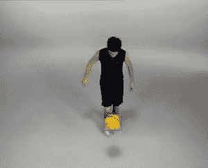
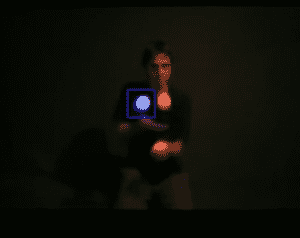
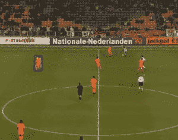
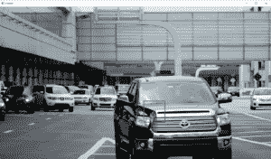
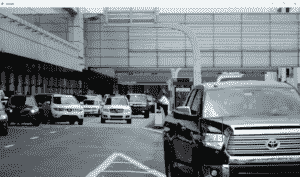

# Python OpenCV: Meanshift

> 原文:[https://www.geeksforgeeks.org/python-opencv-meanshift/](https://www.geeksforgeeks.org/python-opencv-meanshift/)

OpenCV 是用于计算机视觉、机器学习和图像处理的巨大开源库，现在它在实时操作中发挥着重要作用，这在当今的系统中非常重要。通过使用它，人们可以处理图像和视频来识别物体、人脸，甚至是人类的笔迹。

#### 均值漂移

**均值漂移**背后的思想是，在均值漂移算法中，视频的每个实例都以该帧中像素分布的形式进行检查。我们定义一个初始窗口，通常是正方形或圆形，其位置由我们自己指定，它标识最大像素分布的区域，并试图跟踪视频中的该区域，以便当视频运行时，我们的跟踪窗口也向最大像素分布的区域移动。运动的方向取决于我们跟踪窗口的中心和该窗口内所有 k 像素的质心之间的差异。
Meanshift 是跟踪视频中特定对象的非常有用的方法。Meanshift 可以分离视频的静态背景和运动的前景对象。

**示例:**

1.跟踪窗口正在跟踪足球。



2.跟踪窗口正在跟踪杂耍球。



3.跟踪窗口正在跟踪足球运动员。



## 蟒蛇 3

```
# Python program to demonstrate
# meanshift

import numpy as np
import cv2

# read video
cap = cv2.VideoCapture('sample.mp4')

# retrieve the very first
# frame from the video
_, frame = cap.read()

# set the region for the
# tracking window p, q, r, s
# put values according to yourself
p, q, r, s = 150, 150, 460, 100
track_window = (r, p, s, q)

# create the region of interest
r_o_i = frame[p:p + q, r:r + s]

# converting BGR to HSV format
hsv = cv2.cvtColor(frame, cv2.COLOR_BGR2HSV)

# apply mask on the HSV frame
mask = cv2.inRange(hsv,
                   np.array((0., 61., 33.)),
                   np.array((180., 255., 255.)))

# get histogram for hsv channel
roi = cv2.calcHist([hsv], [0], mask,
                   [180], [0, 180])

# normalize the retrieved values
cv2.normalize(roi, roi, 0, 255,
              cv2.NORM_MINMAX)

# termination criteria, either 15
# iteration or by at least 2 pt
termination = (cv2.TERM_CRITERIA_EPS |
               cv2.TERM_CRITERIA_COUNT
               , 15, 2 )

while(True):
    _, frame = cap.read()

    frame = cv2.resize(frame,
                       (1280, 720),
                       fx = 0,
                       fy = 0,
                       interpolation = cv2.INTER_CUBIC)

    # convert BGR to HSV format
    hsv = cv2.cvtColor(frame,
                       cv2.COLOR_BGR2HSV)

    bp = cv2.calcBackProject([hsv],
                             [0],
                             roi,
                             [0, 180],
                             1)

    # applying meanshift to get the new region
    _, track_window = cv2.meanShift(bp,
                                    track_window,
                                    termination)

    # Draw track window on the frame
    x, y, w, h = track_window
    vid = cv2.rectangle(frame, (x, y),
                        (x + w, y + h),
                        255, 2)

    # show results
    cv2.imshow('tracker', vid)

    k = cv2.waitKey(1) & 0xff
    if k == ord('q'):
        break

# release cap object
cap.release()

# destroy all opened windows
cv2.destroyAllWindows()
```

**输出:**输出视频中的一些帧





#### 使用均值漂移的缺点

使用均值漂移进行目标跟踪有两个主要缺点。

*   跟踪窗口的大小保持不变，而与对象离相机的距离无关。
*   只有当对象位于该对象的区域中时，窗口才会跟踪该对象。因此，我们必须仔细地确定窗户的位置。