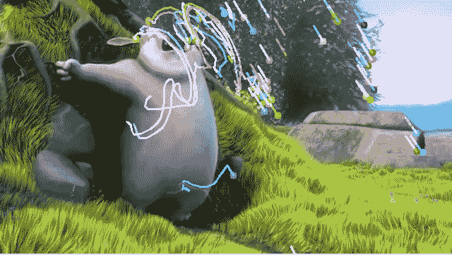
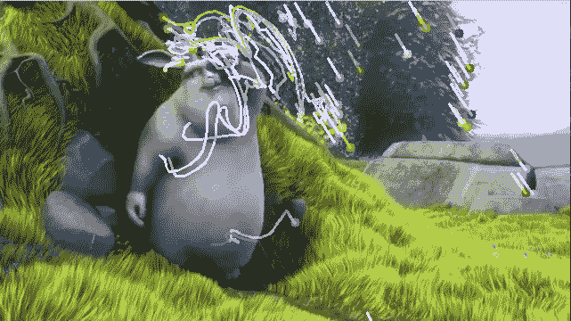

# Python OpenCV:卢卡斯-卡纳德法光流

> 原文:[https://www . geesforgeks . org/python-opencv-optical-flow-with-Lucas-kanade-method/](https://www.geeksforgeeks.org/python-opencv-optical-flow-with-lucas-kanade-method/)

**先决条件:** [OpenCV](https://www.geeksforgeeks.org/opencv-python-tutorial/)

OpenCV 是一个巨大的开源库，用于计算机视觉、机器学习和图像处理。OpenCV 支持多种编程语言，如 Python、C++、Java 等。它可以处理图像和视频来识别物体、人脸，甚至是人类的笔迹。当它与各种库集成时，比如 Numpy，这是一个高度优化的数值操作库，那么你的武器库中的武器数量就会增加，也就是说，无论你在 Numpy 中能做什么操作，都可以与 OpenCV 相结合。

在本文中，我们将学习如何应用卢卡斯-卡纳德方法来跟踪视频上的一些点。要跟踪这些点，首先，我们需要找到要跟踪的点。为了找到点，我们将使用`cv2.goodFeaturesToTrack()`。现在，我们将捕捉第一帧并检测一些角点。这些点将使用 OpenCV 提供的 Lucas-Kanade 算法进行跟踪，即`cv2.calcOpticalFlowPyrLK()`。

> **语法:**cv 2 . caloptical flow pylk(prev img、nextImg、prevPts、nextPts[、winize[、maxLevel[、criteria]])
> 
> **参数:**
> **预览**–第一个 8 位输入图像
> **下一个图像**–第二个输入图像
> **上一个图像**–需要找到流的 2D 点向量。
> **WinSize**–每个金字塔级别的搜索窗口大小。
> **最大等级**–基于 0 的最大金字塔等级数；如果设置为 0，则不使用金字塔(单级)，如果设置为 1，则使用两级，依此类推。
> **条件**–参数，指定迭代搜索算法的终止条件。
> 
> **返回:**
> **下一个点**–2D 点的输出向量(具有单精度浮点坐标)，包含第二幅图像中输入要素的计算新位置；当传递 OPTFLOW_USE_INITIAL_FLOW 标志时，向量必须与输入中的大小相同。
> **状态**–输出状态向量(无符号字符)；如果找到了对应特征的流，则向量的每个元素都被设置为 1，否则，它被设置为 0。
> **错误**–错误的输出向量；向量的每个元素被设置为对应特征的误差，误差度量的类型可以在 flags 参数中设置；如果没有找到流程，那么就没有定义错误(使用 status 参数来查找这种情况)。

**示例:**

```py
import numpy as np
import cv2

cap = cv2.VideoCapture('sample.mp4')

# params for corner detection
feature_params = dict( maxCorners = 100,
                       qualityLevel = 0.3,
                       minDistance = 7,
                       blockSize = 7 )

# Parameters for lucas kanade optical flow
lk_params = dict( winSize = (15, 15),
                  maxLevel = 2,
                  criteria = (cv2.TERM_CRITERIA_EPS | cv2.TERM_CRITERIA_COUNT,
                              10, 0.03))

# Create some random colors
color = np.random.randint(0, 255, (100, 3))

# Take first frame and find corners in it
ret, old_frame = cap.read()
old_gray = cv2.cvtColor(old_frame,
                        cv2.COLOR_BGR2GRAY)
p0 = cv2.goodFeaturesToTrack(old_gray, mask = None,
                             **feature_params)

# Create a mask image for drawing purposes
mask = np.zeros_like(old_frame)

while(1):

    ret, frame = cap.read()
    frame_gray = cv2.cvtColor(frame,
                              cv2.COLOR_BGR2GRAY)

    # calculate optical flow
    p1, st, err = cv2.calcOpticalFlowPyrLK(old_gray,
                                           frame_gray,
                                           p0, None,
                                           **lk_params)

    # Select good points
    good_new = p1[st == 1]
    good_old = p0[st == 1]

    # draw the tracks
    for i, (new, old) in enumerate(zip(good_new, 
                                       good_old)):
        a, b = new.ravel()
        c, d = old.ravel()
        mask = cv2.line(mask, (a, b), (c, d),
                        color[i].tolist(), 2)

        frame = cv2.circle(frame, (a, b), 5,
                           color[i].tolist(), -1)

    img = cv2.add(frame, mask)

    cv2.imshow('frame', img)

    k = cv2.waitKey(25)
    if k == 27:
        break

    # Updating Previous frame and points 
    old_gray = frame_gray.copy()
    p0 = good_new.reshape(-1, 1, 2)

cv2.destroyAllWindows()
cap.release()
```

**输出:**



