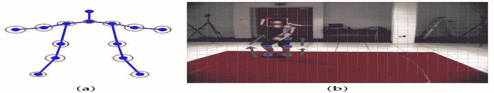
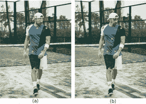
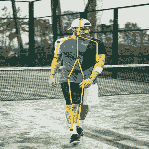

# Python Opencv–姿态估计

> 原文:[https://www . geesforgeks . org/python-opencv-pose-estimation/](https://www.geeksforgeeks.org/python-opencv-pose-estimation/)

### **什么是姿势估计？**

姿势估计是一种计算机视觉技术，用于从图像中预测身体的配置。它之所以重要，是因为有大量的应用程序可以从技术中受益。

人体姿态估计定位身体关键点，以准确识别给定图像的个体的姿态。这些估计是在 3D 或 2D 中执行的。

人体姿态估计的主要过程包括两个基本步骤:I)定位人体关节/关键点 ii)将这些关节分组为有效的人体姿态配置

第一步，主要重点是找到人类每个关键点的位置。例如头、肩、臂、手、膝、踝。第二步是将这些关节分组到有效的人体姿势配置中，以确定身体部位之间的成对术语。



图(b)表示检测关键点，图(a)表示关键点的分组

### **什么是** OpenCV **？**

OpenCV Python 是一个 Python 绑定库，旨在解决计算机视觉问题。它主要侧重于图像处理、视频捕获和分析，包括人脸检测和目标检测等功能。

### **python 中** OpenCV **的使用:**

OpenCV Python 只不过是原始 C++库与 Python 一起使用的包装类。使用这个，所有的 OpenCV 数组结构被转换成/从 NumPy 数组。这使得它更容易与使用 NumPy 的其他库集成。例如，像 SciPy 和 Matplotlib 这样的库。

要了解更多关于 OpenCV 的信息，请访问[https://opencv.org/about/](opencv)

### **可以使用的数据集:**

在数据集选择中，COCO 和 MPII 是最近案例中的默认选择。特别是，COCO 是一个著名的数据集，因为它具有非常宽的人体姿态和大量的图像。LSP 和 FLIC 数据集也用在 COCO 和 MPII 旁边。

*   [**http://cocodataset.org/#keypoints-2018**T3】](http://cocodataset.org/#keypoints-2018)
*   [**http://human-pose . MPI-INF . mpga . de/**](http://human-pose.mpi-inf.mpg.de/)
*   [**http://www.robots.ox.ac.uk/~vgg/data/pose_evaluation/**T3】](http://www.robots.ox.ac.uk/~vgg/data/pose_evaluation/)

您可以使用在[这个位置](https://github.com/CMU-Perceptual-Computing-Lab/openpose/tree/master/models)提供的脚本下载模型重量文件。

### **OpenCV 中人体姿态估计代码**

在本节中，我们将看到如何在 OpenCV 中加载训练好的模型并检查输出。为了简单起见，我们将只讨论单人姿势估计的代码。如果有多人在场，这些输出可用于查找帧中每个人的姿势。我们将在以后的文章中讨论多人案件。

首先，从下面下载代码和模型文件。图像和视频输入有单独的文件。如果您在运行代码时遇到任何困难，请查看*自述文件*。

#### **第一步:下载模型重量**

使用代码附带的 *getModels.sh* 文件将所有模型重量下载到各自的文件夹中。请注意，配置原型文件已经存在于文件夹中。

## 蟒蛇 3

```
sudo chmod a+x getModels.sh
./getModels.sh
```

检查文件夹以确保模型二进制文件(*)。caffemodel* 文件)已下载。如果你不能运行以上脚本，那么你可以点击[这里](http://posefs1.perception.cs.cmu.edu/OpenPose/models/pose/mpi/pose_iter_160000.caffemodel)下载 MPII 模型，点击[这里](http://posefs1.perception.cs.cmu.edu/OpenPose/models/pose/coco/pose_iter_440000.caffemodel)下载可可模型。

#### **第二步:加载网络**

我们正在使用在 Caffe 深度学习框架上训练的模型。Caffe 模型有 2 个文件–

1.  *prototxt* 文件，它指定了神经网络的体系结构——不同层是如何排列的等等。
2.  *存储训练模型权重的 caffemodel* 文件

我们将使用这两个文件将网络加载到内存中。

## 蟒蛇 3

```
# Specify the paths for the 2 files
protoFile = "pose/mpi/pose_deploy_linevec_faster_4_stages.prototxt"
weightsFile = "pose/mpi/pose_iter_160000.caffemodel"
# Read the network into Memory
net = cv2.dnn.readNetFromCaffe(protoFile, weightsFile)
```

#### **第三步:读取图像并准备网络输入**

我们使用 OpenCV 读取的输入帧应该被转换成一个输入斑点(像 Caffe)，以便它可以被馈送到网络。这是使用*blobfromigrate*函数完成的，该函数将图像从 OpenCV 格式转换为 Caffe blob 格式。

参数将在 blobFromImage 函数中提供。首先，我们将像素值归一化为(0，1)。然后我们指定图像的尺寸。接下来，要减去的平均值为(0，0，0)。没有必要交换 R 和 B 通道，因为 OpenCV 和 Caffe 都使用 RGB 格式。

## 蟒蛇 3

```
# Read image
frame = cv2.imread("single.jpg")

# Specify the input image dimensions
inWidth = 368
inHeight = 368

# Prepare the frame to be fed to the network
inpBlob = cv2.dnn.blobFromImage(
    frame, 1.0 / 255, (inWidth, inHeight), (0, 0, 0), swapRB=False, crop=False)

# Set the prepared object as the input blob of the network
net.setInput(inpBlob)
```

#### **第四步:进行预测并解析关键点**

## 蟒蛇 3

```
output = net.forward()
```

输出是 4D 矩阵:

1.  第一维是图像标识()，以防您向网络传递多个图像)。
2.  第二维表示关键点的索引。该模型产生的置信度图和零件相似度图都是串联的。对于 COCO 模型，它由 57 个部分组成——18 个关键点置信度图+ 1 个背景+ 19*2 个部分相似性图。同样，对 MPII 来说，它产生了 44 分。我们将只使用对应于关键点的前几个点。
3.  第三维是输出地图的高度。
4.  第四维是输出地图的宽度。

一旦检测到关键点，我们只需将它们绘制在图像上。

## 蟒蛇 3

```
H = out.shape[2]
W = out.shape[3]
# Empty list to store the detected keypoints
points = []
for i in range(len()):
    # confidence map of corresponding body's part.
    probMap = output[0, i, :, :]

    # Find global maxima of the probMap.
    minVal, prob, minLoc, point = cv2.minMaxLoc(probMap)

    # Scale the point to fit on the original image
    x = (frameWidth * point[0]) / W
    y = (frameHeight * point[1]) / H

    if prob > threshold:
        cv2.circle(frame, (int(x), int(y)), 15, (0, 255, 255),
                   thickness=-1, lineType=cv.FILLED)
        cv2.putText(frame, "{}".format(i), (int(x), int(
            y)), cv2.FONT_HERSHEY_SIMPLEX, 1.4, (0, 0, 255), 3, lineType=cv2.LINE_AA)

        # Add the point to the list if the probability is greater than the threshold
        points.append((int(x), int(y)))
    else:
        points.append(None)

cv2.imshow("Output-Keypoints", frame)
cv2.waitKey(0)
cv2.destroyAllWindows()
```



图(a)显示了使用 COCO 模型绘制的关键点。图(b)显示了使用 MPII 模型绘制的关键点。

#### **第五步:画骨架**



此图显示了由所有关键点连接而成的骨架

## 蟒蛇 3

```
for pair in POSE_PAIRS:
    partA = pair[0]
    partB = pair[1]

    if points[partA] and points[partB]:
        cv2.line(frameCopy, points[partA], points[partB], (0, 255, 0), 3)
```

*我们发现 COCO 模型比 MPI 模型慢 1.5 倍。*

### **姿态估计的应用:**

*   帮助残疾人的手语。
*   人体跟踪
*   赌博
*   视频监控
*   高级驾驶员辅助系统
*   动作识别

### **参考文献:**

*   [**【https://github.com/CMU-Perceptual-Computing-Lab/openpose】**](https://github.com/CMU-Perceptual-Computing-Lab/openpose)
*   **[**https://learnopencv . com/deep-learning-based-human-pose-估计-using-opencv-CPP-python/**](https://learnopencv.com/deep-learning-based-human-pose-estimation-using-opencv-cpp-python/)**
*   ******https://ieeexplore . IEEE . org/document/9144178******