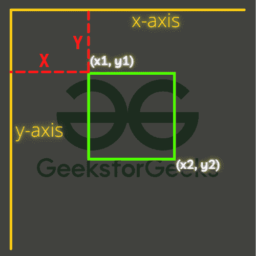
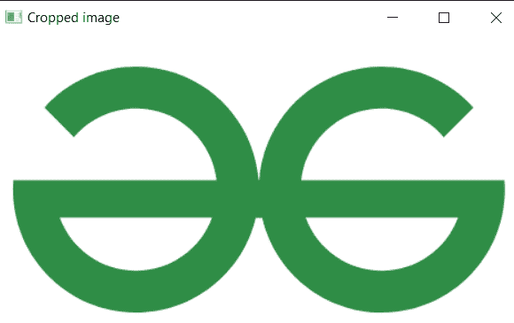
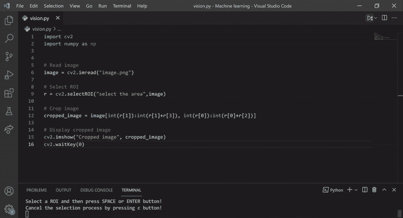

# Python OpenCV–selectroi()函数

> 原文:[https://www . geesforgeks . org/python-opencv-selectroi-function/](https://www.geeksforgeeks.org/python-opencv-selectroi-function/)

在本文中，我们将看到 OpenCV 库的一个有趣的应用程序，它就是 selectROI()。使用这种方法，我们可以通过选择图像上的区域来手动选择图像中的感兴趣范围。

> **语法:**T2【cv2 . selectroi(Window _ name，源图像)
> 
> ***参数:***
> 
> *   window_name:将显示选择过程的窗口的名称。
> *   源图像:选择感兴趣区域的图像。
> *   显示十字准线:如果为真，将显示选择矩形的十字准线。
> *   fromCenter:如果选择的真正原点与鼠标初始位置相匹配

使用 OpenCV 中的这个函数，我们可以从图像中精确地手动选择我们需要的感兴趣区域，因此我们可以为该特定区域执行许多任务。我们可以将该特定区域作为另一项任务的输入。我们还可以使用坐标在该区域上绘制一个跟踪图形(矩形)，或者我们可以精确自由地裁剪图像。首先，我们需要导入所需的库，在我们的例子中是 OpenCV 和 NumPy。NumPy 库在这个程序中起着非常关键的作用，因为 OpenCV 使用 NumPy 作为主干来完成所有的图像操作。

在图像中执行各种功能之前，首先阅读图像是显而易见的。并将其存储在一个变量中，以便将来进行进一步的操作。

**语法:**

> *cv2.imread(源图像)*

现在我们进入实际的函数，即 selectROI()。因此，基本上，这个函数将允许我们选择图像中感兴趣的范围(图像的特定区域)，并在该区域执行不同的操作，在这个特定的示例中，我们将裁剪图像以显示裁剪后的图像。

现在我们将调用 selectRoi()函数，并将图像作为参数传入，该函数将返回一个不同值的数组，其中包含所选区域的坐标，我们将它存储在一个名为“r”的变量中。其基本上是图像中所选区域的开始和结束像素，以及按照[顶部 _X，顶部 _Y，底部 _X，底部 _Y]的顺序的输出阵列

在 OpenCV 中，x 和 y 坐标是互换的，



**注意:**这个 selectedROI()函数有自己的默认输出，会自动给我们显示图像，让我们手动选择图像中的 ROI。我们还可以通过在函数()中传递 windowname 参数来命名该窗口

**功能控制:**选择感兴趣区域后，要求我们按空格键或回车继续选择区域。和 C 来取消选择。使用这些坐标，我们将选择特定的选定区域，将其裁剪出来并显示输出。要使用 NumPy 数组裁剪图像，

**语法:**

> source_image[ start_row : end_row，start_col : end_col]

其中我们应该传递图像的开始和结束像素值的值。最后，我们将显示裁剪后的图像并破坏窗口。

**程序:**选择和裁剪图像的程序。

## 蟒蛇 3

```py
import cv2
import numpy as np

# Read image
image = cv2.imread("image.png")

# Select ROI
r = cv2.selectROI("select the area", image)

# Crop image
cropped_image = image[int(r[1]):int(r[1]+r[3]), 
                      int(r[0]):int(r[0]+r[2])]

# Display cropped image
cv2.imshow("Cropped image", cropped_image)
cv2.waitKey(0)
```

#### 输出:

 