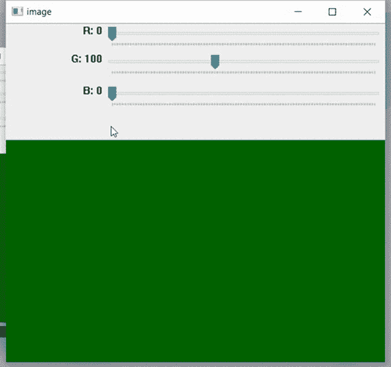

# Python OpenCV–setTrackbarPos()函数

> 原文:[https://www . geesforgeks . org/python-opencv-settrackbarpos-function/](https://www.geeksforgeeks.org/python-opencv-settrackbarpos-function/)

**setTrackbarPos()功能**设置指定窗口中指定跟踪条的位置。它不返回任何东西。setTrackbarPos()接受三个参数。第一个是跟踪条名称，第二个是窗口名称，它是跟踪条的父窗口，第三个是要设置到跟踪条的位置的新值。它返回无。

> **语法:**
> 
> cv . settrackbarPos(trackchild name，winname，pos)的缩写形式
> 
> **参数:**
> 
> *   跟踪栏名称 – 跟踪栏的名称。
> *   winname–轨迹栏父窗口的名称。
> *   位置–新位置。
> 
> **返回:**
> 
> 没有人

要创建跟踪条，首先导入所有需要的库并创建一个窗口。现在创建跟踪栏，并添加代码来根据他们的移动进行更改或工作。

当我们移动任何一个跟踪条的滑块时，它对应的 getTrackbarPos()值会改变，并返回特定滑块的位置。通过它我们相应地改变行为。

**示例:**使用 setTrackbarPos()函数更改窗口中的颜色

## 蟒蛇 3

```
# Demo Trackbar
# importing cv2 and numpy
import cv2
import numpy

def nothing(x):
    pass

# Creating a window with black image
img = numpy.zeros((300, 512, 3), numpy.uint8)
cv2.namedWindow('image')

# creating trackbars for red color change
cv2.createTrackbar('R', 'image', 0, 255, nothing)

# creating trackbars for Green color change
cv2.createTrackbar('G', 'image', 0, 255, nothing)

# creating trackbars for Bule color change
cv2.createTrackbar('B', 'image', 0, 255, nothing)

# setting position of 'G' trackbar to 100
cv2.setTrackbarPos('G', 'image', 100)

while(True):
    # show image
    cv2.imshow('image', img)
    # for button pressing and changing
    k = cv2.waitKey(1) & 0xFF
    if k == 27:
        break

    # get current positions of all Three trackbars
    r = cv2.getTrackbarPos('R', 'image')
    g = cv2.getTrackbarPos('G', 'image')
    b = cv2.getTrackbarPos('B', 'image')

    # display color mixture
    img[:] = [b, g, r]

# close the window
cv2.destroyAllWindows()
```

**输出:**

