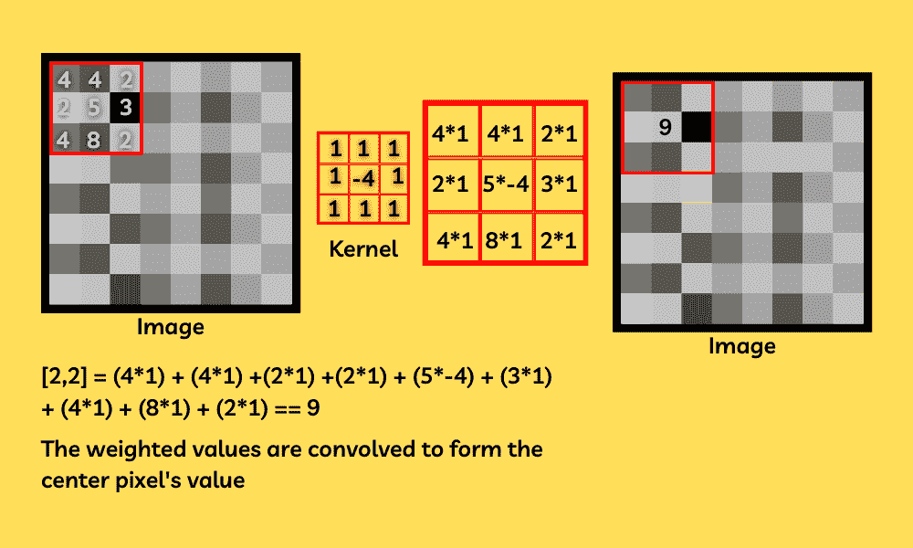
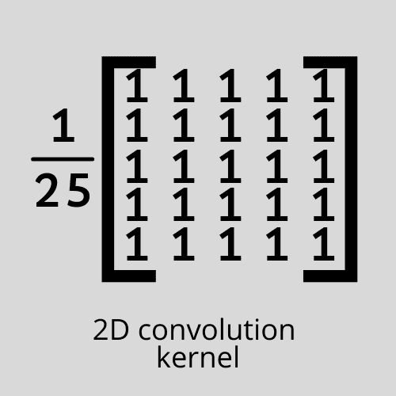
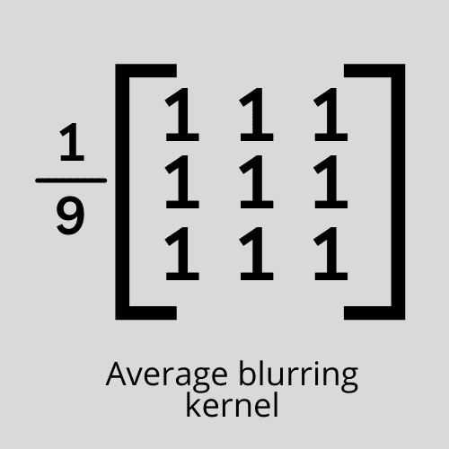
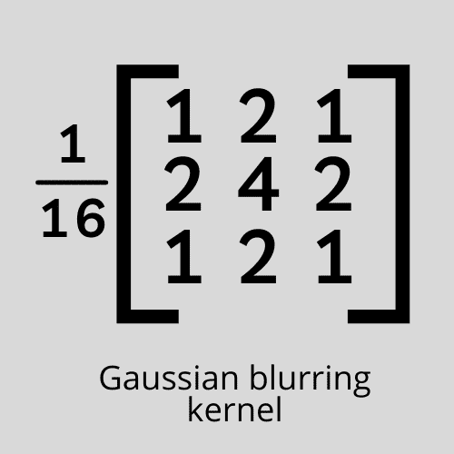
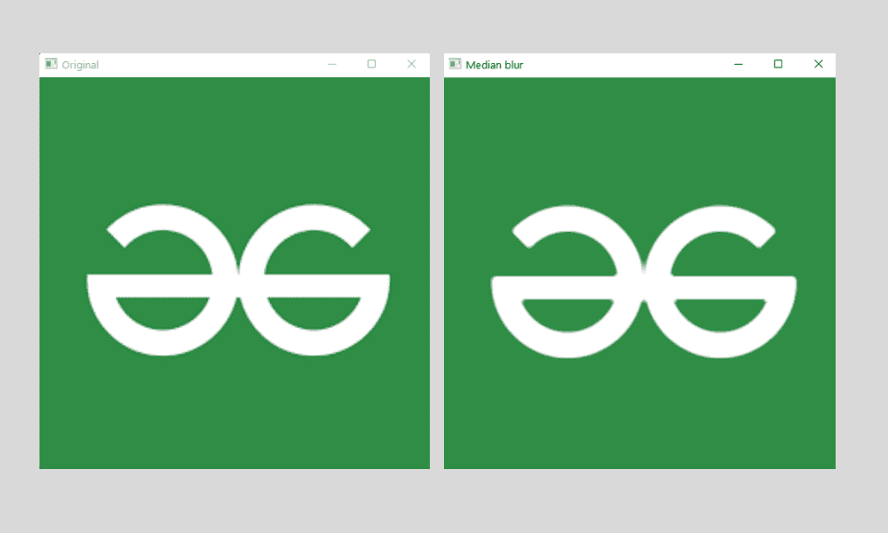

# Python OpenCV–平滑和模糊

> 原文:[https://www . geesforgeks . org/python-opencv-平滑和模糊/](https://www.geeksforgeeks.org/python-opencv-smoothing-and-blurring/)

在本文中，我们将学习使用 python-OpenCV 进行平滑和模糊。

当我们在某些地方处理图像时，图像会变得更清晰，我们需要平滑或模糊以获得清晰的图像，或者有时图像会有很差的边缘，我们也需要平滑它以使图像可用。在 OpenCV 中，我们得到了不止一种平滑或模糊图像的方法，让我们逐一讨论。

## 方法 1:2D 卷积

在这种平滑方法中，我们在过滤过程中有完全的灵活性，因为我们将使用我们定制的内核[一个简单的 NumPy 阵列的 2d 矩阵，它通过与图像逐像素卷积来帮助我们处理图像]。内核基本上会给图像中的每个像素赋予一个特定的权重，并将加权的相邻像素相加形成一个像素，通过这种方法，我们可以压缩图像中的像素，从而降低图像的清晰度，通过这种方法，我们可以很容易地平滑或模糊图像。



**注意:**通过使用这些核[2d 矩阵]，我们可以执行许多功能，如锐化和边缘检测图像。但是请记住，每个进程都有不同的内核，即不同的矩阵值。我们将在本文中使用的内核是一个 5 乘 5 平均内核，它基本上是一个 1 的矩阵，整体除以 25，看起来像，



要使用定制内核平滑图像，我们将使用一个名为 filter2D()的函数，它基本上帮助我们将定制内核与图像卷积，以实现不同的图像过滤器，如锐化和模糊等。

> **语法:** filter2D(sourceImage，ddepth，kernel)

**代码**:

## 蟒蛇 3

```py
# Importing ths modules
import cv2
import numpy as np

# Reading the image
image = cv2.imread('image.png')

# Creating the kernel with numpy
kernel2 = np.ones((5, 5), np.float32)/25

# Applying the filter
img = cv2.filter2D(src=image, ddepth=-1, kernel=kernel2)

# showing the image
cv2.imshow('Original', image)
cv2.imshow('Kernel Blur', img)

cv2.waitKey()
cv2.destroyAllWindows()
```

**输出:**


## 方法 2:使用预先构建的函数

OpenCV 附带了许多预先构建的模糊和平滑功能，让我们可以简单地看到它们，

### 1.平均:

> **语法:** cv2.blur(图像，shapeOfTheKernel)

*   **图像**–需要平滑的图像
*   **内核形状**–矩阵状 3 乘 3 / 5 乘 5 的形状

平均方法非常类似于 2d 卷积方法，因为它遵循相同的规则来平滑或模糊图像，并且使用相同类型的核，这将基本上将中心像素的值设置为核加权的周围像素的平均值。通过这种方式，我们可以通过用颜色基本相似的相似值替换一组像素来降低图像的清晰度，从而大大降低图像的噪声。我们可以大大降低图像的噪声，平滑图像。我们用于该方法的核是矩阵的期望形状，所有值都为“1”，整个矩阵除以矩阵的相应形状中的值的数量[这基本上是对像素范围内的核加权值进行平均]。我们在这个例子中使用的内核是，



**代码**:

## 蟒蛇 3

```py
# Importing the modules
import cv2
import numpy as np

# Reading the image
image = cv2.imread('image.png')

# Applying the filter
averageBlur = cv2.blur(image, (5, 5))

# Showing the image
cv2.imshow('Original', image)
cv2.imshow('Average blur', averageBlur)

cv2.waitKey()
cv2.destroyAllWindows()
```

**输出:**


### 2.高斯模糊:

> **语法:** cv2。gaussianblur(图像、shapeofthekernel、sigmatel)

*   **图像**–需要模糊的图像
*   **内核形状**–矩阵状 3 乘 3 / 5 乘 5 的形状
*   **sigmaX**–高斯核标准差，默认设置为 0

在高斯模糊中，我们将使用加权平均值，而不是使用由内核中相似值组成的箱式滤波器，这是一个简单的平均值。在这种类型的内核中，靠近中心像素的值将具有更高的权重。有了这种类型的模糊，我们可能会得到一个不太模糊的图像，但自然模糊的图像看起来更自然，因为它处理边缘值非常好。这里不求像素的加权和的平均值，我们用一个特定的值来除它，这个值是 16，在一个 3×3 形状的核的情况下是这样的。



**注意:**当我们在 filter2D()函数中使用这个完全相同的内核时，我们可以达到同样的结果，但是在这种情况下，我们不需要创建内核，因为这个函数会自动为我们做这件事。

**代码**:

## 蟒蛇 3

```py
# Importing the module
import cv2
import numpy as np

# Reading the image
image = cv2.imread('image.png')

# Applying the filter
gaussian = cv2.GaussianBlur(image, (3, 3), 0)

# Showing the image
cv2.imshow('Original', image)
cv2.imshow('Gaussian blur', gaussian)

cv2.waitKey()
cv2.destroyAllWindows()
```

**输出:**


### 3.中间模糊:

> **语法:** cv。图像，内核大小

*   **图像**–我们需要应用平滑的图像
*   **内核大小**–内核的大小，因为它总是取平方矩阵，该值必须是大于 2 的正整数。

**注**:这个方法没有具体的内核值。

在这种平滑方法中，我们将简单地取内核窗口内所有像素的中值，并用该值替换中心值。这种方法优于高斯模糊和方块模糊的一个优点是，在这两种情况下，被替换的中心值可能包含甚至不存在于图像中的像素值，这将使图像的颜色看起来不同和怪异，但是在中值模糊的情况下，尽管它取图像中已经存在的值的中值，但它看起来会自然得多。

**代码**:

## 蟒蛇 3

```py
# Importing the modules
import cv2
import numpy as np

# Reading the image
image = cv2.imread('image.png')

# Applying the filter
medianBlur = cv2.medianBlur(image, 9)

# Showing the image
cv2.imshow('Original', image)
cv2.imshow('Median blur', medianBlur)

cv2.waitKey()
cv2.destroyAllWindows()
```

**输出:**



### 4.双侧模糊:

> **语法:** cv2 .双边滤波器(图像、直径、sigmaColor、sigmaSpace)

*   **图像**–我们需要应用平滑的图像
*   **直径**–类似于内核的大小
*   **sigma color**–给定像素范围内要考虑的颜色数量[较高的值代表给定像素区域内颜色数量的增加]—不应保持很高
*   **sigma space**–偏置像素和相邻像素较高值之间的空间意味着远离像素的像素将操纵像素值

我们之前看到的平滑方法速度很快，但是我们可能会丢失图像的边缘，这不是很好。但是通过使用这种方法，该函数更加关注边缘，并且通过保留图像来平滑图像。这是通过执行两个高斯分布来实现的。与我们到目前为止讨论的其他方法相比，这可能非常慢。

**代码:**

## 蟒蛇 3

```py
# Importing the modules
import cv2
import numpy as np

# Reading the image
image = cv2.imread('image.png')

# Applying the filter
bilateral = cv2.bilateralFilter(image, 9, 75, 75)

# Showing the image
cv2.imshow('Original', image)
cv2.imshow('Bilateral blur', bilateral)

cv2.waitKey()
cv2.destroyAllWindows()
```

**输出:**

