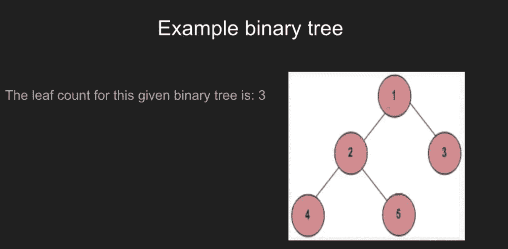

# Python |使用 OpenCV 播放视频

> 原文:[https://www . geesforgeks . org/python-play-a-video-using-opencv/](https://www.geeksforgeeks.org/python-play-a-video-using-opencv/)

**OpenCV** (开源计算机视觉)是一个计算机视觉库，包含对图像或视频进行操作的各种功能。OpenCV 库可以用来对视频进行多种操作。

让我们看看如何使用 OpenCV Python 播放视频。

为了捕捉视频，我们需要创建一个`VideoCapture object`。视频捕获有设备索引或视频文件的名称。设备索引只是指定哪个摄像机的数字。如果我们通过 0，那么它是用于*第一个摄像头*，1 是用于*第二个摄像头*等等。我们一帧一帧地捕捉视频。
**语法:**

```
cv2.VideoCapture(0): Means first camera or webcam.
cv2.VideoCapture(1):  Means second camera or webcam.
cv2.VideoCapture("file name.mp4"): Means video file
```

下面是实现:

```
# importing libraries
import cv2
import numpy as np

# Create a VideoCapture object and read from input file
cap = cv2.VideoCapture('tree.mp4')

# Check if camera opened successfully
if (cap.isOpened()== False): 
  print("Error opening video  file")

# Read until video is completed
while(cap.isOpened()):

  # Capture frame-by-frame
  ret, frame = cap.read()
  if ret == True:

    # Display the resulting frame
    cv2.imshow('Frame', frame)

    # Press Q on keyboard to  exit
    if cv2.waitKey(25) & 0xFF == ord('q'):
      break

  # Break the loop
  else: 
    break

# When everything done, release 
# the video capture object
cap.release()

# Closes all the frames
cv2.destroyAllWindows()
```

**注意:**视频文件应该在执行程序的同一目录下。
T3】输出:

**视频样本帧:**


**相关文章:** [如何在倒车模式下播放视频](https://www.geeksforgeeks.org/python-play-video-reverse-mode-using-opencv/)。