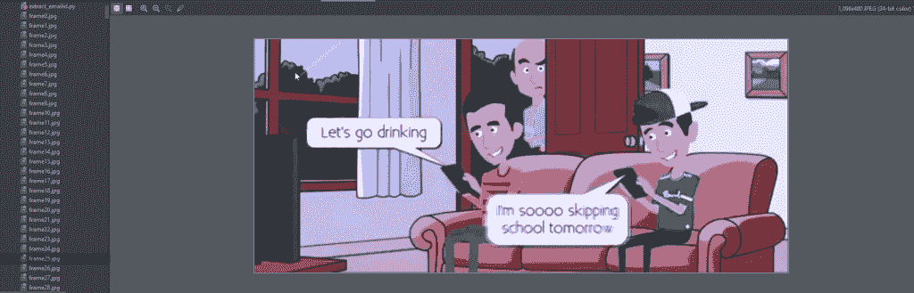

# Python |使用 OpenCV 以反向模式播放视频

> 原文:[https://www . geesforgeks . org/python-play-video-reverse-mode-use-opencv/](https://www.geeksforgeeks.org/python-play-video-reverse-mode-using-opencv/)

[OpenCV](https://www.geeksforgeeks.org/set-opencv-anaconda-environment/) (开源计算机视觉)是一个计算机视觉库，包含对图像或视频进行操作的各种功能。

```
OpenCV's application areas include :

1) Facial recognition system
2) motion tracking
3) Artificial neural network
4) Deep neural network
5) video streaming  etc.
```

在 Python 中，可以使用名为 **CV2** 的 OpenCV 库。Python 没有附带 cv2，所以用户需要单独安装。

> 对于窗口:
> 
> ```
> pip install opencv-python
> ```
> 
> 对于 Linux:
> 
> ```
> sudo apt-get install python-opencv
> ```

OpenCv 库可以用来对视频进行多种操作。让我们尝试使用 **CV2** 做一些有趣的事情。将视频作为输入，通过将视频逐帧分解并同时将该帧存储在列表中，以反向模式播放。在获得帧列表后，我们对帧执行迭代。对于以反向模式播放视频，我们只需要在帧列表中反向迭代。使用列表的反转方法反转列表中帧的顺序。
下面是实现:

## 蟒蛇 3

```
# Python program to play a video
# in reverse mode using opencv

# import cv2 library
import cv2

# videoCapture method of cv2 return video object

# Pass absolute address of video file
cap = cv2.VideoCapture("video_file_location")

# read method of video object will return
# a tuple with 1st element denotes whether
# the frame was read successfully or not,
# 2nd element is the actual frame.

# Grab the current frame.
check , vid = cap.read()

# counter variable for
# counting frames
counter = 0

# Initialize the value
# of check variable
check = True

frame_list = []

# If reached the end of the video
# then we got False value of check.

# keep looping until we
# got False value of check.
while(check == True):

    # imwrite method of cv2 saves the
    # image to the specified format.
    cv2.imwrite("frame%d.jpg" %counter , vid)
    check , vid = cap.read()

    # Add each frame in the list by
    # using append method of the List
    frame_list.append(vid)

    # increment the counter by 1
    counter += 1

# last value in the frame_list is None
# because when video reaches to the end
# then false value store in check variable
# and None value is store in vide variable.

# removing the last value from the
# frame_list by using pop method of List
frame_list.pop()

# looping in the List of frames.
for frame in frame_list:

    # show the frame.
    cv2.imshow("Frame" , frame)

    # waitkey method to stopping the frame
    # for some time. q key is presses,
    # stop the loop
    if cv2.waitKey(25) and 0xFF == ord("q"):
        break

# release method of video
# object clean the input video
cap.release()

# close any open windows
cv2.destroyAllWindows()

# reverse the order of the element
# present in the list by using
# reverse method of the List.
frame_list.reverse()

for frame in frame_list:
    cv2.imshow("Frame" , frame)
    if cv2.waitKey(25) and 0xFF == ord("q"):
        break

cap.release()
cv2.destroyAllWindows()
```

输出:

