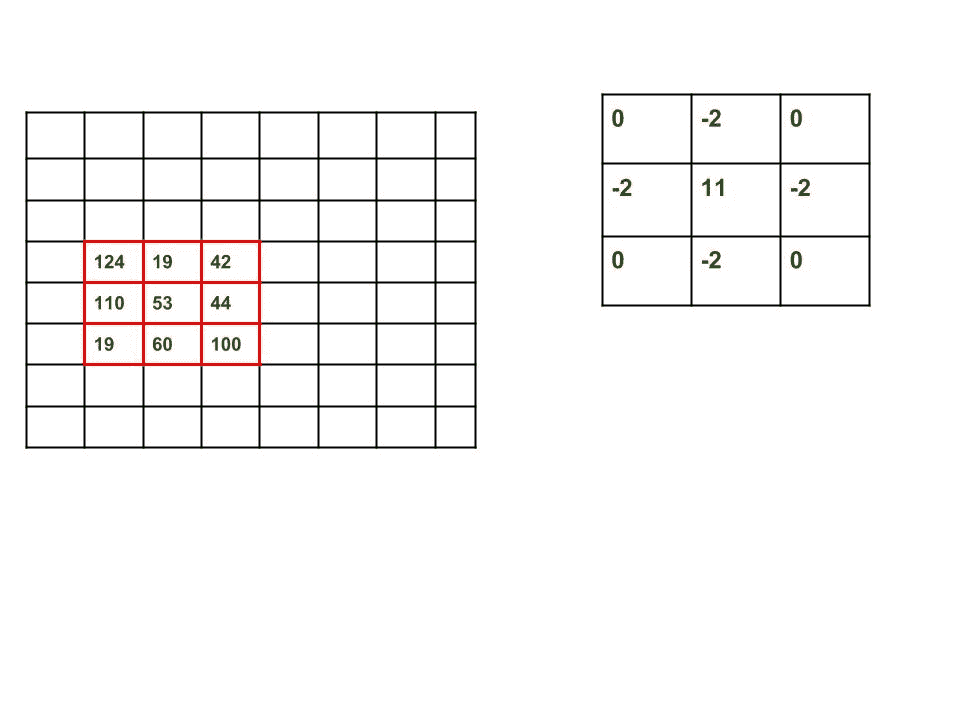

# 使用 OpenCV | Sobel 边缘检测方法检测图像边缘的 Python 程序

> 原文:[https://www . geeksforgeeks . org/python-使用-opencv-sobel-edge-detection 检测图像边缘的程序/](https://www.geeksforgeeks.org/python-program-to-detect-the-edges-of-an-image-using-opencv-sobel-edge-detection/)

以下程序检测实时流视频内容中的帧边缘。代码只能在 linux 环境下编译。在运行程序之前，请确保系统中安装了 openCV。
**步骤下载要求如下:**

*   在您的终端上运行以下命令，从 Ubuntu 或 Debian 安装它。

```
sudo apt-get install libopencv-dev python-opencv
```

*   或者为了从官方网站下载 OpenCV，运行以下命令:

```
bash install-opencv.sh
```

*   在你的终端上。
*   键入您的 sudo 密码，您将安装 OpenCV。

**边缘检测背后的原理**

边缘检测涉及数学方法来寻找图像中像素亮度明显变化的点。

*   我们要做的第一件事是找到灰度图像的**梯度**，允许我们在 x 和 y 方向找到类似边缘的区域。梯度是导数的多变量推广。虽然导数可以定义在单个变量的函数上，但是对于几个变量的函数，梯度取而代之。
*   梯度是向量值函数，而不是标量值的导数。和导数一样，**梯度代表函数**的图形切线的斜率。更准确地说，梯度指向函数最大增长率的方向，其大小是图在该方向上的斜率。

注意:在计算机视觉中，从黑到白的过渡被认为是正斜率，而从白到黑的过渡是负斜率。

## 计算机编程语言

```
# Python program to  Edge detection
# using OpenCV in Python
# using Sobel edge detection
# and laplacian method
import cv2
import numpy as np

#Capture livestream video content from camera 0
cap = cv2.VideoCapture(0)

while(1):

    # Take each frame
    _, frame = cap.read()

    # Convert to HSV for simpler calculations
    hsv = cv2.cvtColor(frame, cv2.COLOR_BGR2HSV)

    # Calculation of Sobelx
    sobelx = cv2.Sobel(frame,cv2.CV_64F,1,0,ksize=5)

    # Calculation of Sobely
    sobely = cv2.Sobel(frame,cv2.CV_64F,0,1,ksize=5)

    # Calculation of Laplacian
    laplacian = cv2.Laplacian(frame,cv2.CV_64F)

    cv2.imshow('sobelx',sobelx)
    cv2.imshow('sobely',sobely)
    cv2.imshow('laplacian',laplacian)
    k = cv2.waitKey(5) & 0xFF
    if k == 27:
        break

cv2.destroyAllWindows()

#release the frame
cap.release()
```

**图像导数的计算**

数字图像由矩阵表示，该矩阵在行和列中存储每个像素的 RGB/BGR/HSV(图像所属的颜色空间)值。矩阵的导数由一个叫做拉普拉斯 T2 的算子来计算。为了计算拉普拉斯算子，你需要计算前两个导数，称为**索贝尔**的导数，每个导数都考虑了某个方向上的梯度变化:一个水平，另一个垂直。

*   **水平索贝尔导数(Sobel x)** :它是通过图像与一个称为核的矩阵的卷积得到的，该矩阵总是具有奇大小。大小为 3 的内核是最简单的情况。
*   **垂直索贝尔导数(Sobel y)** :它是通过图像与一个称为核的矩阵卷积得到的，该矩阵总是具有奇大小。大小为 3 的内核是最简单的情况。
*   **卷积**的计算方法如下:图像表示原始图像矩阵，滤波器为核矩阵。



*   **因子**= 11–2-2-2-2-2 = 3
    **偏移** = 0
    **加权和**= 124 * 0+19 *(2)+110 *(2)+53 * 11+44 *(2)+19 * 0+60 *(2)+100 * 0 = 117
    **O【4，2】**=(117/3)+0

**参数:**

*   **cv2。Sobel():** 函数 cv2。Sobel(框架，cv2。CV_64F，1，0，ksize=5)可以写成

```
cv2.Sobel(original_image,ddepth,xorder,yorder,kernelsize)
```

*   其中第一个参数是原始图像，第二个参数是目标图像的深度。当 ddepth=-1/CV_64F 时，目标图像将具有与源图像相同的深度。第三个参数是导数 x 的阶。第四个参数是导数 y 的阶。在计算 Sobelx 时，我们将 xorder 设置为 1，yorder 设置为 0，而在计算 Sobel 时，情况将相反。最后一个参数是扩展的 Sobel 核的大小；它必须是 1、3、5 或 7。
*   **cv2。拉普拉斯**:在函数中

```
cv2.Laplacian(frame,cv2.CV_64F)
```

*   第一个参数是原始图像，第二个参数是目标图像的深度。当深度=-1/CV_64F 时，目标图像将具有与源图像相同的深度。

**边缘检测应用程序**

*   减少图像中不必要的信息，同时保持图像的结构。
*   提取图像的重要特征，如曲线、角点和线条。
*   识别对象、边界和分割。
*   在计算机视觉和识别中起着重要作用

**相关文章:** [使用 Canny 边缘检测方法进行边缘检测](https://www.geeksforgeeks.org/real-time-edge-detection-using-opencv-python/)
本文由 **Pratima Upadhyay** 供稿。如果你喜欢 GeeksforGeeks 并想投稿，你也可以使用[write.geeksforgeeks.org](https://write.geeksforgeeks.org)写一篇文章或者把你的文章邮寄到 review-team@geeksforgeeks.org。看到你的文章出现在极客博客主页上，帮助其他极客。
如果发现有不正确的地方，或者想分享更多关于上述话题的信息，请写评论。