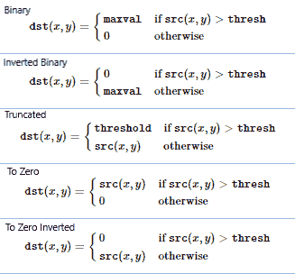
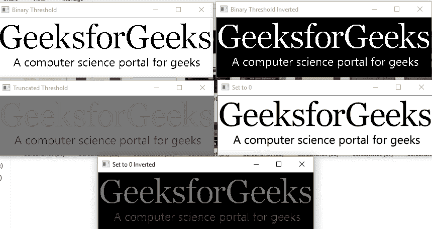

# Python |使用 OpenCV 的阈值技术| Set-1(简单阈值)

> 原文:[https://www . geeksforgeeks . org/python-阈值技术-使用-opencv-set-1-简单阈值/](https://www.geeksforgeeks.org/python-thresholding-techniques-using-opencv-set-1-simple-thresholding/)

**阈值化**是 OpenCV 中的一种技术，它是像素值相对于所提供的阈值的分配。在阈值处理中，将每个像素值与阈值进行比较。如果像素值小于阈值，则设置为 0，否则设置为最大值(一般为 255)。阈值分割是一种非常流行的分割技术，用于将被认为是前景的对象与其背景分离。阈值是在其两侧具有两个区域的值，即低于阈值或高于阈值。
在计算机视觉中，这种阈值技术是在灰度图像上完成的。所以最初，图像必须在灰度颜色空间中转换。

```
If f (x, y) < T 
   then f (x, y) = 0 
else 
   f (x, y) = 255

where 
f (x, y) = Coordinate Pixel Value
T = Threshold Value.
```

在 Python 的 OpenCV 中，函数 **cv2.threshold** 用于阈值化。

> **语法:** cv2.threshold(source，thresholdValue，maxVal，thresholdingTechnique)
> **参数:**
> - > **source** :输入图像数组(必须为灰度)。
> - > **阈值**:低于和高于阈值的值，像素值将相应改变。
> - > **maxVal** :可以分配给一个像素的最大值。
> - > **阈值技术**:要应用的阈值类型。

### 简单阈值化

基本的阈值技术是二值阈值。对于每个像素，应用相同的阈值。如果像素值小于阈值，则设置为 0，否则设置为最大值。
不同的简单阈值技术是:

*   **cv2。THRESH_BINARY** :如果像素强度大于设定的阈值，值设置为 255，否则设置为 0(黑色)。
*   **cv2。THRESH _ BInary _ INV**:cv2 的反相或相反情况。THRESH_BINARY。
*   **cv。THRESH_TRUNC** :如果像素强度值大于阈值，则截断为阈值。像素值被设置为与阈值相同。所有其他值保持不变。
*   **cv。THRESH_TOZERO** :像素强度设置为 0，对于所有像素强度，小于阈值。
*   **cv。THRESH _ TOZERO _ INV**:cv2 的反转或相反情况。THRESH_TOZERO。



下面是解释不同简单阈值技术的 Python 代码–

## 蟒蛇 3

```
# Python program to illustrate
# simple thresholding type on an image

# organizing imports
import cv2
import numpy as np

# path to input image is specified and 
# image is loaded with imread command
image1 = cv2.imread('input1.jpg')

# cv2.cvtColor is applied over the
# image input with applied parameters
# to convert the image in grayscale
img = cv2.cvtColor(image1, cv2.COLOR_BGR2GRAY)

# applying different thresholding
# techniques on the input image
# all pixels value above 120 will
# be set to 255
ret, thresh1 = cv2.threshold(img, 120, 255, cv2.THRESH_BINARY)
ret, thresh2 = cv2.threshold(img, 120, 255, cv2.THRESH_BINARY_INV)
ret, thresh3 = cv2.threshold(img, 120, 255, cv2.THRESH_TRUNC)
ret, thresh4 = cv2.threshold(img, 120, 255, cv2.THRESH_TOZERO)
ret, thresh5 = cv2.threshold(img, 120, 255, cv2.THRESH_TOZERO_INV)

# the window showing output images
# with the corresponding thresholding
# techniques applied to the input images
cv2.imshow('Binary Threshold', thresh1)
cv2.imshow('Binary Threshold Inverted', thresh2)
cv2.imshow('Truncated Threshold', thresh3)
cv2.imshow('Set to 0', thresh4)
cv2.imshow('Set to 0 Inverted', thresh5)

# De-allocate any associated memory usage 
if cv2.waitKey(0) & 0xff == 27:
    cv2.destroyAllWindows()
```

**输入:**


**输出:**

