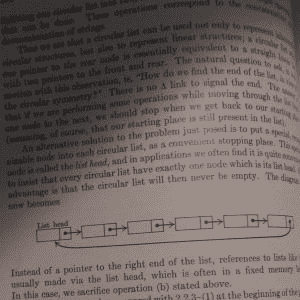
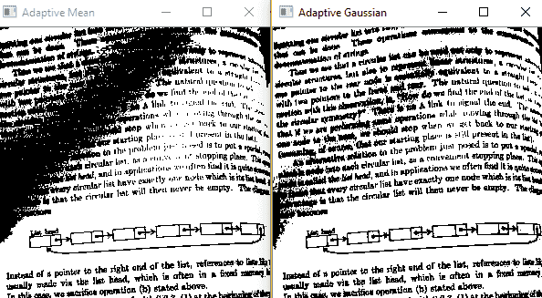

# Python |使用 OpenCV 的阈值技术| Set-2(自适应阈值)

> 原文:[https://www . geesforgeks . org/python-阈值处理-技术-使用-opencv-set-2-自适应阈值处理/](https://www.geeksforgeeks.org/python-thresholding-techniques-using-opencv-set-2-adaptive-thresholding/)

**先决条件:** [使用 OpenCV 的简单阈值处理](https://www.geeksforgeeks.org/python-thresholding-techniques-using-opencv-set-1-simple-thresholding/)

在[之前的文章](https://www.geeksforgeeks.org/python-thresholding-techniques-using-opencv-set-1-simple-thresholding/)中，简单阈值化是用不同类型的阈值化技术来解释的。另一种阈值技术是**自适应阈值**。在简单阈值法中，使用了一个全局阈值，该阈值始终保持不变。因此，在不同区域照明条件变化的情况下，恒定的阈值不会有所帮助。自适应阈值化是为较小的区域计算阈值的方法。这导致不同区域关于照明变化的阈值不同。我们用`**cv2.adaptiveThreshold**`来表示这个。

> **语法**:cv2 . adaptivethreshold(source，maxVal，adaptiveMethod，thresholdType，blocksize，常量)
> 
> **参数:**
> - > **来源**:输入图像数组(单通道、8 位或浮点)
> - > **maxVal** :可分配给一个像素的最大值。
> - > **自适应方法**:自适应方法决定如何计算阈值。
> 
> **cv2。ADAPTIVE_THRESH_MEAN_C** :阈值=(邻域面积值的平均值–常数值)。换句话说，它是一个点的块大小×块大小邻域的平均值减去常数。
> 
> **cv2。ADAPTIVE_THRESH_GAUSSIAN_C** :阈值=(高斯加权的邻域值之和–常数值)。换句话说，它是一个点的块大小×块大小邻域减去常数的加权和。
> 
> -> **阈值类型**:要应用的阈值类型。
> - > **块大小**:用于计算阈值的像素邻域的大小。
> - > **常量**:从邻域像素的平均值或加权和中减去的常量值。

下面是 Python 实现:

```py
# Python program to illustrate 
# adaptive thresholding type on an image

# organizing imports 
import cv2 
import numpy as np 

# path to input image is specified and  
# image is loaded with imread command 
image1 = cv2.imread('input1.jpg') 

# cv2.cvtColor is applied over the
# image input with applied parameters
# to convert the image in grayscale 
img = cv2.cvtColor(image1, cv2.COLOR_BGR2GRAY)

# applying different thresholding 
# techniques on the input image
thresh1 = cv2.adaptiveThreshold(img, 255, cv2.ADAPTIVE_THRESH_MEAN_C,
                                          cv2.THRESH_BINARY, 199, 5)

thresh2 = cv2.adaptiveThreshold(img, 255, cv2.ADAPTIVE_THRESH_GAUSSIAN_C,
                                          cv2.THRESH_BINARY, 199, 5)

# the window showing output images
# with the corresponding thresholding 
# techniques applied to the input image
cv2.imshow('Adaptive Mean', thresh1)
cv2.imshow('Adaptive Gaussian', thresh2)

# De-allocate any associated memory usage  
if cv2.waitKey(0) & 0xff == 27: 
    cv2.destroyAllWindows() 
```

**输入图像** :
[](https://media.geeksforgeeks.org/wp-content/uploads/20190506013251/bp1.jpg)

**输出** : [](https://media.geeksforgeeks.org/wp-content/uploads/20190506013415/Screenshot-443.png)