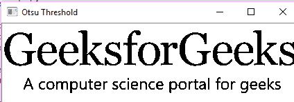

# Python |使用 OpenCV 的阈值技术| Set-3(大津阈值)

> 原文:[https://www . geeksforgeeks . org/python-thresholding-technologies-use-opencv-set-3-Otsu-thresholding/](https://www.geeksforgeeks.org/python-thresholding-techniques-using-opencv-set-3-otsu-thresholding/)

在之前的帖子中，解释了[简单阈值化](https://www.geeksforgeeks.org/python-thresholding-techniques-using-opencv-set-1-simple-thresholding/)和[自适应阈值化](https://www.geeksforgeeks.org/python-thresholding-techniques-using-opencv-set-2-adaptive-thresholding/)。在简单阈值法中，阈值的全局值始终保持不变。在自适应阈值化中，针对较小的区域计算阈值，对于不同的区域，针对照明的变化计算不同的阈值。

在**大津阈值**中，阈值的值不是选择的，而是自动确定的。考虑双峰图像(两个不同的图像值)。生成的直方图包含两个峰值。因此，一般条件是选择一个位于两个直方图峰值中间的阈值。

我们使用传统的 `**cv2.threshold**`功能，并使用 `**cv2.THRESH_OTSU**` 作为额外的标志。

> **语法:** cv2.threshold(来源，阈值，最大值，阈值技术)
> 
> **参数:**
> - > **来源**:输入图像数组(必须为灰度)。
> - > **阈值**:低于和高于阈值的值，像素值将相应改变。
> - > **maxVal** :可以分配给一个像素的最大值。
> - > **阈值技术**:要应用的阈值类型。

下面是解释大津阈值技术的 Python 代码–

```
# Python program to illustrate
# Otsu thresholding type on an image

# organizing imports
import cv2         
import numpy as np    

# path to input image is specified and
# image is loaded with imread command
image1 = cv2.imread('input1.jpg')

# cv2.cvtColor is applied over the
# image input with applied parameters
# to convert the image in grayscale
img = cv2.cvtColor(image1, cv2.COLOR_BGR2GRAY)

# applying Otsu thresholding
# as an extra flag in binary 
# thresholding     
ret, thresh1 = cv2.threshold(img, 120, 255, cv2.THRESH_BINARY + 
                                            cv2.THRESH_OTSU)     

# the window showing output image         
# with the corresponding thresholding         
# techniques applied to the input image    
cv2.imshow('Otsu Threshold', thresh1)         

# De-allocate any associated memory usage         
if cv2.waitKey(0) & 0xff == 27:
    cv2.destroyAllWindows()     
```

**输入:**
[](https://media.geeksforgeeks.org/wp-content/uploads/20190524233042/download6.png)

**输出:**
[](https://media.geeksforgeeks.org/wp-content/uploads/20190524233336/Screenshot-462.png)

该计算接受图片包含跟随前景和背景像素的两类像素，在这一点上，它确定了隔离这两类像素的理想极限，目标是它们的合并扩散不显著。