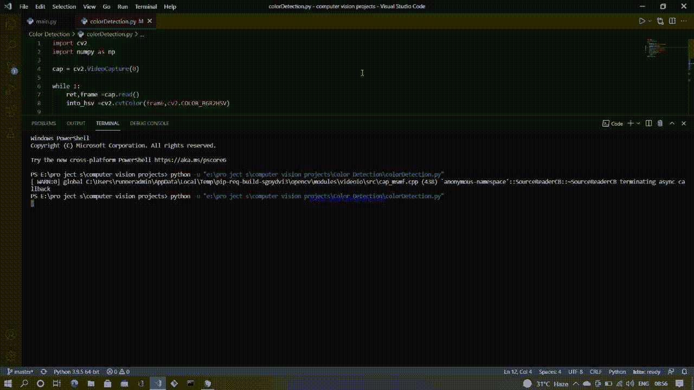

# 使用 OpenCV 的实时物体颜色检测

> 原文:[https://www . geesforgeks . org/实时-物体-颜色-检测-使用-opencv/](https://www.geeksforgeeks.org/real-time-object-color-detection-using-opencv/)

在本文中，我们将讨论如何使用 python 和 OpenCV 检测单色物体。单色是指单一波长的光。我们将使用使用网络摄像头拍摄的视频作为输入，并尝试检测单一颜色的对象，尤其是蓝色。但是如果你设置合适的范围，你可以检测到任何颜色，我们稍后再讨论。

为此，强烈建议将颜色从 RGB 格式转换为 HSV 格式。HSV 代表色调、饱和度和价值。色调表示颜色本身，技术上它表示 HSV 颜色模型中的角度。

先了解一下 HSV 颜色模型。想象一个圆柱体，它有一个高度，一个半径和一个曲面面积。以半径的初始位置为基准，逆时针移动半径到一个角度θ，即θ为半径当前位置与其初始位置之间的角度。如果θ为 0 度，则表示红色，如果θ为 120 度，则表示绿色，依此类推。半径的长度是颜色的饱和度，高度表示值或在 HSV 中的 V。

主要思想是将输入的 RGB 图像(在 OpenCV 的情况下是 BGR，因为在这个模块中图像是这样格式化的)转换为 HSV 格式，这将使我们更容易将特定的颜色屏蔽在帧之外。也就是说，所提供的 HSV 范围内的任何颜色都将被赋予 255 的值，而其他颜色将简单地为 0，因此，指定范围内颜色的每个对象都将变为白色，而图像的其余部分即背景为黑色。

为了显示颜色，我们需要用蒙版对当前帧进行**逐位和**。为此，有一个名为 bitwise_and()的内置函数

```py
syntax: 
result = cv2.bitwise_and(pic1, pic2, mask)
```

其中 pic1 和 pic 2 是输入图像，另一个是掩模。遮罩可以被认为是应用于图像的剪切形状，因此只有剪切部分是可见的。

### **实施:**

首先，使用以下两个代码导入所需模块后，创建一个 OpenCV 视频捕获对象:

```py
import cv2
import numpy as np
```

然后开始无限循环，读取网络摄像头读取的每一帧。使用 ***cv2.cvtColor()*** 功能将每一帧从 BGR 格式转换为 HSV 格式，它将帧作为第一个输入，颜色转换的类型作为第二个输入。

```py
syntax:
cv2.cvtColor(frame, cv2.COLOR_BGR2HSV)
```

之后，指定蓝色(或您喜欢的任何颜色)的下限和上限。通过创建两个期望下限和上限为[H，S，V]的 NumPy 阵列。这两个 NumPy 数组将用作阈值函数中的参数，即 *cv2.inRange()* 函数。它采用三个参数，图像源、下限和上限。

```py
syntax:
cv2.inRange(source, lower_limit, upper_limit)
```

*cv2.inRange()* 函数将范围内的所有值设置为 255，其余值设置为 0。这个函数的输出将是我们的掩码。最后，在前面提到的*逐位 _ 和*函数中传递这个掩码将产生期望的结果。输出如下所示。

### 代码:

## 蟒蛇 3

```py
import cv2
import numpy as np

cap = cv2.VideoCapture(0)

while 1:
    ret,frame =cap.read()
    # ret will return a true value if the frame exists otherwise False
    into_hsv =cv2.cvtColor(frame,cv2.COLOR_BGR2HSV)
    # changing the color format from BGr to HSV
    # This will be used to create the mask
    L_limit=np.array([98,50,50]) # setting the blue lower limit
    U_limit=np.array([139,255,255]) # setting the blue upper limit

    b_mask=cv2.inRange(into_hsv,L_limit,U_limit)
    # creating the mask using inRange() function
    # this will produce an image where the color of the objects
    # falling in the range will turn white and rest will be black
    blue=cv2.bitwise_and(frame,frame,mask=b_mask)
    # this will give the color to mask.
    cv2.imshow('Original',frame) # to display the original frame
    cv2.imshow('Blue Detector',blue) # to display the blue object output

    if cv2.waitKey(1)==27:
        break
    # this function will be triggered when the ESC key is pressed
    # and the while loop will terminate and so will the program
cap.release()

cv2.destroyAllWindows()
```

**输出:**

