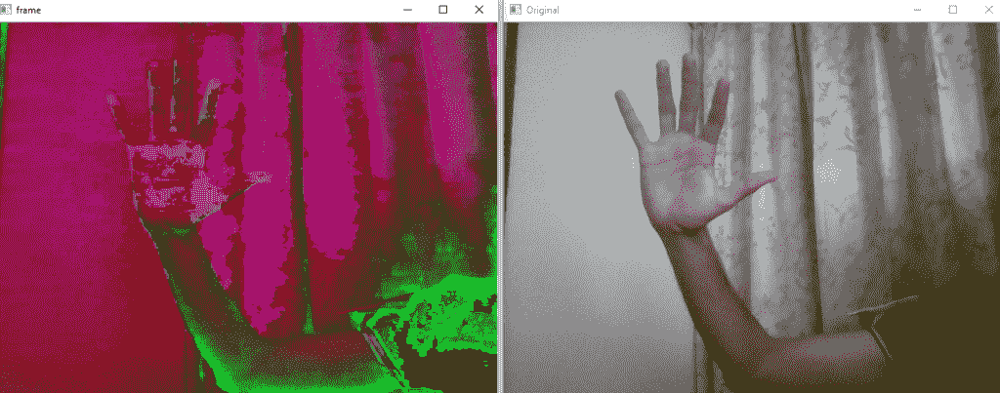

# 使用 OpenCV

从网络摄像头保存操作视频

> 原文:[https://www . geesforgeks . org/saving-operated-video-from-a-network-use-opencv/](https://www.geeksforgeeks.org/saving-operated-video-from-a-webcam-using-opencv/)

**OpenCV** 是一个庞大的库，有助于为图像和视频操作提供各种功能。有了 OpenCV，我们可以对输入的视频进行操作。OpenCV 还允许我们保存操作过的视频，以便进一步使用。为了保存图像，我们使用 cv2.imwrite()将图像保存到指定的文件位置。但是，为了保存录制的视频，我们创建了一个[视频编写器](https://docs.opencv.org/3.0-beta/doc/py_tutorials/py_gui/py_video_display/py_video_display.html)对象。

首先，我们指定 [fourcc](https://en.wikipedia.org/wiki/FourCC) 变量。FourCC 是用于指定视频编解码器的 4 字节代码。代码列表可通过 Forcc 在[视频编解码器获取。Windows 的编解码器是 **DIVX** ，OSX 的编解码器是 avc1，h263。FourCC 代码作为 **cv2 传递。video writer _ fourcc(*“MJPG”)**为 MJPG，**为 cv2。video writer _ fourcc(*“XVID”)**代表 DIVX。](http://www.fourcc.org/codecs.php)

然后， [cv2。使用了 VideoWriter()](https://docs.opencv.org/3.4/dd/d9e/classcv_1_1VideoWriter.html) 功能。

```py
cv2.VideoWriter( filename, fourcc, fps, frameSize )

```

这些参数是:

1.  **文件名:**指定输出视频文件的名称。
2.  **fourcc:** (用于录制)定义编解码器
3.  **fps:** 输出视频流的定义帧速率
4.  **帧大小:**视频帧的大小

```py
# Python program to illustrate 
# saving an operated video

# organize imports
import numpy as np
import cv2

# This will return video from the first webcam on your computer.
cap = cv2.VideoCapture(0)  

# Define the codec and create VideoWriter object
fourcc = cv2.VideoWriter_fourcc(*'XVID')
out = cv2.VideoWriter('output.avi', fourcc, 20.0, (640, 480))

# loop runs if capturing has been initialized. 
while(True):
    # reads frames from a camera 
    # ret checks return at each frame
    ret, frame = cap.read() 

    # Converts to HSV color space, OCV reads colors as BGR
    # frame is converted to hsv
    hsv = cv2.cvtColor(frame, cv2.COLOR_BGR2HSV)

    # output the frame
    out.write(hsv) 

    # The original input frame is shown in the window 
    cv2.imshow('Original', frame)

    # The window showing the operated video stream 
    cv2.imshow('frame', hsv)

    # Wait for 'a' key to stop the program 
    if cv2.waitKey(1) & 0xFF == ord('a'):
        break

# Close the window / Release webcam
cap.release()

# After we release our webcam, we also release the output
out.release() 

# De-allocate any associated memory usage 
cv2.destroyAllWindows()
```

**输出:**
输出屏幕显示两个窗口。名为“原始”的窗口显示输入帧，而“帧”窗口显示操作的视频序列。
[](https://contribute.geeksforgeeks.org/?attachment_id=679881) 
此外，视频以“输出”的名称记录并保存在具有预定义帧速率和帧大小的同一文件位置。
一般是. avi 格式，保存的视频是这样的:[输出视频](https://media.geeksforgeeks.org/wp-content/uploads/output-1.avi)

输入视频也可以在其他颜色空间操作，如**灰度**

```py
# Python program to illustrate 
# saving an operated video

# organize imports
import numpy as np
import cv2

# This will return video from the first webcam on your computer.
cap = cv2.VideoCapture(0)  

# Define the codec and create VideoWriter object
fourcc = cv2.VideoWriter_fourcc(*'XVID')
out = cv2.VideoWriter('output.avi', fourcc, 20.0, (640, 480))

# loop runs if capturing has been initialized. 
while(True):
    # reads frames from a camera 
    # ret checks return at each frame
    ret, frame = cap.read() 

    # Converts to grayscale space, OCV reads colors as BGR
    # frame is converted to gray
    gray = cv2.cvtColor(frame, cv2.COLOR_BGR2GRAY)

    # output the frame
    out.write(gray) 

    # The original input frame is shown in the window 
    cv2.imshow('Original', frame)

    # The window showing the operated video stream 
    cv2.imshow('frame', gray)

    # Wait for 'a' key to stop the program 
    if cv2.waitKey(1) & 0xFF == ord('a'):
        break

# Close the window / Release webcam
cap.release()

# After we release our webcam, we also release the out-out.release() 

# De-allocate any associated memory usage 
cv2.destroyAllWindows()
```

**输出:**
[](https://media.geeksforgeeks.org/wp-content/uploads/Grayscale-2.png)

该操作视频的视频文件保存在我们上面看到的相同文件位置。

这种方法可以帮助我们创建自己的数据集，用于项目/模型中的训练数据，从网络摄像头进行记录并进行必要的操作，还可以在不同的颜色空间中创建视频。

不同颜色空间的可视化内容请参考此链接:
[https://www . geeksforgeeks . org/python-可视化-不同颜色空间的图像/](https://www.geeksforgeeks.org/python-visualizing-image-in-different-color-spaces/)

**参考文献:**

1.  https://docs.opencv.org/3.4/dd/d9e/classcv_1_1VideoWriter.html
2.  https://docs.opencv.org/3.1.0/dd/d43/tutorial_py_video_display.html
3.  https://en.wikipedia.org/wiki/FourCC
4.  https://opencv-python-tutroals.readthedocs.io/en/latest/py_tutorials/py_imgproc/py_colorspaces/py_colorspaces.html