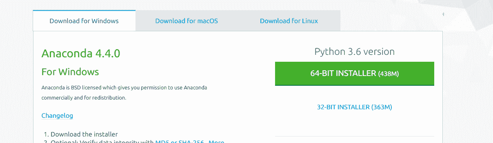

# 用蟒蛇环境设置 Opencv

> 原文:[https://www . geesforgeks . org/set-opencv-anaconda-environment/](https://www.geeksforgeeks.org/set-opencv-anaconda-environment/)

如果你喜欢使用 python 进行图像处理和视频分析，那么你来对地方了。Python 是可以用来处理图像或视频的主要语言之一。

**对 OpenCV 和 Anaconda**
的要求–32 位或 64 位计算机。
–对于 Miniconda—400 MB 磁盘空间。
–对于 Anaconda—下载和安装至少需要 3 GB 磁盘空间。
–Windows、macOS 或 Linux。
–Python 2.7、3.4、3.5 或 3.6。

**ANACONDA**

Anaconda 是一个开源软件，包含 jupiter、spyder 等，用于大型数据处理、数据分析、重型科学计算。Anaconda 为 R 和 python 编程语言工作。python 使用 spyder(Anaconda 的子应用程序)。python 的 Opencv 将在 skyder 中工作。包版本由包管理系统 conda 管理。


**安装蟒蛇:**前往 continuum.io/downloads/，安装最新版本的蟒蛇。确保安装“Python 3.6 版本”以获得合适的体系结构。用默认设置安装它。



**OPENCV**

OpenCV(开放源代码计算机视觉)是一个计算机视觉库，包含对图片或视频执行操作的各种功能。它最初由英特尔开发，但后来由 Willow Garage 维护，现在由 Itseez 维护。这个库是跨平台的，因为它可以在多种编程语言上使用，如 Python、C++等。


**在 windows 环境下在蟒蛇上导入 opencv 的步骤**

1.  **创建蟒蛇环境:**
    **步骤 1:-** 在任务栏中搜索蟒蛇并选择蟒蛇导航器。
    
    **第二步:-** 现在你会看到一个菜单，里面有各种选项，像木星笔记本、Spyder 等。这是阿纳康达环境。
    **步骤 3:-** 选择 Spyder，因为它是 Anaconda 的 python IDE，OpenCV 库只能在其中工作。
2.  **Install OpenCV**
    **Step 1 :-** After installing the anaconda open the Anaconda Prompt.

    [](https://media.geeksforgeeks.org/wp-content/uploads/sca.png) 
    **第二步:-** 输入给定的命令，按回车键让它下载整个包。
    命令

    ```py
    conda install -c menpo opencv

    ```

    **第 3 步:-** 现在只需在 python 程序中导入 opencv，在该程序中您希望使用图像处理功能。

**示例:****opencv 库的一些基本功能(这些功能在 Anaconda 的 Windows 味上执行，但在 linux 味上也会起作用)**

*   **Reading a image**

    ```py
    img = cv2.imread('LOCATION OF THE IMAGE')

    ```

    上面的函数 imread 将给定位置的图像存储到变量 img 中。

*   **Converting a image to greyscale**

    ```py
    img = cv2.imread('watch.jpg',cv2.IMREAD_GRAYSCALE)

    ```

    上述函数将图像转换为灰度，然后将其存储在变量 img 中。

*   **Showing the stored image**

    ```py
    cv2.imshow('image',img)

    ```

    上面的函数显示了存储在 img 变量中的图像。

*   **Save an image to a file**

    ```py
    imwrite(filename, img)

    ```

    上述函数将图像存储到文件中。图像以矩阵的形式存储在 Mat 类型的变量中。

*   **Reading video directly from the webcam**

    ```py
    cap = cv2.VideoCapture(0)

    ```

    以可变上限存储网络摄像头的实时视频。

*   **Reading a video from local storage**

    ```py
    cap = cv2.VideoCapture('LOCATION OF THE VIDEO')

    ```

    将位于给定位置的视频存储到变量中。

*   **To check if the video is successfully stored in the variable**

    ```py
    cap.isOpened()

    ```

    cap 是包含视频的变量。如果视频打开成功，上述函数返回真，否则返回假。

*   **Release the stored video after processing is done**

    ```py
    cap.release()

    ```

    上述功能释放 cap 中存储的视频。