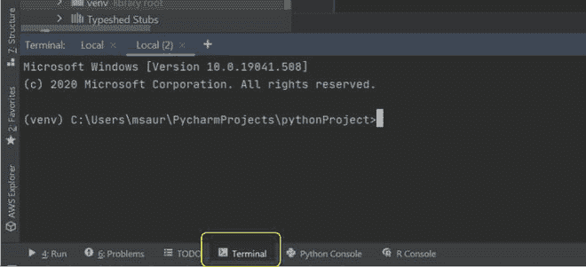
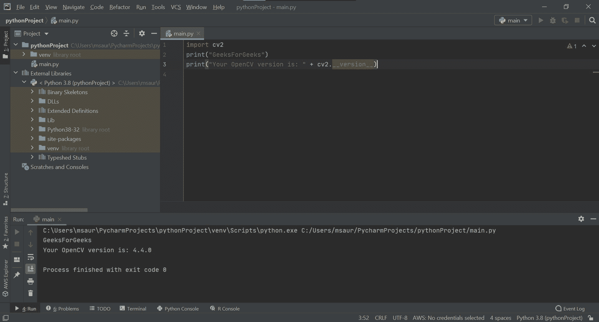

# 使用 PyCharm 环境设置 OpenCV

> 原文:[https://www . geesforgeks . org/setup-opencv-with-py charm-environment/](https://www.geeksforgeeks.org/setup-opencv-with-pycharm-environment/)

#### 导言:

如果你喜欢使用 python 进行图像处理和视频分析，那么你来对地方了。Python 是用于处理视频和图像的关键语言之一。

#### 对 OpenCV 的要求:

*   32 位或 64 位计算机。
*   Windows、macOS 或 Linux。
*   Python 2.7、3.4、3.5 或 3.6。

### PyCharm

PyCharm 是一个跨平台的 IDE，专门用于 Python 的计算机编程。JetBrains 开发的平台主要用于代码分析、图形调试器等……它支持与 Django 的 web 开发，也支持与 Anaconda 的数据科学。


#### 官网:[https://www.jetbrains.com/pycharm/](https://www.jetbrains.com/pycharm/)

### OpenCV

OpenCV(开放源代码计算机视觉)是一个计算机视觉库，包含对图片或视频执行操作的各种功能。它最初由英特尔建造，但后来由威洛·加拉格管理，目前由伊塞兹管理。这是一个跨平台的库，除了 python 之外，它还适用于其他编程语言。


### 在 PyCharm 上导入 OpenCV 的步骤:

**1)** 转到 IDE 窗口底部的终端选项。



**2)**pip(包管理器)也可以用来下载安装 OpenCV。要安装 OpenCV，只需键入以下命令:

## 蟒蛇 3

```
pip install opencv-python
```


**3)** 现在只需在您想要使用图像处理功能的 python 程序中导入 OpenCV。

要检查 OpenCV 是否正确安装，只需在 PyCharm 中运行以下程序来执行版本检查:

## 蟒蛇 3

```
import cv2
print("GeeksForGeeks")
print("Your OpenCV version is: " + cv2.__version__)
```

#### 输出:

```
GeeksForGeeks
Your OpenCV version is: 4.4.0

```

