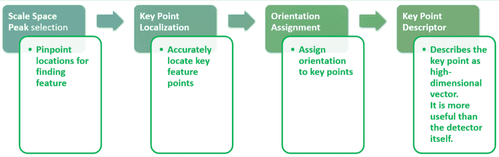
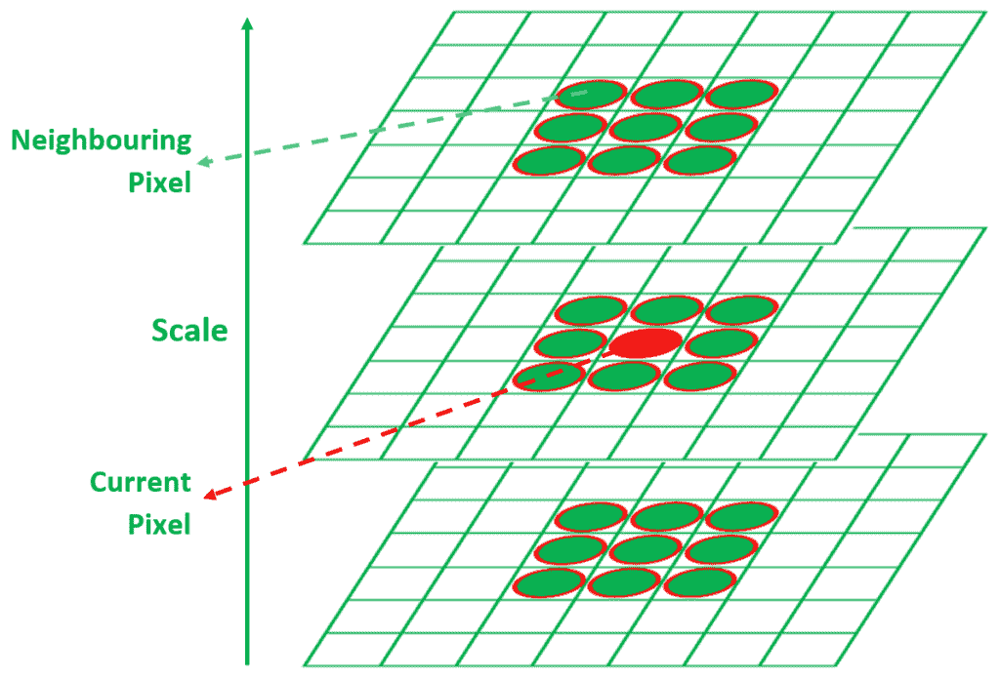
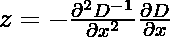
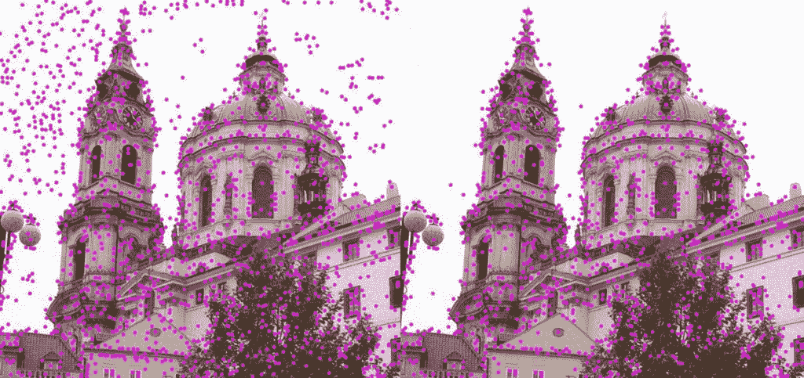
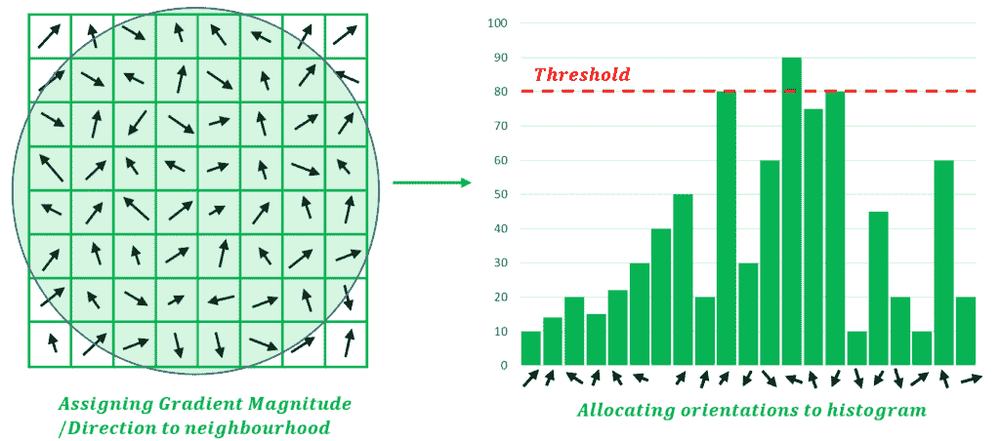

# 使用 Python–OpenCV 的 SIFT 兴趣点检测器

> 原文:[https://www . geesforgeks . org/sift-兴趣点-检测器-使用-python-opencv/](https://www.geeksforgeeks.org/sift-interest-point-detector-using-python-opencv/)

**SIFT(尺度不变傅里叶变换)**检测器用于检测输入图像上的 [**兴趣点**](https://en.wikipedia.org/wiki/Feature_detection_(computer_vision)) 。它允许识别图像中的局部特征，这在以下应用中是必不可少的:

*   图像中的目标识别
*   路径检测和避障算法
*   手势识别、马赛克生成等

与依赖于图像属性(如视点、深度和比例)的 [**哈里斯检测器**](https://www.geeksforgeeks.org/python-corner-detection-with-harris-corner-detection-method-using-opencv/) 不同，SIFT 可以独立于图像的这些属性执行特征检测。这是通过将图像数据转换成**比例不变坐标**来实现的。SIFT 检测器被认为是灵长类视觉系统的近似系统。

### 提取兴趣点的步骤

[](https://media.geeksforgeeks.org/wp-content/uploads/20200517234610/C5BBC774-8499-4561-BDF6-D8D2499773F3.png)

**图 01:** 在 SIFT 检测器中遵循的步骤序列

### 第一阶段:尺度空间峰值选择

尺度空间的概念处理对目标图像应用连续范围的高斯滤波器，使得选择的高斯具有不同的σ参数值。这样得到的图称为**标度空间**。尺度空间峰值选择取决于**空间重合假设**。据此，如果在多个标尺(由标尺空间中的过零点指示)**中的**相同位置检测到边缘，则我们将其分类为实际边缘。**** 

[](https://media.geeksforgeeks.org/wp-content/uploads/20200518221935/F60FA5DE-EF38-4B7E-89D1-CBD432D80CC8.png)

**图 02:** 跨刻度选择峰值。

在 2D 图像中，我们可以利用高斯拉普拉斯的**尺度空间中的局部最大值/最小值来检测兴趣点。**对于给定的 sigma 值，通过挑选潜在的兴趣点并考虑上面级别(具有较高的 sigma)、相同级别和下面级别(具有比当前 sigma 级别更低的 sigma)中的像素，来确定潜在的 SIFT 兴趣点。如果该点是所有这 26 个相邻点的最大值/最小值，则它是潜在的 SIFT 兴趣点——并且它充当兴趣点检测的起点。

### 第二阶段:关键点定位

关键点定位包括细化前一阶段选择的关键点。消除低对比度关键点、不稳定关键点和位于边缘的关键点。这是通过计算前一阶段发现的关键点的 [**拉普拉斯**](http://mathworld.wolfram.com/Laplacian.html) 来实现的。极值计算如下:



在上面的表达式中，D 代表高斯的差值。为了去除不稳定的关键点，计算 *z* 的值，如果 z 处的函数值低于阈值，则排除该点。

[](https://media.geeksforgeeks.org/wp-content/uploads/20200518225323/0261CA10-1DF1-42A2-B3CC-14354F451621.jpg)

**图 03** 关键点定位后关键点的细化

### 第三阶段:给关键点指定方向

为了实现相对于图像旋转不变的检测，需要为关键点计算方向。这是通过考虑关键点的邻域并计算邻域梯度的大小和方向来实现的。基于获得的值，用 36 个面元构建直方图，以表示 360 度的方向(每个面元 10 度)。因此，如果某个点的梯度方向是 67.8 度，则与该点的梯度大小成比例的值被添加到表示 60-70 度的箱中。80%以上的直方图峰值被转换成新的关键点，用于决定原始关键点的方向。

[](https://media.geeksforgeeks.org/wp-content/uploads/20200606191134/8A1FB766-72C5-4CC8-8C25-0AF81A9E2998.png)

图 04:为邻域指定方向并创建方向直方图

### 第四阶段:关键点描述符

最后，对于每个关键点，使用关键点邻域创建描述符。这些描述符用于跨图像匹配关键点。关键点的 16×16 邻域用于定义该关键点的描述符。这个 16×16 的邻域被分成子块。每个这样的子块都是一个不重叠、连续的 4×4 邻域。随后，对于每个子块，类似于“方向分配”中所讨论的，创建一个 8 面元方向。这 128 个面元值(16 个子块*每个块 8 个面元)被表示为矢量，以生成关键点描述符。

**示例:Python 中的 SIFT 检测器**

在同一个目录下运行以下脚本，并使用名为“geeks.jpg”的文件，生成包含兴趣点的“image-with-keypoints.jpg”，这些兴趣点是使用 OpenCV 中的 SIFT 模块检测到的，并使用循环覆盖进行标记。

**下面是实现:**

## 蟒蛇 3

```
# Important NOTE:  Use opencv <= 3.4.2.16 as
# SIFT is no longer available in
# opencv > 3.4.2.16
import cv2

# Loading the image
img = cv2.imread('geeks.jpg')

 # Converting image to grayscale
gray= cv2.cvtColor(img,cv2.COLOR_BGR2GRAY)

# Applying SIFT detector
sift = cv2.xfeatures2d.SIFT_create() 
kp = sift.detect(gray, None)

# Marking the keypoint on the image using circles
img=cv2.drawKeypoints(gray ,
                      kp ,
                      img ,
                      flags=cv2.DRAW_MATCHES_FLAGS_DRAW_RICH_KEYPOINTS)

cv2.imwrite('image-with-keypoints.jpg', img)
```

**输出:**

[](https://media.geeksforgeeks.org/wp-content/uploads/20201205113150/geeks13.jpg)

左边的图像是原始图像，右边的图像显示了图像上各种突出显示的兴趣点