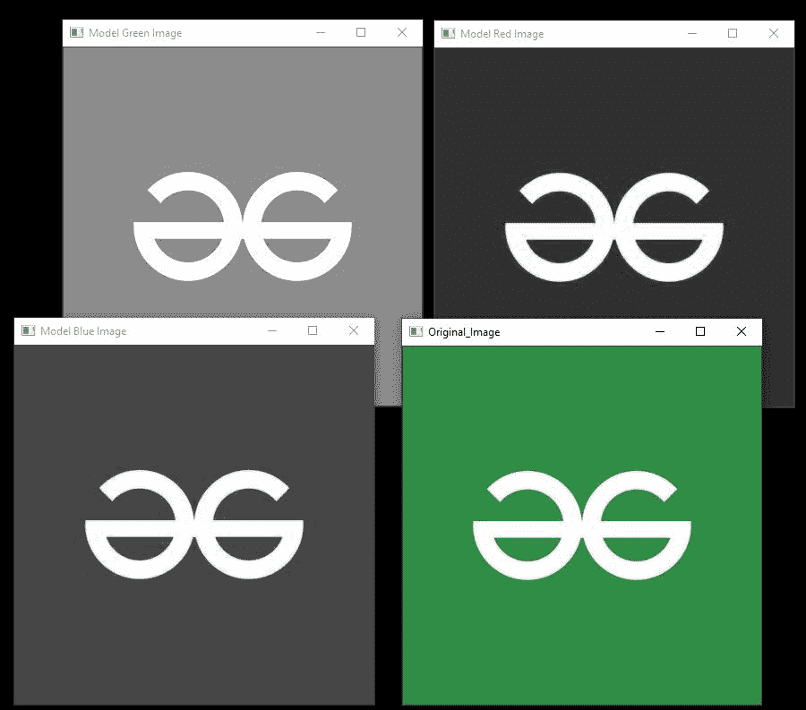
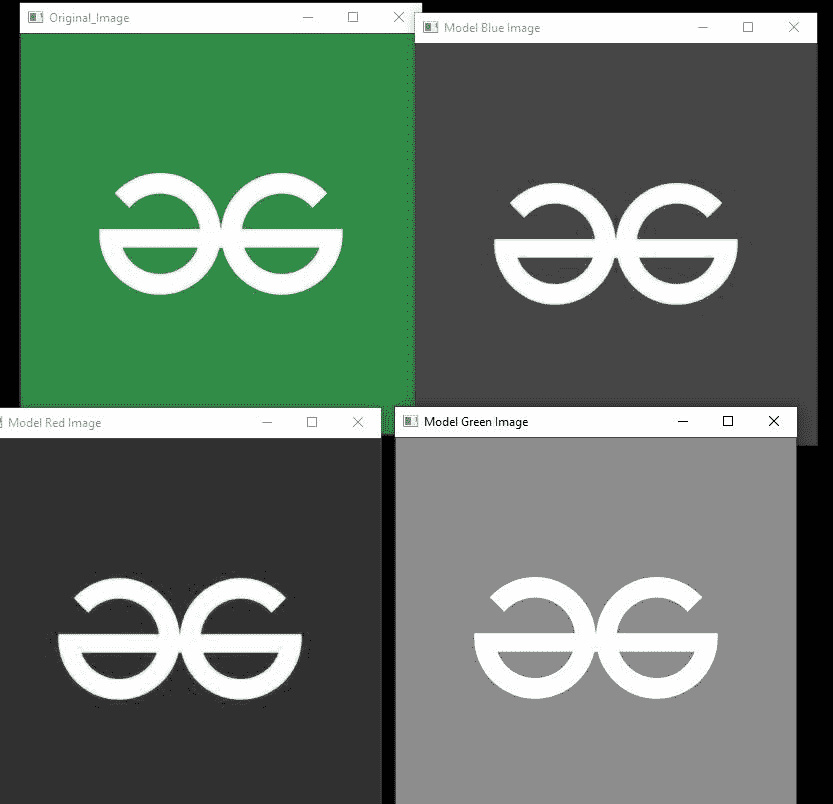

# 使用 Python-OpenCV 拆分和合并通道

> 原文:[https://www . geeksforgeeks . org/用 python 拆分和合并频道-opencv/](https://www.geeksforgeeks.org/splitting-and-merging-channels-with-python-opencv/)

在本文中，我们将学习如何使用 Python 中的 OpenCV 将多通道图像拆分成单独的通道，并将这些单独的通道组合成多通道图像。

为此，我们分别使用 **cv2.split()和 cv2.merge()** 函数。

**使用的图像:**


## **分裂通道**

cv2.split()用于将彩色/多通道图像分割成独立的单通道图像。就性能(时间)而言，cv2.split()是一个昂贵的操作。阵列输出向量的顺序取决于输入图像通道的顺序。

> **语法:** cv2.split(m[，mv])
> 
> **参数:**
> 
> *   **m:** 输入多通道阵列
> *   **mv:** 数组的输出向量

**示例:**

## 蟒蛇 3

```
# Python program to explain splitting of channels

# Importing cv2
import cv2 

# Reading the image using imread() function
image = cv2.imread('img.jpg')

# Displaying the original BGR image
cv2.imshow('Original_Image', image)

# Using cv2.split() to split channels of coloured image 
b,g,r = cv2.split(image)

# Displaying Blue channel image
# Blue colour is highlighted the most
cv2.imshow("Model Blue Image", b)

# Displaying Green channel image
# Green colour is highlighted the most
cv2.imshow("Model Green Image", g)

# Displaying Red channel image
# Red colour is highlighted the most
cv2.imshow("Model Red Image", r)

# Waits for user to press any key
cv2.waitKey(0)
```

**输出:**



## **合并频道**

**cv2.merge()** 用于将多个单通道图像合并成一个彩色/多通道图像。

> **语法:** cv2.merge(mv[，dst])
> 
> **参数:**
> 
> *   **mv:** 待合并矩阵的输入向量。所有矩阵必须具有相同的大小。
> *   **dst:** 输出 mv[0]大小的多通道阵列。通道数将等于矩阵阵列中通道的总数。

**示例:**

## 蟒蛇 3

```
# Python program to explain Merging of Channels

# Importing cv2
import cv2

# Reading the BGR image using imread() function
image = cv2.imread("img.jpg")

# Splitting the channels first to generate different 
# single

# channels for merging as we don't have separate
# channel images
b, g, r = cv2.split(image)

# Displaying Blue channel image
cv2.imshow("Model Blue Image", b)

# Displaying Green channel image
cv2.imshow("Model Green Image", g)

# Displaying Red channel image
cv2.imshow("Model Red Image", r)

# Using cv2.merge() to merge Red, Green, Blue Channels

# into a coloured/multi-channeled image
image_merge = cv2.merge([r, g, b])

# Displaying Merged RGB image
cv2.imshow("RGB_Image", image_merge)

# Waits for user to press any key
cv2.waitKey(0)
```

**输出:**

