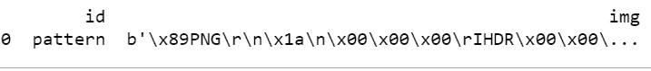
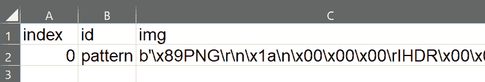

# 用 Python 在 SQLite3 中存储 OpenCV 镜像

> 原文:[https://www . geesforgeks . org/storing-opencv-image-in-SQLite 3-with-python/](https://www.geeksforgeeks.org/storing-opencv-image-in-sqlite3-with-python/)

**OpenCV** 是一个巨大的开源库，用于计算机视觉、机器学习和图像处理。OpenCV 支持多种编程语言，如 Python、C++、Java 等。它可以处理图像和视频来识别物体、人脸，甚至是人类的笔迹。当它与各种库集成时，如 Numpy。这是一个高度优化的数值操作库，那么你的武器库中的武器数量会增加，也就是说，你可以在 Numpy 中做的任何操作都可以与 OpenCV 相结合。

**SQLite** 是一个自包含、高可靠性、嵌入式、全功能、公共域的 SQL 数据库引擎。它是万维网上使用最多的数据库引擎。Python 有一个用来访问 SQLite 数据库的库，名为 sqlite3，用于处理这个自 2.5 版本以来就包含在 Python 包中的数据库。

在本文中，我们将使用 Python 在 sqlite3 数据库中存储一个 OpenCV 映像。让我们以这张图片“gfg.png”为例:


### **分步方法:**

*   首先导入必要的库。

## 蟒蛇 3

```
# import necessary libraries
import cv2
import sqlite3
import pandas as pd
```

*   连接到 sqlite3 数据库。

## 蟒蛇 3

```
# connect to database
conn = sqlite3.connect("gfg.db")
```

*   创建光标对象并获取当前光标位置:

## 蟒蛇 3

```
cursorObject = conn.cursor()
```

*   创建一个新表并将其提交给数据库。

## 蟒蛇 3

```
# create a table
cursorObject.execute("CREATE TABLE imgfg(id string, img blob)")
conn.commit()
```

*   在读取模式下用 Open()打开图像。

## 蟒蛇 3

```
im = open( 'gfg.png', 'rb' ).read()
```

*   将图像插入表格。

## 蟒蛇 3

```
# open the image you want to store in read more
im = open('gfg.png', 'rb').read()
conn.execute("INSERT INTO imgfg VALUES(?,?)",
             ("pattern", sqlite3.Binary(im)))
```

上面的语句打开图像，然后通过简单地解释二进制 BLOB 上下文将其转换为模式。最后，它将该模式存储到表中。

*   提交到数据库。

## 蟒蛇 3

```
conn.commit()
```

*   将 sqlite3 表存储为带有熊猫的 CSV 文件。

## 蟒蛇 3

```
# Use pandas to create a dataframe from
# the table and save it as a csv
table = pd.read_sql_query("SELECT * FROM imgfg", conn)
table.to_csv("imgfg" + '.csv', index_label='index')
```

内容存储在*表*变量中，然后转换成 CSV 文件保存到系统中。

*   显示表格的内容。

## 蟒蛇 3

```
# display table
print(table)
```

**下面是完整的程序:**

## 蟒蛇 3

```
# import necessary libraries
import cv2
import sqlite3
import pandas as pd

# connect to database
conn = sqlite3.connect("gfg.db")
cursorObject = conn.cursor()

# create a table
cursorObject.execute("CREATE TABLE imgfg(id string, img blob)")
conn.commit()

# open the image you want to store in read more
im = open('gfg.png', 'rb').read()
conn.execute("INSERT INTO imgfg VALUES(?,?)",
             ("pattern", sqlite3.Binary(im)))
conn.commit()

# Use pandas to create a dataframe from
# the table and save it as a csv
table = pd.read_sql_query("SELECT * FROM imgfg", conn)
table.to_csv("imgfg" + '.csv', index_label='index')

# display table
print(table)
```

**输出:**



**生成的 CSV:**

