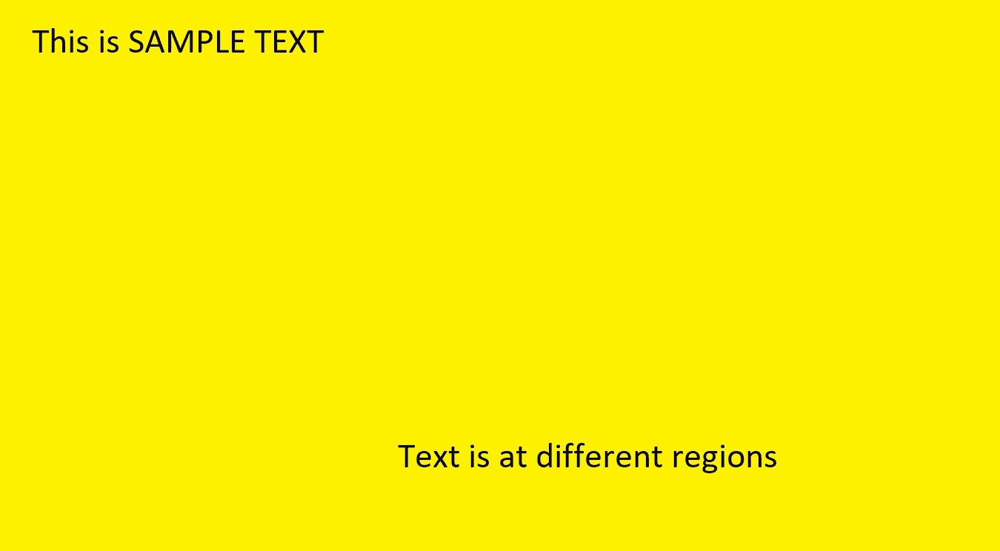
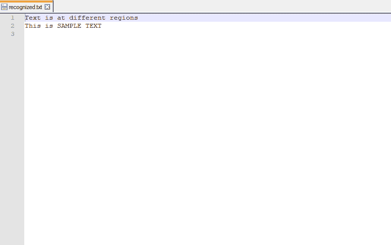
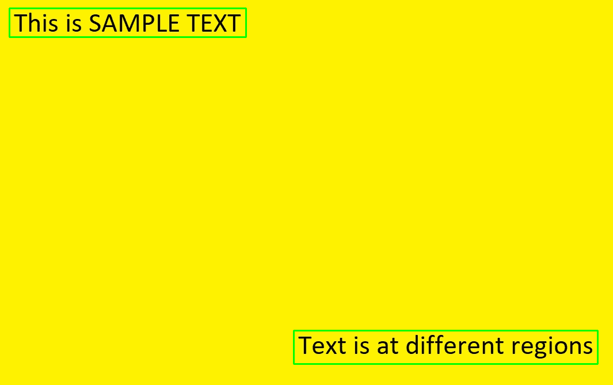

# 使用 OpenCV 和 OCR 进行文本检测和提取

> 原文:[https://www . geesforgeks . org/text-detection-and-extraction-use-opencv-and-ocr/](https://www.geeksforgeeks.org/text-detection-and-extraction-using-opencv-and-ocr/)

**OpenCV** (开源计算机视觉)是一个主要针对实时计算机视觉的编程函数库。python 中的 [OpenCV](https://www.geeksforgeeks.org/opencv-python-tutorial/) 有助于处理图像并应用各种功能，如调整图像大小、像素操作、对象检测等。在本文中，我们将学习如何使用轮廓来检测图像中的文本，并将其保存到文本文件中。
**所需安装:**

```py
pip install opencv-python
pip install pytesseract
```

[OpenCV](https://www.geeksforgeeks.org/opencv-python-tutorial/) 包用于读取图像并执行某些图像处理技术。python-宇宙魔方是谷歌宇宙魔方-光学字符识别引擎的包装器，用于从图像中识别文本。
从[这个链接](https://github.com/tesseract-ocr/tesseract/releases)下载宇宙魔方可执行文件。
**方法:**
必要的导入后，使用 opencv 的 **imread** 功能读取样本图像。

## 对图像应用图像处理:

图像的色彩空间首先被改变并存储在变量中。对于颜色转换，我们使用函数 cv2.cvtColor(input_image，flag)。第二个参数标志决定了转换的类型。我们可以在 **cv2 中选择。COLOR_BGR2GRAY** 和 **cv2。COLOR_BGR2HSV** 。cv2。COLOR_BGR2GRAY 帮助我们将一个 RGB 图像转换成灰度图像和 cv2。颜色 _BGR2HSV 用于将 RGB 图像转换为 HSV(色调、饱和度、值)颜色空间图像。这里，我们使用 **cv2。颜色 _BGR2GRAY** 。使用 cv2.threshold 函数对转换后的图像应用阈值。
阈值有 3 种类型:

1.  简单阈值化
2.  自适应阈值化
3.  大津二值化

有关阈值的更多信息，请参考使用 OpenCV 的[阈值技术。
cv2.threshold()有 4 个参数，第一个参数是颜色空间变化的图像，随后是最小阈值、最大阈值和需要应用的阈值类型。](https://www.geeksforgeeks.org/python-thresholding-techniques-using-opencv-set-1-simple-thresholding/) 

## 要获得矩形结构:

cv2.getStructuringElement()用于定义椭圆、圆形、矩形等结构元素。这里，我们使用矩形结构元素(cv2。MORPH_RECT)。cv2.getStructuringElement 需要额外的**大小的内核**参数。更大的内核会将更大的文本块组合在一起。选择正确的核后，使用 cv2 . expansion 函数对图像进行膨胀。膨胀使文本组被更准确地检测，因为它**膨胀**(扩展)一个文本块。

## 寻找轮廓:

cv2 . find 等高线()用于查找扩张图像中的等高线。cv . find 等高线()中有三个参数:源图像、等高线检索模式和等高线逼近方法。
该函数返回等高线和层次。等高线是图像中所有等高线的 python 列表。每个轮廓都是对象中边界点的(x，y)坐标的 Numpy 数组。轮廓通常用于从黑色背景中找到白色对象。应用所有上述图像处理技术，使得轮廓可以检测图像的文本块的边界边缘。文本文件以写模式打开并刷新。打开该文本文件，保存光学字符识别输出的文本。

## 应用光学字符识别:

循环遍历每个轮廓，并使用函数 cv2.boundingRect()获取 x 和 y 坐标以及宽度和高度。然后使用函数 cv2.rectangle()借助获得的 x 和 y 坐标以及宽度和高度在图像中绘制一个矩形。cv2.rectangle()中有 5 个参数，第一个参数指定输入图像，后面是 x 和 y 坐标(矩形的起始坐标)、矩形的结束坐标(x+w，y+h)、RGB 值中矩形的边界颜色和边界的大小。现在裁剪矩形区域，然后将其传递给宇宙魔方，从图像中提取文本。然后我们在追加模式下打开创建的文本文件，追加获得的文本并关闭文件。
用于代码的样本图像:



## 蟒蛇 3

```py
# Import required packages
import cv2
import pytesseract

# Mention the installed location of Tesseract-OCR in your system
pytesseract.pytesseract.tesseract_cmd = 'System_path_to_tesseract.exe'

# Read image from which text needs to be extracted
img = cv2.imread("sample.jpg")

# Preprocessing the image starts

# Convert the image to gray scale
gray = cv2.cvtColor(img, cv2.COLOR_BGR2GRAY)

# Performing OTSU threshold
ret, thresh1 = cv2.threshold(gray, 0, 255, cv2.THRESH_OTSU | cv2.THRESH_BINARY_INV)

# Specify structure shape and kernel size.
# Kernel size increases or decreases the area
# of the rectangle to be detected.
# A smaller value like (10, 10) will detect
# each word instead of a sentence.
rect_kernel = cv2.getStructuringElement(cv2.MORPH_RECT, (18, 18))

# Applying dilation on the threshold image
dilation = cv2.dilate(thresh1, rect_kernel, iterations = 1)

# Finding contours
contours, hierarchy = cv2.findContours(dilation, cv2.RETR_EXTERNAL,
                                                 cv2.CHAIN_APPROX_NONE)

# Creating a copy of image
im2 = img.copy()

# A text file is created and flushed
file = open("recognized.txt", "w+")
file.write("")
file.close()

# Looping through the identified contours
# Then rectangular part is cropped and passed on
# to pytesseract for extracting text from it
# Extracted text is then written into the text file
for cnt in contours:
    x, y, w, h = cv2.boundingRect(cnt)

    # Drawing a rectangle on copied image
    rect = cv2.rectangle(im2, (x, y), (x + w, y + h), (0, 255, 0), 2)

    # Cropping the text block for giving input to OCR
    cropped = im2[y:y + h, x:x + w]

    # Open the file in append mode
    file = open("recognized.txt", "a")

    # Apply OCR on the cropped image
    text = pytesseract.image_to_string(cropped)

    # Appending the text into file
    file.write(text)
    file.write("\n")

    # Close the file
    file.close
```

**输出:**
最终文本文件:



检测到的文本块:

