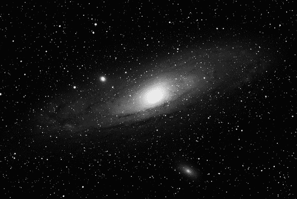
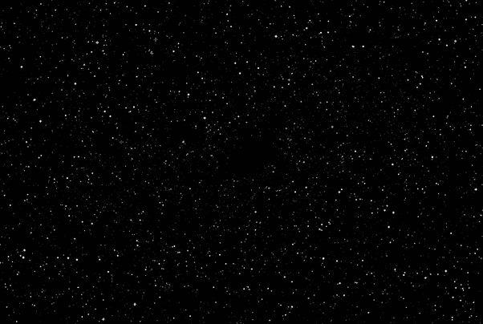
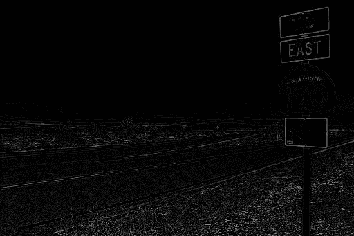

# 使用 Python-OpenCV 的高帽和黑帽变换

> 原文:[https://www . geesforgeks . org/top-hat-and-black-hat-transform-use-python-opencv/](https://www.geeksforgeeks.org/top-hat-and-black-hat-transform-using-python-opencv/)

在形态学和数字图像处理中，top-hat 和 black-hat 变换是用于从给定图像中提取小元素和细节的操作。这两种类型的变换，其中，顶帽变换被定义为输入图像和由某种结构元素打开的图像之间的差异，而黑帽变换被定义为关闭图像和输入图像之间的差异。这些变换用于各种图像处理任务，如特征提取、背景均衡、图像增强等。

这里我们将使用[打开](https://www.geeksforgeeks.org/python-morphological-operations-in-image-processing-opening-set-1/)和[关闭](https://www.geeksforgeeks.org/python-morphological-operations-in-image-processing-closing-set-2/)的形态操作。

## 高帽和黑帽的区别

礼帽滤镜用于增强黑暗背景中感兴趣的明亮物体。黑帽操作被用来做相反的事情，在明亮的背景中增强感兴趣的深色物体。
**例 1:** 顶帽变换

**使用的图像:**



```py
# Importing OpenCV 
import cv2

# Getting the kernel to be used in Top-Hat
filterSize =(3, 3)
kernel = cv2.getStructuringElement(cv2.MORPH_RECT, 
                                   filterSize)

# Reading the image named 'input.jpg'
input_image = cv2.imread("testing.jpg")
input_image = cv2.cvtColor(input_image, cv2.COLOR_BGR2GRAY)

# Applying the Top-Hat operation
tophat_img = cv2.morphologyEx(input_image, 
                              cv2.MORPH_TOPHAT,
                              kernel)

cv2.imshow("original", input_image)
cv2.imshow("tophat", tophat_img)
cv2.waitKey(5000)
```

**输出:**



正如你在上面的图片中所看到的，非常小的细节被增强了，并且使用了 Top-Hat 操作。因此，当输入在暗背景上呈现为亮像素时，观察输入的次要细节是有用的。

**例 2:** 黑帽变换

**输入图像:**


```py
# Importing OpenCV and numpy
import cv2

# Defining the kernel to be used in Top-Hat
filterSize =(3, 3)
kernel = cv2.getStructuringElement(cv2.MORPH_RECT,
                                   filterSize)

# Reading the image named 'input.jpg'
input_image = cv2.imread("testing.jpg")
input_image = cv2.cvtColor(input_image, cv2.COLOR_BGR2GRAY)

# Applying the Black-Hat operation
tophat_img = cv2.morphologyEx(input_image, 
                              cv2.MORPH_BLACKHAT,
                              kernel)

cv2.imshow("original", input_image)
cv2.imshow("tophat", tophat_img)
cv2.waitKey(5000)
```

**输出:**


在此图像中，由于对输入图像应用了黑帽变换，所有在暗背景上为白色的对象都被高亮显示。