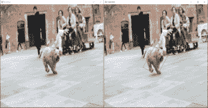
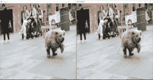
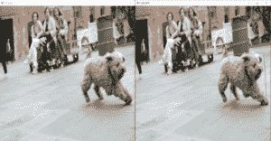

# 使用 OpenCV 使用 Camshift 跟踪对象

> 原文:[https://www . geesforgeks . org/track-objects-with-camshift-using-opencv/](https://www.geeksforgeeks.org/track-objects-with-camshift-using-opencv/)

OpenCV 是用于计算机视觉、机器学习和图像处理的巨大开源库，现在它在实时操作中发挥着重要作用，这在当今的系统中非常重要。通过使用它，人们可以处理图像和视频来识别物体、人脸，甚至是人类的笔迹。

Camshift 或者我们可以说 Continuously Adaptive Meanshift 是 Meanshift 算法的增强版本，它为模型提供了更高的精度和鲁棒性。在 Camshift 算法的帮助下，当跟踪窗口试图收敛时，窗口的大小会不断更新。跟踪是通过使用对象的颜色信息来完成的。此外，它为对象跟踪提供了最佳的跟踪窗口。它首先应用 meanshift，然后将窗口大小更新为:

![ \[s = 2\times\sqrt{\frac{M_{00}}{256}}\] ](img/77f929c169f7a379ff9e532990913ec2.png "Rendered by QuickLaTeX.com")

然后，它计算最适合它的椭圆，并再次对新缩放的搜索窗口和前一个窗口应用均值漂移。这个过程一直持续到达到要求的精度。

**注:**关于 meanshift 的更多信息，请参考 [Python OpenCV: Meanshift](http://geeksforgeeks.org/python-opencv-meanshift/)

下面是实现。

```py
import numpy as np
import cv2 as cv

# Read the input video
cap = cv.VideoCapture('sample.mp4')

# take first frame of the
# video
ret, frame = cap.read()

# setup initial region of
# tracker
x, y, width, height = 400, 440, 150, 150
track_window = (x, y, 
                width, height)

# set up the Region of
# Interest for tracking
roi = frame[y:y + height,
            x : x + width]

# convert ROI from BGR to
# HSV format
hsv_roi = cv.cvtColor(roi,
                      cv.COLOR_BGR2HSV)

# perform masking operation
mask = cv.inRange(hsv_roi, 
                  np.array((0., 60., 32.)),
                  np.array((180., 255., 255)))

roi_hist = cv.calcHist([hsv_roi], 
                       [0], mask,
                       [180], 
                       [0, 180])

cv.normalize(roi_hist, roi_hist,
             0, 255, cv.NORM_MINMAX)

# Setup the termination criteria, 
# either 15 iteration or move by
# atleast 2 pt
term_crit = ( cv.TERM_CRITERIA_EPS | 
             cv.TERM_CRITERIA_COUNT, 15, 2)

while(1):

    ret, frame = cap.read()

    # Resize the video frames.
    frame = cv.resize(frame, 
                      (720, 720), 
                      fx = 0, fy = 0,
                      interpolation = cv.INTER_CUBIC)

    cv.imshow('Original', frame)

    # perform thresholding on 
    # the video frames
    ret1, frame1 = cv.threshold(frame,
                                180, 155,
                                cv.THRESH_TOZERO_INV)

    # convert from BGR to HSV
    # format.
    hsv = cv.cvtColor(frame1, 
                      cv.COLOR_BGR2HSV)

    dst = cv.calcBackProject([hsv], 
                             [0], 
                             roi_hist, 
                             [0, 180], 1)

    # apply Camshift to get the 
    # new location
    ret2, track_window = cv.CamShift(dst,
                                     track_window,
                                     term_crit)

    # Draw it on image
    pts = cv.boxPoints(ret2)

    # convert from floating
    # to integer
    pts = np.int0(pts)

    # Draw Tracking window on the
    # video frame.
    Result = cv.polylines(frame, 
                          [pts], 
                          True, 
                          (0, 255, 255), 
                          2)

    cv.imshow('Camshift', Result)

    # set ESC key as the
    # exit button.
    k = cv.waitKey(30) & 0xff

    if k == 27:
        break

# Release the cap object
cap.release()

# close all opened windows
cv.destroyAllWindows()
```

**输出:**





