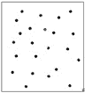
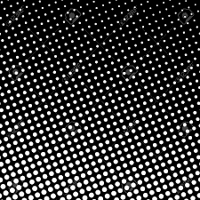

# 使用 OpenCV | Python 进行黑白点检测

> 原文:[https://www . geesforgeks . org/黑白点检测-使用-opencv-python/](https://www.geeksforgeeks.org/white-and-black-dot-detection-using-opencv-python/)

使用 Python 进行图像处理是当今世界最热门的话题之一。但是图像处理有点复杂，初学者对第一种方法感到厌烦。所以在本文中，我们有一个非常基础的图像处理 python 程序，使用 OpenCV 函数(`cv2.imread, cv2.threshold, cv2.findContours, cv2.contourArea`)来统计白色表面的黑点和黑色表面的白点。

## 计算白色表面上的黑点–

首先我们需要导入 OpenCV 库。所有关于图像处理的功能都存在于这个库中。为了存储图像的路径，我们将在可变路径中处理。

```py
import cv2
```

```py
# path ="C:/Users/Personal/Downloads/black dot.jpg"
path ="black dot.jpg"
```

输入图像–


以灰度模式加载图像。通过灰度模式，图像被转换为由灰色阴影组成的黑白图像。

```py
gray = cv2.imread(path, 0)
```

功能`cv2.threshold` 的工作原理是，如果像素值大于阈值，则为其分配一个值(可以是白色)，否则为其分配另一个值(可以是黑色)。第一个参数是源图像，它应该是灰度图像(以前做过)。第二个参数是阈值，用于对像素值进行分类。对于阈值，只需传递零。然后算法找到最佳阈值，并返回你作为第二个输出，th。如果不使用大津阈值，这与您使用的阈值相同。

```py
# threshold
th, threshed = cv2.threshold(gray, 100, 255,
       cv2.THRESH_BINARY_INV|cv2.THRESH_OTSU)
```

轮廓可以简单地解释为连接所有连续点(沿边界)的曲线，具有相同的颜色或强度。轮廓是用于形状分析和物体检测和识别的有用工具。轮廓为使用二值图像提供了更好的准确性。`cv2.findContours()`函数中有三个自变量，第一个是源图像，第二个是轮廓检索方式，第三个是轮廓逼近法。它输出轮廓和层次。等高线是图像中所有等高线的 Python 列表。每个单独的轮廓是对象边界点的(x，y)坐标的 Numpy 数组。

它主要连接图像的黑点进行计数–

```py
# findcontours
cnts = cv2.findContours(threshed, cv2.RETR_LIST,
                    cv2.CHAIN_APPROX_SIMPLE)[-2]
```

`cv2.contourArea()`可以计算出物体的轮廓面积。这里的对象是黑点。当它得到一个黑点时，它将计算面积，如果它满足最小面积被算作一个点的条件，那么它将把它的面积值推到列表 xcnts。

```py
# filter by area
s1 = 3
s2 = 20
xcnts = []
for cnt in cnts:
    if s1<cv2.contourArea(cnt) <s2:
        xcnts.append(cnt)
```

最后，我们不需要这些区域。如果它被认为是一个点，那么它的面积包括在列表 xcnts 中。所以如果我们计算列表的长度，我们会得到点的数量。

```py
print("\nDots number: {}".format(len(xcnts)))
```

**输出:**

```py
23
```

## 计算黑色背景上的白点–

现在为了计算白点，我们需要稍微改变一下阈值。我们必须使用 c `v2.THRESH_BINARY`而不是`cv2.THRESH_BINARY_INV`，因为我们在黑色表面上计算白色值。其他过程都是一样的。我们可以更改 *s1* 和 *s2* 的值来检查最佳结果。

输入图像:


```py
import cv2
path ="white dot.png"

# reading the image in grayscale mode
gray = cv2.imread(path, 0)

# threshold
th, threshed = cv2.threshold(gray, 100, 255, 
          cv2.THRESH_BINARY|cv2.THRESH_OTSU)

# findcontours
cnts = cv2.findContours(threshed, cv2.RETR_LIST, 
                    cv2.CHAIN_APPROX_SIMPLE)[-2]

# filter by area
s1 = 3
s2 = 20
xcnts = []

for cnt in cnts:
    if s1<cv2.contourArea(cnt) <s2:
        xcnts.append(cnt)

# printing output
print("\nDots number: {}".format(len(xcnts)))
```

**输出:**

```py
583
```

**参考文献:**
[https://docs . opencv . org/3.0-beta/doc/py _ tutorials/py _ imgproc/py _ thresholding/py _ thresholding . html](https://docs.opencv.org/3.0-beta/doc/py_tutorials/py_imgproc/py_thresholding/py_thresholding.html)
[https://docs . opencv . org/3 . 1 . 0/D4/d73/tutorial _ py _ contours _ begin . html](https://docs.opencv.org/3.1.0/d4/d73/tutorial_py_contours_begin.html)