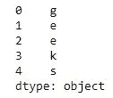
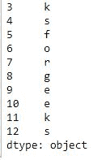
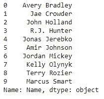
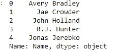
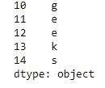
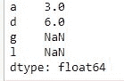
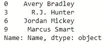

# 访问熊猫系列的元素

> 原文:[https://www . geeksforgeeks . org/access-a-elements-of-a-pandas-series/](https://www.geeksforgeeks.org/accessing-elements-of-a-pandas-series/)

[Pandas Series](https://www.geeksforgeeks.org/python-pandas-series/) 是一个一维标记数组，能够保存任何类型的数据(整数、字符串、浮点、python 对象等)。).标签不必是唯一的，但必须是可散列的类型。序列中的元素可以像数组中的元素一样被访问。可以通过两种方式访问系列元素–

*   **Use location to access elements from a series.**
***   Use labels (indexes)**

访问元素

本文中，我们使用的是“`nba.csv`”文件，要下载 CSV，点击[这里](https://media.geeksforgeeks.org/wp-content/uploads/nba.csv)。

### 从具有位置的序列中访问元素

为了访问序列元素引用了索引号。使用索引操作符 **[ ]** 访问序列中的元素。索引必须是整数。
为了从一个序列中访问多个元素，我们使用了 Slice 操作。使用冒号( **:** )在 Series 上执行切片操作。从开始到一个范围打印元素使用`**[:Index]**`，从最终使用 `**[:-Index]**`打印元素，从特定索引到结束使用`**[Index:]**`，在一个范围内打印元素使用【开始索引:结束索引】，使用切片操作打印整个系列，使用`**[:]**`。此外，要以相反的顺序打印整个系列，请使用 `**[::-1]**`。

**代码#1:** 访问序列的第一个元素

```py
# import pandas and numpy 
import pandas as pd
import numpy as np

# creating simple array
data = np.array(['g', 'e', 'e', 'k', 's', 'f', 'o', 'r', 'g', 'e', 'e', 'k', 's'])
ser = pd.Series(data)

# retrieve the first element
print(ser[0])
```

**输出:**

```py
g

```

**代码#2:** 访问系列的前 5 个元素

```py
# import pandas and numpy 
import pandas as pd
import numpy as np

# creating simple array
data = np.array(['g', 'e', 'e', 'k', 's', 'f', 'o', 'r', 'g', 'e', 'e', 'k', 's'])
ser = pd.Series(data)

# retrieve the first element
print(ser[:5])
```

**输出:**



**代码#3:** 访问系列的最后 10 个元素

```py
# import pandas and numpy 
import pandas as pd
import numpy as np

# creating simple array
data = np.array(['g', 'e', 'e', 'k', 's', 'f', 'o', 'r', 'g', 'e', 'e', 'k', 's'])
ser = pd.Series(data)

# retrieve the first element
print(ser[-10:])
```

**输出:**



**代码#4:** 访问`nba.csv`文件中系列的前 5 个元素

```py
# importing pandas module  
import pandas as pd  

# making data frame  
df = pd.read_csv("nba.csv")  

ser = pd.Series(df['Name']) 
ser.head(10) 
```


现在我们访问系列的前 5 个元素

```py
# get first five names 
ser[:5] 
```

**输出:**



### 使用标签(索引)访问元素

为了访问序列中的元素，我们必须通过索引标签设置值。系列就像一个固定大小的字典，因为你可以通过索引标签获取和设置值。

**代码#1:** 使用索引标签访问单个元素

```py
# import pandas and numpy 
import pandas as pd
import numpy as np

# creating simple array
data = np.array(['g', 'e', 'e', 'k', 's', 'f', 'o', 'r', 'g', 'e', 'e', 'k', 's'])
ser = pd.Series(data, index =[10, 11, 12, 13, 14, 15, 16, 17, 18, 19, 20, 21, 22])

# accessing a element using index element
print(ser[16])
```

**输出:**

```py
o

```

**代码#2:** 使用索引标签访问多元素

```py
# import pandas and numpy 
import pandas as pd
import numpy as np

# creating simple array
data = np.array(['g', 'e', 'e', 'k', 's', 'f', 'o', 'r', 'g', 'e', 'e', 'k', 's'])
ser = pd.Series(data, index =[10, 11, 12, 13, 14, 15, 16, 17, 18, 19, 20, 21, 22])

# accessing a multiple element using 
# index element
print(ser[[10, 11, 12, 13, 14]])
```

**输出:**



**代码#3:** 通过提供索引的标签来访问多个元素

```py
# importing pandas and numpy  
import pandas as pd  
import numpy as np 

ser = pd.Series(np.arange(3, 9), index =['a', 'b', 'c', 'd', 'e', 'f']) 

print(ser[['a', 'd', 'g', 'l']])
```

**输出:**



**代码#4:** 使用`nba.csv`文件中的索引标签访问多个元素

```py
# importing pandas module  
import pandas as pd  

# making data frame  
df = pd.read_csv("nba.csv")  

ser = pd.Series(df['Name']) 
ser.head(10) 
```


现在我们使用索引标签访问一个多元素

```py
ser[[0, 3, 6, 9]] 
```

**输出:**

