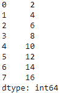
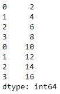

# 将一个熊猫系列添加到另一个熊猫系列

> 原文:[https://www . geesforgeks . org/add-a-pandas-series-to-other-pandas-series/](https://www.geeksforgeeks.org/add-a-pandas-series-to-another-pandas-series/)

让我们看看如何用 Python 将熊猫系列添加到另一个系列中。这可以通过两种方式实现:

*   [追加()](https://www.geeksforgeeks.org/python-pandas-series-append/)
*   [concat()](https://pandas.pydata.org/pandas-docs/stable/reference/api/pandas.concat.html)

**方法 1 :** 使用`append()`功能。它将一个序列对象追加到另一个序列对象的末尾，并返回追加的序列。

```py
# importing the module
import pandas as pd

# create 2 series objects
series_1 = pd.Series([2, 4, 6, 8])
series_2 = pd.Series([10, 12, 14, 16])

# adding series_2 to series_1 using the append() function
series_1 = series_1.append(series_2, ignore_index = True)

# displaying series_1
print(series_1)
```

**输出:**


**方法 2 :** 使用`concat()`功能。它将待连接的系列对象列表作为参数，并返回一个连接的系列。

```py
# importing the module
import pandas as pd

# create 2 series objects
series_1 = pd.Series([2, 4, 6, 8])
series_2 = pd.Series([10, 12, 14, 16])

# adding series_2 to series_1 using the concat() function
series_1 = pd.concat([series_1, series_2])

# displaying series_1
print(series_1)
```

**输出:**
