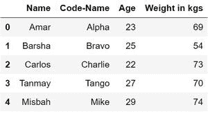

# 在熊猫

中为数据框添加列名

> 原文:[https://www . geesforgeks . org/add-column-name-to-data frame-in-pandas/](https://www.geeksforgeeks.org/add-column-names-to-dataframe-in-pandas/)

让我们看看如何在 Pandas 中为数据框列添加名称。

**创建数据帧:**

```py
# importing the pandas library
import pandas as pd

# creating lists
l1 =["Amar", "Barsha", "Carlos", "Tanmay", "Misbah"]
l2 =["Alpha", "Bravo", "Charlie", "Tango", "Mike"]
l3 =[23, 25, 22, 27, 29]
l4 =[69, 54, 73, 70, 74]

# creating the DataFrame
team = pd.DataFrame(list(zip(l1, l2, l3, l4))) 

# displaying the DataFrame
print(team)
```

**输出:**

[](https://media.geeksforgeeks.org/wp-content/uploads/20200712151207/Data-200x173.jpg)

这里我们可以看到数据框中的列是未命名的。

**向数据框添加列名:**我们可以使用其`columns` 属性向现有数据框添加列。

```py
# adding column name to the respective columns
team.columns =['Name', 'Code', 'Age', 'Weight']

# displaying the DataFrame
print(team)
```

**输出:**

[](https://media.geeksforgeeks.org/wp-content/uploads/20200712151004/Data-300x216.jpg)

现在数据框有了列名。

**重命名数据框的列名:**我们可以使用`rename()`函数重命名数据框的列。

```py
# reanming the DataFrame columns
team.rename(columns = {'Code':'Code-Name', 
                       'Weight':'Weight in kgs'}, 
            inplace = True)

# displaying the DataFrame
print(team)
```

**输出:**

[](https://media.geeksforgeeks.org/wp-content/uploads/20200712151310/22-300x168.jpg)

我们可以看到列的名称已经改变。