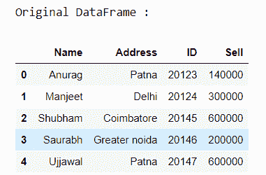
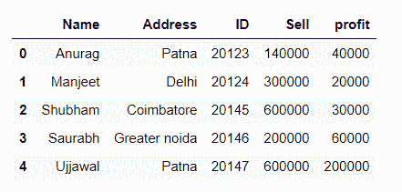
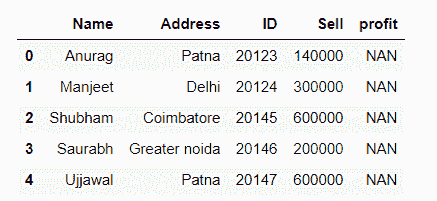
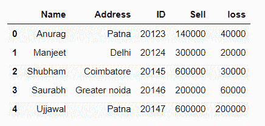
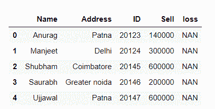
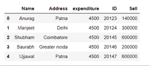

# 用默认值

为熊猫数据框添加列

> 原文:[https://www . geesforgeks . org/add-column-to-pandas-data frame-带默认值/](https://www.geeksforgeeks.org/add-column-to-pandas-dataframe-with-a-default-value/)

用默认值向熊猫数据框添加列的三种方法。

*   利用熊猫。DataFrame.assign(**kwargs)
*   使用[]运算符
*   利用熊猫。DataFrame.insert()

## 使用熊猫。DataFrame.assign(**kwargs)

它将新列分配给数据框，并将包含所有现有列的新对象返回给新对象。重新分配的现有列将被覆盖。

> **语法:**熊猫。DataFrame.assign(**kwargs)
> 
> **参数:** **kwargsdict of {str: callable 或 Series}
> 
> **返回:**数据帧

让我们用例子来理解:

首先，创建一个简单的数据帧。

## 蟒蛇 3

```
# importing pandas as pd
import pandas as pd

# creating the dataframe
df = pd.DataFrame({"Name": ['Anurag', 'Manjeet', 'Shubham',
                            'Saurabh', 'Ujjawal'],

                   "Address": ['Patna', 'Delhi', 'Coimbatore',
                               'Greater noida', 'Patna'],

                   "ID": [20123, 20124, 20145, 20146, 20147],

                   "Sell": [140000, 300000, 600000, 200000, 600000]})

print("Original DataFrame :")
display(df)
```

**输出:**



**新增一栏:**

## 蟒蛇 3

```
new_df = df.assign(profit=[40000, 20000, 30000, 60000, 200000])
new_df
```

**输出:**



**添加新列，默认值:**

## 蟒蛇 3

```
new_df = df.assign(profit='NAN')
new_df
```

**输出:**



## 使用[]运算符添加新列

我们可以使用数据框索引在数据框中创建新列，并将其设置为默认值。

**语法:**

```
df[col_name]=value

```

让我们用一个例子来理解:

## 蟒蛇 3

```
# importing pandas as pd
import pandas as pd

# creating the dataframe
df = pd.DataFrame({"Name": ['Anurag', 'Manjeet', 'Shubham',
                            'Saurabh', 'Ujjawal'],

                   "Address": ['Patna', 'Delhi', 'Coimbatore', 
                               'Greater noida', 'Patna'],

                   "ID": [20123, 20124, 20145, 20146, 20147],

                   "Sell": [140000, 300000, 600000, 200000, 600000]})

print("Original DataFrame :")
display(df)
```

**输出:**


**在数据框中添加新列:**

## 蟒蛇 3

```
df['loss'] = [40000, 20000, 30000, 60000, 200000]
df
```

**输出:**



**添加新列，默认值:**

## 蟒蛇 3

```
df['loss'] = 'NAN'
df
```

**输出:**



## 利用熊猫。DataFrame.insert()

在指定位置向数据框中添加新列。

> **语法:**数据框。插入(loc，列，值，allow_duplicates=False)
> 
> **参数**
> 
> **锁定** : int 插入索引。必须验证 0 < = loc < = len(列)。
> 
> **列**:插入列的字符串、数字或散列对象标签。
> 
> **值** : int、Series 或类似数组
> 
> **允许重复** : bool，可选

让我们用例子来理解:

## 蟒蛇 3

```
# importing pandas as pd
import pandas as pd

# creating the dataframe
df = pd.DataFrame({"Name": ['Anurag', 'Manjeet', 'Shubham',
                            'Saurabh', 'Ujjawal'],

                   "Address": ['Patna', 'Delhi', 'Coimbatore', 
                               'Greater noida', 'Patna'],

                   "ID": [20123, 20124, 20145, 20146, 20147],

                   "Sell": [140000, 300000, 600000, 200000, 600000]})

print("Original DataFrame :")
display(df)
```

**输出:**


**新增一列，默认值:**

## 蟒蛇 3

```
df.insert(2, "expenditure", 4500, allow_duplicates=False)
df
```

**输出:**

