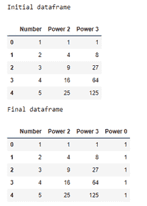

# 给熊猫数据框添加常数值的列

> 原文:[https://www . geesforgeks . org/add-带常量值的列到 pandas-dataframe/](https://www.geeksforgeeks.org/add-column-with-constant-value-to-pandas-dataframe/)

**先决条件:**T2】熊猫

在本文中，我们将学习如何向熊猫数据框添加一个新的常数值列。在此之前，必须熟悉以下概念:

*   **熊猫数据框:**熊猫数据框是二维可变大小的、潜在异构的表格排列，带有标记轴(行和列)。数据框可以是二维排列，即数据以表格形式排列成行和列。熊猫数据框架由三个主要部分组成，即数据、行和列。
*   **数据框中的列:**为了在熊猫数据框中选择一列，我们要么通过按列名调用列来访问它们。列添加:为了在熊猫数据框中显示一列，我们将声明一个替换列表作为一列，并增加一个现有的数据框。
*   **常数:**固定值。在代数中，一个连续的可能是一个数字本身，或者有时像 a，b 或 c 这样的字母面对一个硬而快的数字。例:在“x + 5 = 9”中，5 和 9 是常数。

## 方法

1.  导入库
2.  加载或创建数据帧
3.  将具有常数值的列添加到数据框

为了理解上述步骤，让我们讨论一些例子:

**例 1:** (使用熊猫系列)

## 蟒蛇 3

```py
# import packages
import pandas as pd
import numpy as np

# create dataframe
df = pd.DataFrame({'Number': {0: 1, 1: 2, 2: 3, 3: 4, 4: 5},
                   'Power 2': {0: 1, 1: 4, 2: 9, 3: 16, 4: 25},
                   'Power 3': {0: 1, 1: 8, 2: 27, 3: 64, 4: 125}})

# view dataframe
print("Initial dataframe")
display(df)

# adding column with constant value
df['Power 0'] = pd.Series([1 for x in range(len(df.index))])

# view dataframe
print("Final dataframe")
display(df)
```

**输出:**



**例 2:** (作为静态值)

## 蟒蛇 3

```py
# import packages
import pandas as pd
import numpy as np

# create dataframe
df = pd.DataFrame({'Name': {0: 'Ram', 1: 'Deep', 2: 'Yash', 3: 'Aman', 4: 'Akash'},
                   'Marks': {0: 68, 1: 87, 2: 45, 3: 78, 4: 56}})

# view dataframe
print("Initial dataframe")
display(df)

# adding column with constant value
df['Pass'] = True

# view dataframe
print("Final dataframe")
display(df)
```

**输出:**

