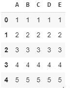
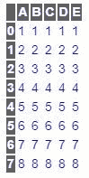
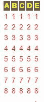

# 使用熊猫

将 CSS 添加到 Jupyter 笔记本中

> 原文:[https://www . geesforgeks . org/add-CSS-to-the-jupyter-notebook-use-pandas/](https://www.geeksforgeeks.org/add-css-to-the-jupyter-notebook-using-pandas/)

在 Jupyter Notebook 中，当我们打印数据的输出表时，它会显示一个包含数据的非常基本的表。但是如果我们想要定制这个默认样式呢？在本文中，我们将看到如何向输出数据表添加样式。

这是 Jupyter 笔记本中默认数据表的外观:

```py
import pandas as pd

df = pd.DataFrame({'A':[1, 2, 3, 4, 5, 6, 7, 8], 
                   'B':[1, 2, 3, 4, 5, 6, 7, 8], 
                   'C':[1, 2, 3, 4, 5, 6, 7, 8],
                   'D':[1, 2, 3, 4, 5, 6, 7, 8]})

df.head()
```

**输出:**


现在让我们尝试改变风格。我们可以通过熊猫模块的**set _ table _ style**方法来实现。

```py
df.style.set_table_styles()
```

现在我们需要将“选择器”和“道具”作为参数传递给这个方法，也就是说，我们需要选择表格的 CSS 标签(例如:th、td 等)并更改它们的属性值(例如:背景、字体颜色、字体系列等)。

因此，如果我们需要更改表格数据部分中文本的字体系列，我们可以这样做:

```py
df.style.set_table_styles(

[{'selector': 'td',
  'props': [('font-family', 'Sans-serif')]},
])
```

让我们尝试添加更多的更改并查看输出。

```py
df = pd.DataFrame({'A':[1, 2, 3, 4, 5, 6, 7, 8], 
                   'B':[1, 2, 3, 4, 5, 6, 7, 8], 
                   'C':[1, 2, 3, 4, 5, 6, 7, 8],
                   'D':[1, 2, 3, 4, 5, 6, 7, 8],
                   'E':[1, 2, 3, 4, 5, 6, 7, 8]})

df.style.set_table_styles(
[
 {'selector': 'th',
  'props': [('background', '# 606060'), 
            ('color', 'white'), ]},
 {'selector': 'td',
  'props': [('color', 'blue')]},
])
```

**输出:**


我们也可以通过 `**hide_index()**`方法隐藏索引列:

```py
df.style.set_table_styles(
[
 {'selector': 'th',
  'props': [('background', '# 606060'), 
            ('color', 'yellow'), ]},
 {'selector': 'td',
  'props': [('color', 'red')]},
]
).hide_index()
```

**输出:**
