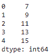
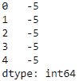
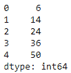
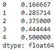

# 两熊猫系列

加减乘除

> 原文:[https://www . geesforgeks . org/加减乘除二熊猫-系列/](https://www.geeksforgeeks.org/add-subtract-multiple-and-divide-two-pandas-series/)

让我们看看如何在 2 熊猫系列上执行基本的算术运算，如加法、减法、乘法和除法。

对于所有 4 个操作，我们将遵循基本算法:

1.  导入`Pandas` 模块。
2.  创建 2 熊猫系列对象。
3.  使用 2 系列之间的相应算术运算符执行所需的算术运算，并将结果分配给另一系列。
4.  显示结果系列。

### 增加 2 个系列

```py
# importing the module
import pandas as pd

# creating 2 Pandas Series
series1 = pd.Series([1, 2, 3, 4, 5])
series2 = pd.Series([6, 7, 8, 9, 10])

# adding the 2 Series
series3 = series1 + series2

# displaying the result
print(series3)
```

**输出:**


### 2 级数的减法

```py
# importing the module
import pandas as pd

# creating 2 Pandas Series
series1 = pd.Series([1, 2, 3, 4, 5])
series2 = pd.Series([6, 7, 8, 9, 10])

# subtracting the 2 Series
series3 = series1 - series2

# displaying the result
print(series3)
```

**输出:**


### 2 级数的乘法

```py
# importing the module
import pandas as pd

# creating 2 Pandas Series
series1 = pd.Series([1, 2, 3, 4, 5])
series2 = pd.Series([6, 7, 8, 9, 10])

# multiplying the 2 Series
series3 = series1 * series2

# displaying the result
print(series3)
```

**输出:**


### 2 系列的划分

```py
# importing the module
import pandas as pd

# creating 2 Pandas Series
series1 = pd.Series([1, 2, 3, 4, 5])
series2 = pd.Series([6, 7, 8, 9, 10])

# dividing the 2 Series
series3 = series1 / series2

# displaying the result
print(series3)
```

**输出:**
