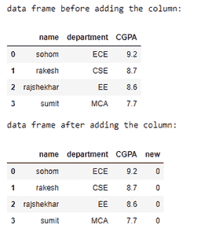
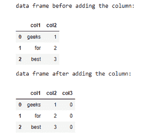

# 给熊猫数据框添加零列

> 原文:[https://www . geesforgeks . org/add-zero-columns-to-pandas-data frame/](https://www.geeksforgeeks.org/add-zero-columns-to-pandas-dataframe/)

**先决条件:**T2】熊猫

这里的任务是使用 Pandas 模块生成一个 Python 程序，该程序可以将所有条目都为零的列添加到现有的数据帧中。

数据框是一种二维的、大小可变的、潜在的异构表格数据。它用于以表格形式表示数据，如 Excel 文件格式。以下是在熊猫中创建数据帧的语法。它可以想象成一个像字典一样的系列对象的容器。

**语法:**

> 数据框(数据=无，索引=无，列=无，数据类型=无，复制=假)

### 方法

*   导入所需的库
*   创建或导入数据
*   添加一个全零的新列。

**例 1:**

## 蟒蛇 3

```py
# import pandas library
import pandas as pd

# creating dictionary of lists
dict = {'name': ["sohom", "rakesh", "rajshekhar", "sumit"],
        'department': ["ECE", "CSE", "EE", "MCA"],
        'CGPA': [9.2, 8.7, 8.6, 7.7]}

# creating a dataframe
df = pd.DataFrame(dict)

print("data frame before adding the column:")
display(df)

# creating a new column
# of zeroes to the
# dataframe
df['new'] = 0

# showing the dataframe
print("data frame after adding the column:")
display(df)
```

**输出:**



**例 2:**

## 蟒蛇 3

```py
# import pandas library
import pandas as pd

# create data
data = [["geeks", 1], ["for", 2], ["best", 3]]

# creating a dataframe
df = pd.DataFrame(data, columns=['col1', 'col2'])

print("data frame before adding the column:")
display(df)

# creating a new column with all zero entries
df['col3'] = 0

# showing the dataframe
print("data frame after adding the column:")
display(df)
```

**输出:**

