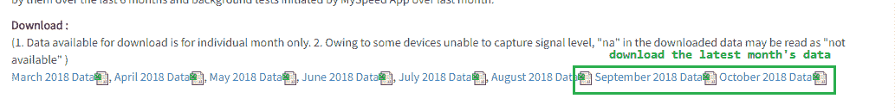
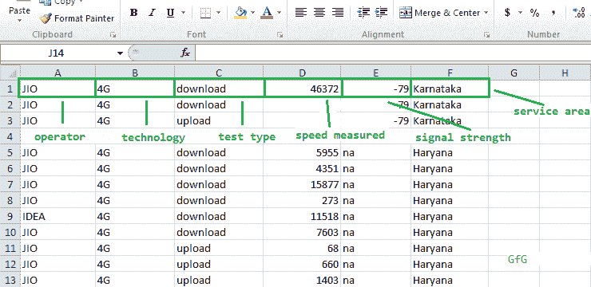
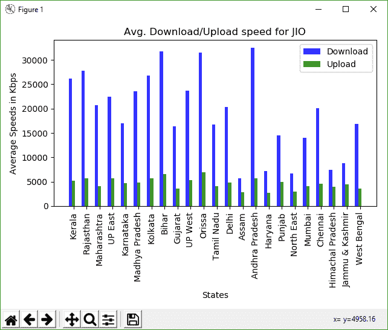
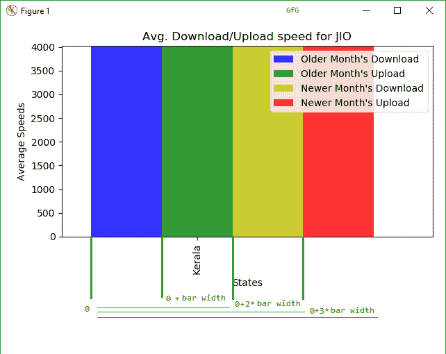
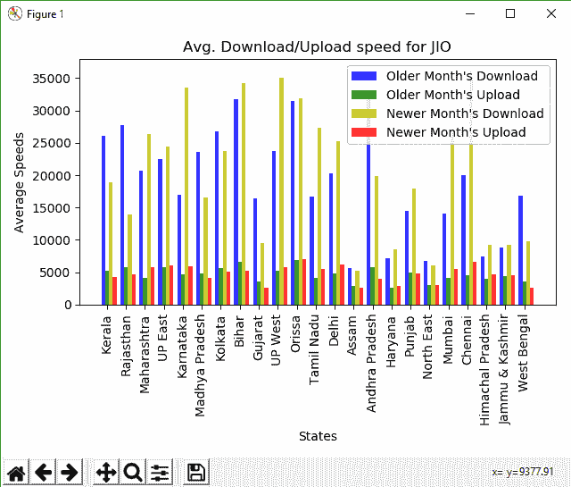

# 用熊猫分析来自 TRAI 的移动数据速度

> 原文:[https://www . geesforgeks . org/analysis-mobile-data-speed-from-trai-with-pandas/](https://www.geeksforgeeks.org/analyzing-mobile-data-speeds-from-trai-with-pandas/)

Python 是进行数据分析的优秀语言，主要是因为以数据为中心的 Python 包的奇妙生态系统。 ***【熊猫】*** 就是其中一个包，让导入和分析数据变得容易多了。

让我们使用来自 TRAI 的真实数据集来分析移动数据，并尝试查看特定运营商或州在该月的平均速度。这也将显示熊猫可以多么容易地用于任何真实世界的数据，以获得有趣的结果。

**关于数据集–**
印度(TRAI)电信管理局通过 [MySpeed (TRAI)](https://play.google.com/store/apps/details?id=com.rma.myspeed&hl=en) 应用发布了一个每月一次的互联网速度数据集。这包括用户自己启动的速度测试或应用程序定期进行的后台测试。我们将尝试分析该数据集，并查看该月特定操作员或州的平均速度。

**检查数据的原始结构:**

*   Go to [TRAI MySpeed Portal](https://myspeed.trai.gov.in/) and download the latest month’s csv file under the **Download** section. You can also download the csv file used in this article: [sept18_publish.csv](https://myspeed.trai.gov.in/download/sept18_publish.csv) or [sept18_publish_drive.csv](https://drive.google.com/open?id=1cpoOQS5_2yH_RcRobFIhEAXzK_N0x3tG)

    

*   Open this spreadsheet file.
    **NOTE**: As the dataset is huge, the software may give you an warning that all rows could not be loaded. This is fine. Also if you are using Microsoft Excel, there might be a warning about opening of a SYLK file. This error could be ignored as it is a common bug in Excel.
    Now, let’s take a look at the arrangement of the data-

    数据集中的列名

    > 第一栏是**网络运营商**–*JIO、Airtel* 等。
    > 第二栏是**网络技术**–*3G 或 4G* 。
    > 第三列是**类型的测试**启动–*上传或下载*。
    > 第四列是**测量的**速度，单位为*千字节每秒。*
    > 第 5 列为测量时的**信号强度**。
    > 第 6 列是**本地服务区(LSA)** ，或进行测试的圆圈–*德里、奥里萨邦*等。我们将称之为简单的“状态”。

    **注意:**由于某些设备无法捕获信号，信号强度可能有`na (Not Available)`值。我们将忽略在计算中使用这个参数，以使事情更简单。但是，它可以很容易地在过滤时作为条件添加。

    > **所需包装–**
    > 
    > **熊猫**——一个流行的数据分析工具包。非常适合处理大量数据。
    > **Numpy**–在同构数据阵列上提供快速高效的操作。我们会用这个来搭配熊猫和 matplotlib。
    > **Matplotlib**–是一个绘图库。我们将使用它的条形图功能来制作条形图。

    **让我们开始分析数据。**

    **步骤#1:** 导入包并定义一些常量。

    ```
    import pandas as pd
    import numpy as np
    import matplotlib.pyplot as plt

    # we will define some constants

    # name of the csv dataset
    DATASET_FILENAME = 'sept18_publish.csv'

    # define the operator to be filtered upon.
    CONST_OPERATOR = 'JIO'

    # define the state to be filtered upon.
    CONST_STATE = 'Delhi'

    # define the the technology to be filtered upon
    CONST_TECHNOLOGY = '4G'
    ```

    **第 2 步:**定义一些存储最终计算结果的列表，这样就可以很容易地将其传递给条形图功能。状态(或操作符)、下载速度和上传速度将串行存储，因此对于一个索引，可以访问状态(或操作符)及其对应的下载和上传速度。

    例如，`final_states[2], final_download_speeds[2]`和`final_upload_speeds[2]`将给出*第三*状态的相应值。

    ```
    # define lists
    final_download_speeds = []
    final_upload_speeds = []
    final_states = []
    final_operators = []
    ```

    **步骤 3:** 使用熊猫`read_csv()`功能导入文件，并将其存储在“df”中。这将创建一个我们将要处理的 csv 内容的数据框架。

    ```
    df = pd.read_csv(DATASET_FILENAME)

    # assign headers for each of the columns based on the data
    # this allows us to access columns easily

    df.columns = ['Service Provider', 'Technology', 'Test Type',
                       'Data Speed', 'Signal Strength', 'State']
    ```

    **步骤#4:** 首先让我们在这个数据集中找到所有唯一的*状态*和*操作符*，并将它们存储到相应的状态和操作符列表中。

    我们将使用熊猫数据帧的`[unique()](https://www.geeksforgeeks.org/python-pandas-series-unique/)`方法。

    ```
    # find and display the unique states
    states = df['State'].unique()
    print('STATES Found: ', states)

    # find and display the unique operators
    operators = df['Service Provider'].unique()
    print('OPERATORS Found: ', operators)
    ```

    **输出:**

    ```
    STATES Found:  ['Kerala' 'Rajasthan' 'Maharashtra' 'UP East' 'Karnataka' nan
     'Madhya Pradesh' 'Kolkata' 'Bihar' 'Gujarat' 'UP West' 'Orissa'
     'Tamil Nadu' 'Delhi' 'Assam' 'Andhra Pradesh' 'Haryana' 'Punjab'
     'North East' 'Mumbai' 'Chennai' 'Himachal Pradesh' 'Jammu & Kashmir'
     'West Bengal']
    OPERATORS Found:  ['IDEA' 'JIO' 'AIRTEL' 'VODAFONE' 'CELLONE']
    ```

    **步骤#5:** 定义函数`fixed_operator`，该函数将保持运算符不变，并迭代该运算符的所有可用状态。我们可以为固定状态构造一个类似的函数。

    ```
    # filter out the operator and technology
    # first as this will be common for all
    filtered = df[(df['Service Provider'] == CONST_OPERATOR) 
                   & (df['Technology'] == CONST_TECHNOLOGY)]

    # iterate through each of the states
    for state in states:

        # create new dataframe which contains
        # only the data of the current state
        base = filtered[filtered['State'] == state]

        # filter only download speeds based on test type
        down = base[base['Test Type'] == 'download']

        # filter only upload speeds based on test type
        up = base[base['Test Type'] == 'upload']

        # calculate mean of speeds in Data Speed
        # column using the Pandas.mean() method
        avg_down = down['Data Speed'].mean()

        # calculate mean of speeds
        # in Data Speed column
        avg_up = up['Data Speed'].mean()

        # discard values if mean is not a number(nan)
        # and append only the valid ones
        if (pd.isnull(avg_down) or pd.isnull(avg_up)):
            down, up = 0, 0

        else:
            final_states.append(state)
            final_download_speeds.append(avg_down)
            final_upload_speeds.append(avg_up)

            # print output upto 2 decimal places
            print(str(state) + ' -- Avg. Download: ' +
                              str('%.2f' % avg_down) + 
             '  Avg. Upload: ' + str('%.2f' % avg_up))
    ```

    **输出:**

    ```
    Kerala -- Avg. Download: 26129.27  Avg. Upload: 5193.46
    Rajasthan -- Avg. Download: 27784.86  Avg. Upload: 5736.18
    Maharashtra -- Avg. Download: 20707.88  Avg. Upload: 4130.46
    UP East -- Avg. Download: 22451.35  Avg. Upload: 5727.95
    Karnataka -- Avg. Download: 16950.36  Avg. Upload: 4720.68
    Madhya Pradesh -- Avg. Download: 23594.85  Avg. Upload: 4802.89
    Kolkata -- Avg. Download: 26747.80  Avg. Upload: 5655.55
    Bihar -- Avg. Download: 31730.54  Avg. Upload: 6599.45
    Gujarat -- Avg. Download: 16377.43  Avg. Upload: 3642.89
    UP West -- Avg. Download: 23720.82  Avg. Upload: 5280.46
    Orissa -- Avg. Download: 31502.05  Avg. Upload: 6895.46
    Tamil Nadu -- Avg. Download: 16689.28  Avg. Upload: 4107.44
    Delhi -- Avg. Download: 20308.30  Avg. Upload: 4877.40
    Assam -- Avg. Download: 5653.49  Avg. Upload: 2864.47
    Andhra Pradesh -- Avg. Download: 32444.07  Avg. Upload: 5755.95
    Haryana -- Avg. Download: 7170.63  Avg. Upload: 2680.02
    Punjab -- Avg. Download: 14454.45  Avg. Upload: 4981.15
    North East -- Avg. Download: 6702.29  Avg. Upload: 2966.84
    Mumbai -- Avg. Download: 14070.97  Avg. Upload: 4118.21
    Chennai -- Avg. Download: 20054.47  Avg. Upload: 4602.35
    Himachal Pradesh -- Avg. Download: 7436.99  Avg. Upload: 4020.09
    Jammu & Kashmir -- Avg. Download: 8759.20  Avg. Upload: 4418.21
    West Bengal -- Avg. Download: 16821.17  Avg. Upload: 3628.78
    ```

    ### 绘制数据–

    使用 Numpy 的`arange()`方法，该方法返回给定间隔内均匀间隔的值。这里，传递`final_states`列表的长度，因此我们得到从 0 到列表中状态数的值，如[0，1，2，3 …]
    然后我们可以使用这些索引在该位置绘制一个条形图。通过将第一个条形的位置偏移条形宽度来绘制第二个条形。

    ```
    fig, ax = plt.subplots()

    # the width of each bar
    bar_width = 0.25

    # opacity of each bar
    opacity = 0.8

    # store the positions
    index = np.arange(len(final_states))

    # the plt.bar() takes in the position
    # of the bars, data to be plotted,
    # width of each bar and some other 
    # optional parameters, like the opacity and colour

    # plot the download bars
    bar_download = plt.bar(index, final_download_speeds,
                           bar_width, alpha=opacity,
                           color='b', label='Download')
    # plot the upload bars  
    bar_upload = plt.bar(index + bar_width, final_upload_speeds, 
                            bar_width, alpha=opacity, color='g',
                                                 label='Upload')

    # title of the graph
    plt.title('Avg. Download/Upload speed for '
                         + str(CONST_OPERATOR))

    # the x-axis label
    plt.xlabel('States')

    # the y-axis label
    plt.ylabel('Average Speeds in Kbps')

    # the label below each of the bars,
    # corresponding to the states
    plt.xticks(index + bar_width, final_states, rotation=90)

    # draw the legend
    plt.legend()

    # make the graph layout tight
    plt.tight_layout()

    # show the graph
    plt.show()
    ```

    

    计算速度的条形图

    ### 比较两个月的数据–

    让我们再取几个月的数据，并把它们绘制在一起，观察数据速度的差异。

    本例中，前一个月的数据集将是相同的[9 月 18 日 _publish.csv](https://myspeed.trai.gov.in/download/sept18_publish.csv) ，下一个月的数据集是[10 月 18 日 _publish.csv](https://myspeed.trai.gov.in/download/oct18_publish.csv) 。

    我们只需要再次执行相同的步骤。阅读另一个月的数据。过滤出后续的数据帧，然后用稍微不同的方法绘制出来。在绘制条的过程中，我们会将第 3 条和第 4 条(对应于第二个文件的上传和下载)增加条宽的 2 倍和 3 倍，以便它们处于正确的位置。

    

    绘制 4 条时的偏移逻辑

    下面是比较 2 个月数据的实现:

    ```
    import pandas as pd
    import numpy as np
    import matplotlib.pyplot as plt
    import time

    # older month
    DATASET_FILENAME = 'https://myspeed.trai.gov.in/download/sept18_publish.csv'

    # newer month
    DATASET_FILENAME2 = 'https://myspeed.trai.gov.in/download/oct18_publish.csv'

    CONST_OPERATOR = 'JIO'
    CONST_STATE = 'Delhi'
    CONST_TECHNOLOGY = '4G'

    # read file with Pandas and store as Dataframe
    df = pd.read_csv(DATASET_FILENAME)
    df2 = pd.read_csv(DATASET_FILENAME2)

    # assign column names
    df.columns = ['Service Provider', 'Technology', 'Test Type',
                       'Data Speed', 'Signal Strength', 'State']
    df2.columns = ['Service Provider', 'Technology', 'Test Type',
                        'Data Speed', 'Signal Strength', 'State']

    # find and display the unique states
    states = df['State'].unique()
    print('STATES Found: ', states)

    # find and display the unique operators
    operators = df['Service Provider'].unique()
    print('OPERATORS Found: ', operators)

    # define lists
    final_download_speeds = []
    final_upload_speeds = []

    final_download_speeds_second =[]
    final_upload_speeds_second = []

    final_states = []
    final_operators = []

    # assign column names to the data
    df.columns = ['Service Provider', 'Technology', 'Test Type', 
                       'Data Speed', 'Signal Strength', 'State']
    df2.columns = ['Service Provider', 'Technology', 'Test Type',
                        'Data Speed', 'Signal Strength', 'State']

    print('\n\nComparing data for' + str(CONST_OPERATOR))
    filtered = df[(df['Service Provider'] == CONST_OPERATOR)
                   & (df['Technology'] == CONST_TECHNOLOGY)]

    filtered2 = df2[(df2['Service Provider'] == CONST_OPERATOR)
                     & (df2['Technology'] == CONST_TECHNOLOGY)]

    for state in states:
        base = filtered[filtered['State'] == state]

        # calculate mean of download speeds
        avg_down = base[base['Test Type'] ==
                   'download']['Data Speed'].mean()

        # calculate mean of upload speeds
        avg_up = base[base['Test Type'] ==
                     'upload']['Data Speed'].mean()

        base2 = filtered2[filtered2['State'] == state]

        # calculate mean of download speeds
        avg_down2 = base2[base2['Test Type'] == 
                 'download']['Data Speed'].mean()

        # calculate mean of upload speeds
        avg_up2 = base2[base2['Test Type'] == 
                    'upload']['Data Speed'].mean()

        # discard values if mean is not a number(nan)
        # and append only the needed speeds
        if (pd.isnull(avg_down) or pd.isnull(avg_up) or
            pd.isnull(avg_down2) or pd.isnull(avg_up2)):
            avg_down = 0
            avg_up = 0
            avg_down2 = 0
            avg_up2 = 0
        else:
            final_states.append(state)
            final_download_speeds.append(avg_down)
            final_upload_speeds.append(avg_up)
            final_download_speeds_second.append(avg_down2)
            final_upload_speeds_second.append(avg_up2)

            print('Older: ' + str(state) + ' -- Download: ' +
                  str('%.2f' % avg_down) + '  Upload: ' +
                  str('%.2f' % avg_up))

            print('Newer: ' + str(state) + ' -- Download: ' +
                  str('%.2f' % avg_down2) + '  Upload: ' +
                  str('%.2f' % avg_up2))

    # plot bargraph
    fig, ax = plt.subplots()
    index = np.arange(len(final_states))
    bar_width = 0.2
    opacity = 0.8

    rects1 = plt.bar(index, final_download_speeds, 
                     bar_width, alpha=opacity, color='b',
                         label='Older Month\'s Download')

    rects2 = plt.bar(index + bar_width, final_upload_speeds, 
                        bar_width, alpha=opacity, color='g',
                              label='Older Month\'s Upload')

    rects3 = plt.bar(index + 2 * bar_width, final_download_speeds_second, 
                                     bar_width, alpha=opacity, color='y',
                                         label='Newer Month\'s Download')

    rects4 = plt.bar(index + 3 * bar_width, final_upload_speeds_second, 
                                   bar_width, alpha=opacity, color='r',
                                         label='Newer Month\'s Upload')

    plt.xlabel('States')
    plt.ylabel('Average Speeds')
    plt.title('Avg. Download/Upload speed for '
                         + str(CONST_OPERATOR))

    plt.xticks(index + bar_width, final_states, rotation=90)
    plt.legend()
    plt.tight_layout()

    plt.show()
    ```

    **输出:**

    ```
    STATES Found:  ['Kerala' 'Rajasthan' 'Maharashtra' 'UP East' 'Karnataka' nan
     'Madhya Pradesh' 'Kolkata' 'Bihar' 'Gujarat' 'UP West' 'Orissa'
     'Tamil Nadu' 'Delhi' 'Assam' 'Andhra Pradesh' 'Haryana' 'Punjab'
     'North East' 'Mumbai' 'Chennai' 'Himachal Pradesh' 'Jammu & Kashmir'
     'West Bengal']
    OPERATORS Found:  ['IDEA' 'JIO' 'AIRTEL' 'VODAFONE' 'CELLONE']
    ```

    ```
    Comparing data forJIO
    Older: Kerala -- Download: 26129.27  Upload: 5193.46
    Newer: Kerala -- Download: 18917.46  Upload: 4290.13
    Older: Rajasthan -- Download: 27784.86  Upload: 5736.18
    Newer: Rajasthan -- Download: 13973.66  Upload: 4721.17
    Older: Maharashtra -- Download: 20707.88  Upload: 4130.46
    Newer: Maharashtra -- Download: 26285.47  Upload: 5848.77
    Older: UP East -- Download: 22451.35  Upload: 5727.95
    Newer: UP East -- Download: 24368.81  Upload: 6101.20
    Older: Karnataka -- Download: 16950.36  Upload: 4720.68
    Newer: Karnataka -- Download: 33521.31  Upload: 5871.38
    Older: Madhya Pradesh -- Download: 23594.85  Upload: 4802.89
    Newer: Madhya Pradesh -- Download: 16614.49  Upload: 4135.70
    Older: Kolkata -- Download: 26747.80  Upload: 5655.55
    Newer: Kolkata -- Download: 23761.85  Upload: 5153.29
    Older: Bihar -- Download: 31730.54  Upload: 6599.45
    Newer: Bihar -- Download: 34196.09  Upload: 5215.58
    Older: Gujarat -- Download: 16377.43  Upload: 3642.89
    Newer: Gujarat -- Download: 9557.90  Upload: 2684.55
    Older: UP West -- Download: 23720.82  Upload: 5280.46
    Newer: UP West -- Download: 35035.84  Upload: 5797.93
    Older: Orissa -- Download: 31502.05  Upload: 6895.46
    Newer: Orissa -- Download: 31826.96  Upload: 6968.59
    Older: Tamil Nadu -- Download: 16689.28  Upload: 4107.44
    Newer: Tamil Nadu -- Download: 27306.54  Upload: 5537.58
    Older: Delhi -- Download: 20308.30  Upload: 4877.40
    Newer: Delhi -- Download: 25198.16  Upload: 6228.81
    Older: Assam -- Download: 5653.49  Upload: 2864.47
    Newer: Assam -- Download: 5243.34  Upload: 2676.69
    Older: Andhra Pradesh -- Download: 32444.07  Upload: 5755.95
    Newer: Andhra Pradesh -- Download: 19898.16  Upload: 4002.25
    Older: Haryana -- Download: 7170.63  Upload: 2680.02
    Newer: Haryana -- Download: 8496.27  Upload: 2862.61
    Older: Punjab -- Download: 14454.45  Upload: 4981.15
    Newer: Punjab -- Download: 17960.28  Upload: 4885.83
    Older: North East -- Download: 6702.29  Upload: 2966.84
    Newer: North East -- Download: 6008.06  Upload: 3052.87
    Older: Mumbai -- Download: 14070.97  Upload: 4118.21
    Newer: Mumbai -- Download: 26898.04  Upload: 5539.71
    Older: Chennai -- Download: 20054.47  Upload: 4602.35
    Newer: Chennai -- Download: 36086.70  Upload: 6675.70
    Older: Himachal Pradesh -- Download: 7436.99  Upload: 4020.09
    Newer: Himachal Pradesh -- Download: 9277.45  Upload: 4622.25
    Older: Jammu & Kashmir -- Download: 8759.20  Upload: 4418.21
    Newer: Jammu & Kashmir -- Download: 9290.38  Upload: 4533.08
    Older: West Bengal -- Download: 16821.17  Upload: 3628.78
    Newer: West Bengal -- Download: 9763.05  Upload: 2627.28
    ```

    

    输出的条形图

    我们刚刚学习了如何分析一些真实世界的数据，并从中得出一些有趣的观察结果。但是请注意，并不是所有的数据都将被很好地格式化和简单地处理，熊猫使得处理这样的数据集变得非常容易。