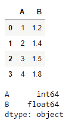
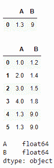
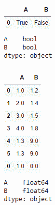
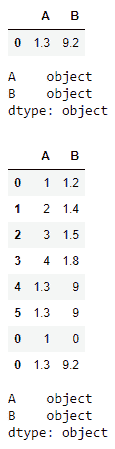
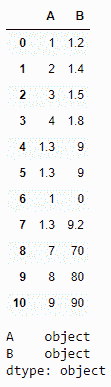
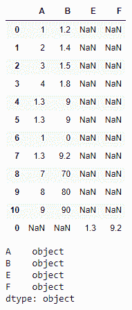

# 向空熊猫数据框添加数据

> 原文:[https://www . geesforgeks . org/append-data-to-a-empands-data frame/](https://www.geeksforgeeks.org/append-data-to-an-empty-pandas-dataframe/)

让我们看看如何向一个空的熊猫数据帧添加数据。

创建数据框并为其分配列

```py
# importing the module
import pandas as pd

# creating the DataFrame of int and float
a = [[1, 1.2], [2, 1.4], [3, 1.5], [4, 1.8]]
t = pd.DataFrame(a, columns =["A", "B"])

# displaying the DataFrame
print(t)
print(t.dtypes)
```

**输出:**



将浮点值附加到 int 值数据类型列后，结果数据框列类型将变为 float，以便容纳浮点值

如果我们使用参数`**ignore_index = True**` = >来表示索引值将保持连续，而不是从 0 开始，默认情况下它的值是`**False**`

```py
# Appending a Data Frame of float and int
s = pd.DataFrame([[1.3, 9]], columns = ["A", "B"])
display(s)

# makes index continuous
t = t.append(s, ignore_index = True)  
display(t)

# Resultant data frame is of type float and float
display(t.dtypes)  
```

**输出:**



当我们将布尔格式数据追加到已经属于浮点列类型的数据框中时，它将相应地更改值，以便只容纳浮点数据类型域中的布尔值。

```py
# Appending a Data Frame of bool and bool
u = pd.DataFrame([[True, False]], columns =["A", "B"])
display(u)
display(u.dtypes)

t = t.append(u)
display(t)
display(t.dtypes)  # type casted into float and float
```

**输出:**



在将不同数据类型的数据附加到先前形成的数据框时，得到的数据框列类型将总是更宽范围的数据类型。

```py
# Appending a Data Frame of object and object
x = pd.DataFrame([["1.3", "9.2"]], columns = ["A", "B"])
display(x)
display(x.dtypes)

t = t.append(x)
display(t)
display(t.dtypes)
```

**输出:**



如果我们的目标是通过 for 循环创建数据帧，那么最有效的方法如下:

```py
# Creating a DataFrame using a for loop in efficient manner
y = pd.concat([pd.DataFrame([[i, i * 10]], columns = ["A", "B"])
               for i in range(7, 10)], ignore_index = True)

# makes index continuous
t = t.append(y, ignore_index = True)  
display(t)
display(t.dtypes)
```

**输出**



如果我们试图添加与数据框中不同的列，那么结果如下:

```py
# Appending Different Columns
z = pd.DataFrame([["1.3", "9.2"]], columns = ["E", "F"])
t = t.append(z)
print(t)
print(t.dtypes)
print()
```

**输出:**

