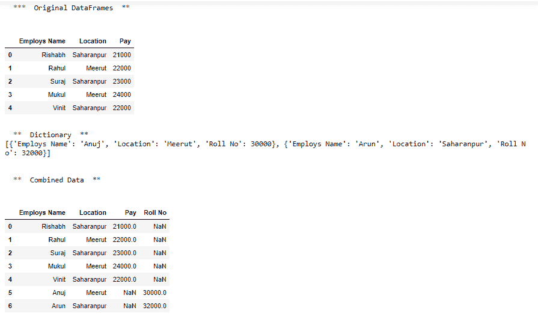
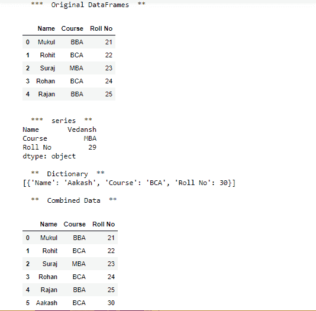

# 将字典和系列列表添加到 Python 中现有的熊猫数据框中

> 原文:[https://www . geesforgeks . org/append-list-of-dictionary-series-to-a-existing-pandas-data frame-in-python/](https://www.geeksforgeeks.org/append-list-of-dictionary-and-series-to-a-existing-pandas-dataframe-in-python/)

在本文中，我们将讨论如何将字典列表[中的值](https://www.geeksforgeeks.org/create-a-pandas-dataframe-from-list-of-dicts/)或[熊猫系列](https://www.geeksforgeeks.org/creating-a-pandas-series-from-dictionary/)添加到已经存在的熊猫数据框中。为此追加()熊猫的功能，模块就足够了。

> ***语法:** DataFrame.append(其他，ignore_index=False，verify_integrity=False，sort=None)*
> 
> ***参数:***
> ***其他:**数据框或 Series/dict 类对象，或这些的列表*
> ***忽略 _index :** 如果为 True，则不要使用索引标签。*
> ***验证 _ 完整性:**如果为真，则在创建重复索引时引发值错误。*
> ***排序:**如果自身列和其他列不对齐，则排序列。默认排序已被弃用，并将在熊猫的未来版本中更改为不排序。显式传递排序=True 以消除警告并排序。显式传递 sort=False 以消除警告并不排序。*
> 
> ***返回:**追加:数据框*

**接近**

*   导入模块
*   创建数据框或系列
*   用字典创建列表
*   将此列表附加到现有数据框或系列中

**例 1:**

## 计算机编程语言

```
# import pandas
import pandas as pd

# create dataframe
df = pd.DataFrame({
    'Employs Name': ['Rishabh', 'Rahul', 'Suraj', 'Mukul', 'Vinit'],
    'Location': ['Saharanpur', 'Meerut', 'Saharanpur', 'Meerut', 'Saharanpur'],
    'Pay': [21000, 22000, 23000, 24000, 22000]})

# print dataframe
print("\n  ***  Original DataFrames  **  \n")
print(df)

# create dictionaries
dicts = [{'Employs Name': 'Anuj', 'Location': 'Meerut', 'Roll No': 30000},
         {'Employs Name': 'Arun', 'Location': 'Saharanpur', 'Roll No': 32000}]

# print dictionaries
print("\n  **  Dictionary  ** ")
print(dicts)

# combined data
df = df.append(dicts, ignore_index=True, sort=False)

# print combined dataframe
print("\n\n  **  Combined Data  **\n")
print(df)
```

**输出:**



**例 2:**

## 计算机编程语言

```
# import pandas
import pandas as pd

# create dataframe
df = pd.DataFrame({
    'Name': ['Mukul', 'Rohit', 'Suraj', 'Rohan', 'Rajan'],
    'Course': ['BBA', 'BCA', 'MBA', 'BCA', 'BBA'],
    'Roll No': [21, 22, 23, 24, 25]})

# print dataframe
print("\n  ***  Original DataFrames  ** ")
display(df)

# create series
s6 = pd.Series(['Vedansh', 'MBA', 29], index=['Name', 'Course', 'Roll No'])

# print series
print("\n  ***  series  ** ")
print(s6)

# create dictionaries
dicts = [{'Name': 'Aakash', 'Course': 'BCA', 'Roll No': 30}]

# print dictionaries
print("\n  **  Dictionary  ** ")
print(dicts)

# combined data
df = df.append(dicts, ignore_index=True, sort=False)
print("\n  **  Combined Data  **")
display(df)
```

**输出:**

