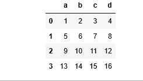
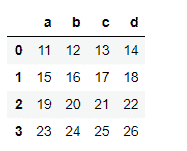
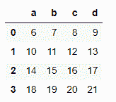
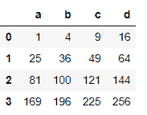
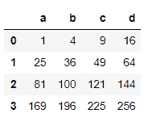

# 使用 pandas 将函数应用于数据框中的每一行或每一列。apply()

> 原文:[https://www . geesforgeks . org/apply-a-function-to-每行或每列-in-data frame-use-pandas-apply/](https://www.geeksforgeeks.org/apply-a-function-to-each-row-or-column-in-dataframe-using-pandas-apply/)

对数据框中的每一行或每一列应用函数有不同的方法。我们将在这篇文章中了解各种方法。让我们先创建一个小的数据帧，看看这个。

## 蟒蛇 3

```py
# import pandas and numpy library
import pandas as pd
import numpy as np

# list of tuples
matrix = [(1,2,3,4),
          (5,6,7,8,),
          (9,10,11,12),
          (13,14,15,16)
         ]

# Create a Dataframe object
df = pd.DataFrame(matrix, columns = list('abcd'))

# Output
df
```

**输出:**



**方法 1:** 对每行/每列应用 lambda 函数。
**例 1:** 为列

## 蟒蛇 3

```py
# import pandas and numpy library
import pandas as pd
import numpy as np

# list of tuples
matrix = [(1,2,3,4),
          (5,6,7,8,),
          (9,10,11,12),
          (13,14,15,16)
         ]

# Create a Dataframe object
df = pd.DataFrame(matrix, columns = list('abcd'))

# Applying a lambda function to each
# column which will add 10 to the value
new_df = df.apply(lambda x : x + 10)

# Output
new_df
```

**输出:**



**示例 2:** 对于行

## 蟒蛇 3

```py
# import pandas and numpy library
import pandas as pd
import numpy as np

# list of tuples
matrix = [(1,2,3,4),
          (5,6,7,8,),
          (9,10,11,12),
          (13,14,15,16)
         ]

# Creating a Dataframe object
df = pd.DataFrame(matrix, columns = list('abcd'))

# Applying a lambda function to each
# row which will add 5 to the value
new_df = df.apply(lambda x: x + 5, axis = 1)

# Output
new_df
```

**输出:**



**方法 2:** 将用户定义的函数应用于每一行/列
**示例 1:** 用于列

## 蟒蛇 3

```py
# function to returns x*x
def squareData(x):
    return x * x

# import pandas and numpy packages
import pandas as pd
import numpy as np

# list of tuples
matrix = [(1,2,3,4),
          (5,6,7,8,),
          (9,10,11,12),
          (13,14,15,16)
         ]

# Creating a Dataframe object
df = pd.DataFrame(matrix, columns = list('abcd'))

# Applying a user defined function to
# each column that will square the given
# value
new_df = df.apply(squareData)

# Output
new_df
```

**输出:**



**示例 2:** 对于行

## 蟒蛇 3

```py
# function to returns x*X
def squareData(x):
    return x * x

# import pandas and numpy library
import pandas as pd
import numpy as np

# List of tuples
matrix = [(1,2,3,4),
          (5,6,7,8,),
          (9,10,11,12),
          (13,14,15,16)
         ]

# Creating a Dataframe object
df = pd.DataFrame(matrix, columns = list('abcd'))

# Applying a user defined function
# to each row that will square the given value
new_df = df.apply(squareData, axis = 1)

# Output
new_df
```

**输出:**



在上面的示例中，我们看到了如何将用户定义的函数应用于每一行和每一列。我们还可以应用带有两个参数的用户定义函数。

**实施例 1:** 对于柱

## 蟒蛇 3

```py
# function to returns x+y
def addData(x, y):
    return x + y

# import pandas and numpy library
import pandas as pd
import numpy as np

# list of tuples
matrix = [(1,2,3,4),
          (5,6,7,8,),
          (9,10,11,12),
          (13,14,15,16)
         ]

# Creating a Dataframe object
df = pd.DataFrame(matrix, columns = list('abcd'))

# Applying a user defined function to each
# column which will add value in each
# column by given number
new_df = df.apply(addData, args = [1])

# Output
print(new_df)
```