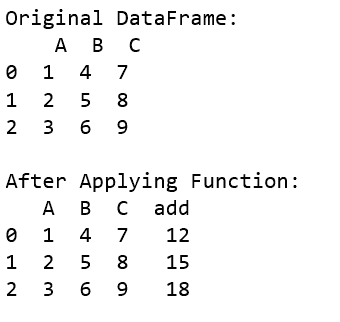
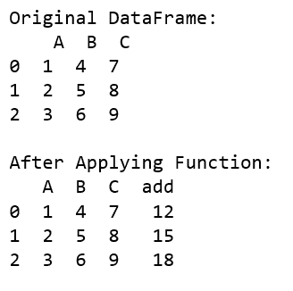
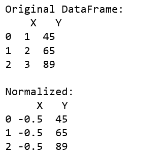
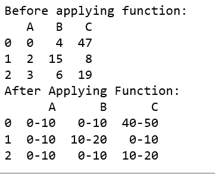

# 对熊猫数据框中的每一行应用功能

> 原文:[https://www . geeksforgeeks . org/apply-function-to-每行一个熊猫-dataframe/](https://www.geeksforgeeks.org/apply-function-to-every-row-in-a-pandas-dataframe/)

Python 是执行数据分析任务的优秀语言。它提供了大量的类和函数，有助于以更简单的方式分析和操作数据。
可以使用 apply()函数将函数应用于给定数据框中的每一行。让我们看看做这项工作的方法。
**例 1:**

## 蟒蛇 3

```py
# Import pandas package
import pandas as pd

# Function to add
def add(a, b, c):
    return a + b + c

def main():

    # create a dictionary with
    # three fields each
    data = {
            'A':[1, 2, 3],
            'B':[4, 5, 6],
            'C':[7, 8, 9] }

    # Convert the dictionary into DataFrame
    df = pd.DataFrame(data)
    print("Original DataFrame:\n", df)

    df['add'] = df.apply(lambda row : add(row['A'],
                     row['B'], row['C']), axis = 1)

    print('\nAfter Applying Function: ')
    # printing the new dataframe
    print(df)

if __name__ == '__main__':
    main()
```

**输出:**



**示例#2:**
您也可以使用 numpy 函数作为数据帧的参数。

## 蟒蛇 3

```py
import pandas as pd
import numpy as np

def main():

    # create a dictionary with
    # five fields each
    data = {
            'A':[1, 2, 3],
            'B':[4, 5, 6],
            'C':[7, 8, 9] }

    # Convert the dictionary into DataFrame
    df = pd.DataFrame(data)
    print("Original DataFrame:\n", df)

    # applying function to each row in the dataframe
    # and storing result in a new column
    df['add'] = df.apply(np.sum, axis = 1)

    print('\nAfter Applying Function: ')
    # printing the new dataframe
    print(df)

if __name__ == '__main__':
    main()
```

**输出:**



**示例#3:** 标准化数据

## 蟒蛇 3

```py
# Import pandas package
import pandas as pd

def normalize(x, y):
    x_new = ((x - np.mean([x, y])) /
             (max(x, y) - min(x, y)))

    # print(x_new)
    return x_new

def main():

    # create a dictionary with three fields each
    data = {
        'X':[1, 2, 3],
        'Y':[45, 65, 89] }

    # Convert the dictionary into DataFrame
    df = pd.DataFrame(data)
    print("Original DataFrame:\n", df)

    df['X'] = df.apply(lambda row : normalize(row['X'],
                                  row['Y']), axis = 1)

    print('\nNormalized:')
    print(df)

if __name__ == '__main__':
    main()
```

**输出:**



**示例#4:** 生成范围

## 蟒蛇 3

```py
import pandas as pd
import numpy as np

pd.options.mode.chained_assignment = None

# Function to generate range
def generate_range(n):

    # printing the range for eg:
    # input is 67 output is 60-70
    n = int(n)

    lower_limit = n//10 * 10
    upper_limit = lower_limit + 10

    return str(str(lower_limit) + '-' + str(upper_limit))

def replace(row):
    for i, item in enumerate(row):

        # updating the value of the row
        row[i] = generate_range(item)
    return row

def main():
    # create a dictionary with
    # three fields each
    data = {
            'A':[0, 2, 3],
            'B':[4, 15, 6],
            'C':[47, 8, 19] }

    # Convert the dictionary into DataFrame
    df = pd.DataFrame(data)

    print('Before applying function: ')
    print(df)

    # applying function to each row in
    # dataframe and storing result in a new column
    df = df.apply(lambda row : replace(row))

    print('After Applying Function: ')
    # printing the new dataframe
    print(df)

if __name__ == '__main__':
    main()
```

**输出:**

