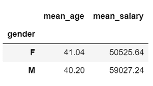
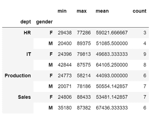
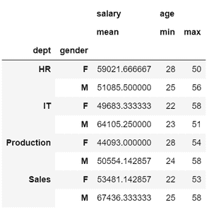
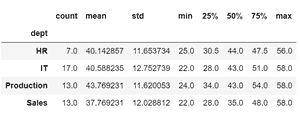
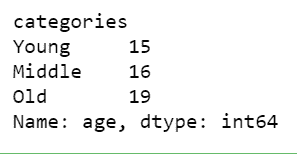
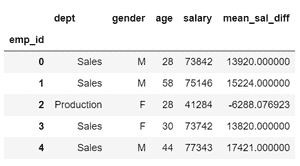

# 对熊猫群体应用操作

> 原文:[https://www . geesforgeks . org/apply-operations-to-group-in-pandas/](https://www.geeksforgeeks.org/apply-operations-to-groups-in-pandas/)

**先决条件:**T2】熊猫

Pandas 是一个用于数据分析和数据操作的 Python 库。数据分析通常需要将数据分成组，以便对这些组执行各种操作。Pandas 中的 [GroupBy](https://www.geeksforgeeks.org/pandas-groupby/) 函数采用了拆分-应用-组合策略，这意味着它执行了一个组合——拆分一个对象，将函数应用于该对象，并组合结果。在本文中，我们将使用 *groupby()* 函数对分组数据执行各种操作。

### **聚合**

汇总包括使用平均值、中值、模式、最小值、最大值、标准差、方差、总和、计数等方法创建数据的统计摘要。要对组执行聚合操作，请执行以下操作:

*   导入模块
*   创建或加载数据
*   创建一个 GroupBy 对象，该对象沿着一个键或多个键对数据进行分组
*   应用统计运算。

**例 1:** 计算男性和女性群体的平均工资和年龄。它给出数值列的平均值，并为列名添加前缀。

## 蟒蛇 3

```py
# Import required libraries
import pandas as pd
import numpy as np

# Create a sample dataframe
df = pd.DataFrame({"dept": np.random.choice(["IT", "HR", "Sales", "Production"], size=50),
                   "gender": np.random.choice(["F", "M"], size=50),
                   "age": np.random.randint(22, 60, size=50),
                   "salary": np.random.randint(20000, 90000, size=50)})
df.index.name = "emp_id"

# Calculate mean data of gender groups
df.groupby('gender').mean().add_prefix('mean_')
```

**输出:**



**示例 2:** 使用接受字符串、函数或函数列表的聚合函数( *DataFrameGroupBy.agg* )执行多个聚合操作。

## 蟒蛇 3

```py
# Import required libraries
import pandas as pd
import numpy as np

# Create a sample dataframe
df = pd.DataFrame({"dept": np.random.choice(["IT", "HR", "Sales", "Production"], size=50),
                   "gender": np.random.choice(["F", "M"], size=50),
                   "age": np.random.randint(22, 60, size=50),
                   "salary": np.random.randint(20000, 90000, size=50)})
df.index.name = "emp_id"

# Calculate min, max, mean and count of salaries
# in different departments for males and females
df.groupby(['dept', 'gender'])['salary'].agg(["min", "max", "mean", "count"])
```

**输出:**



**示例 3:** 指定多个列及其对应的聚合操作，如下所示。

## 蟒蛇 3

```py
# Import required libraries
import pandas as pd
import numpy as np

# Create a sample dataframe
df = pd.DataFrame({"dept": np.random.choice(["IT", "HR", "Sales", "Production"], size=50),
                   "gender": np.random.choice(["F", "M"], size=50),
                   "age": np.random.randint(22, 60, size=50),
                   "salary": np.random.randint(20000, 90000, size=50)})
df.index.name = "emp_id"

# Calculate mean salaries and min-max age of employees
# in different departments for gender groups
df.groupby(['dept', 'gender']).agg({'salary': 'mean', 'age': ['min', 'max']})
```

**输出:**



**示例 4:** 显示任意组的常用统计数据。

## 蟒蛇 3

```py
# Import required libraries
import pandas as pd
import numpy as np

# Create a sample dataframe
df = pd.DataFrame({"dept": np.random.choice(["IT", "HR", "Sales", "Production"], size=50),
                   "gender": np.random.choice(["F", "M"], size=50),
                   "age": np.random.randint(22, 60, size=50),
                   "salary": np.random.randint(20000, 90000, size=50)})
df.index.name = "emp_id"

# Statistics of employee age grouped by departments
df["age"].groupby(df['dept']).describe()
```

**输出:**



**创建箱或组并应用操作**

Pandas 的 cut 方法将值分类到 bin 区间，从而创建组或类别。然后可以对这些组执行聚合或其他功能。其实现如下所示:

**示例:**将年龄划分为年龄范围，并计算样本数据中的观察计数。**T3】**

## 蟒蛇 3

```py
# Import required libraries
import pandas as pd
import numpy as np

# Create a sample dataframe
df = pd.DataFrame({"dept": np.random.choice(["IT", "HR", "Sales", "Production"], size=50),
                   "gender": np.random.choice(["F", "M"], size=50),
                   "age": np.random.randint(22, 60, size=50),
                   "salary": np.random.randint(20000, 90000, size=50)})
df.index.name = "emp_id"

# Create bin intervals
bins = [20, 30, 45, 60]

# Segregate ages into bins of age groups
df['categories'] = pd.cut(df['age'], bins,
                          labels=['Young', 'Middle', 'Old'])

# Calculate number of obervations in each age category
df['age'].groupby(df['categories']).count()
```

**输出:**



### **转化**

转换是执行特定于组的操作，其中单个值发生变化，而数据的形状保持不变。我们使用[变换()](https://www.geeksforgeeks.org/python-pandas-dataframe-transform/)函数来实现。

**示例:**

## 蟒蛇 3

```py
# Import required libraries
import pandas as pd
import numpy as np

# Create a sample dataframe
df = pd.DataFrame({"dept": np.random.choice(["IT", "HR", "Sales", "Production"], size=50),
                   "gender": np.random.choice(["F", "M"], size=50),
                   "age": np.random.randint(22, 60, size=50),
                   "salary": np.random.randint(20000, 90000, size=50)})
df.index.name = "emp_id"

# Calculate mean difference by transforming each salary value
df['mean_sal_diff'] = df['salary'].groupby(
    df['dept']).transform(lambda x: x - x.mean())
df.head()
```

**输出:**

