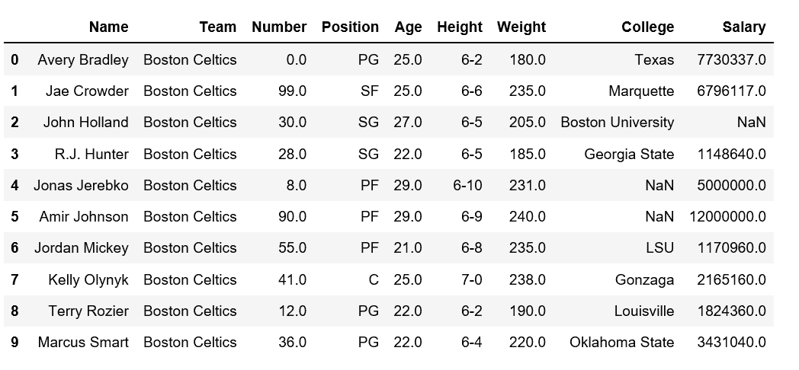
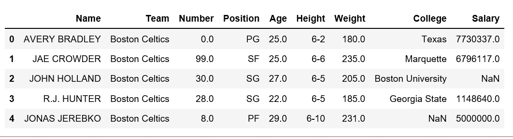
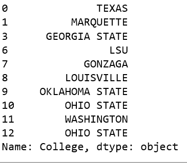

# 对熊猫数据框中的一列应用大写

> 原文:[https://www . geeksforgeeks . org/apply-大写到 a-column-in-pandas-data frame/](https://www.geeksforgeeks.org/apply-uppercase-to-a-column-in-pandas-dataframe/)

分析真实世界的数据有些困难，因为我们需要考虑各种因素。除了从大型数据集中获取有用的数据之外，将数据保持在所需的格式也非常重要。

我们可能会遇到这样的情况，在给定的数据框中，我们需要将任何特定列中的每个字母大写。让我们看看如何将大写字母应用于熊猫数据框中的列。

让我们使用`nba.csv`创建一个数据帧。

```py
# Import pandas package 
import pandas as pd 

# making data frame 
data = pd.read_csv("https://media.geeksforgeeks.org/wp-content/uploads/nba.csv") 

# calling head() method  
# storing in new variable 
data_top = data.head(10) 

# display 
data_top
```

**输出:**


有一些方法我们可以改变/修改熊猫数据框中列的大小写。让我们看看如何使用`upper()`方法将大写字母应用于熊猫数据框中的列。

**方法#1:**

```py
# Import pandas package 
import pandas as pd 

# making data frame 
data = pd.read_csv("https://media.geeksforgeeks.org/wp-content/uploads/nba.csv") 

# display 
data['Name'] = data['Name'].str.upper()

data.head()
```

**输出:**


**方法 2:** 使用λ配合`upper()`方法

```py
# Import pandas package 
import pandas as pd 

# making data frame 
data = pd.read_csv("https://media.geeksforgeeks.org/wp-content/uploads/nba.csv") 

# removing null values to avoid errors  
data.dropna(inplace = True)  

# Applying upper() method on 'College' column
data['College'].apply(lambda x: x.upper()).head(10)
```

**输出:**
