# 熊猫的布尔索引

> 原文:[https://www.geeksforgeeks.org/boolean-indexing-in-pandas/](https://www.geeksforgeeks.org/boolean-indexing-in-pandas/)

在布尔索引中，我们将根据数据框中数据的实际值选择数据子集，而不是根据它们的行/列标签或整数位置。在布尔索引中，我们使用布尔向量来过滤数据。


布尔索引是一种使用数据框中数据的实际值的索引类型。在布尔索引中，我们可以通过四种方式过滤数据–

*   使用布尔索引访问数据帧
*   对数据帧应用布尔掩码
*   基于列值屏蔽数据
*   基于索引值屏蔽数据

**访问具有布尔索引的数据帧:**
为了访问具有布尔索引的数据帧，我们必须创建一个数据帧，其中数据帧的索引包含布尔值“真”或“假”。例如

## 蟒蛇 3

```
# importing pandas as pd
import pandas as pd

# dictionary of lists
dict = {'name':["aparna", "pankaj", "sudhir", "Geeku"],
        'degree': ["MBA", "BCA", "M.Tech", "MBA"],
        'score':[90, 40, 80, 98]}

df = pd.DataFrame(dict, index = [True, False, True, False])

print(df)
```

**输出:**

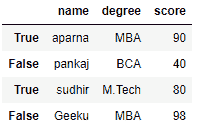

现在，我们已经创建了一个带有布尔索引的数据帧，用户可以在布尔索引的帮助下访问数据帧。用户可以使用三种功能访问数据帧。loc[]，。iloc[]，。ix[]

#### 使用[访问带有布尔索引的数据帧。loc[]](https://www.geeksforgeeks.org/python-pandas-extracting-rows-using-loc/)

为了使用布尔索引访问数据帧。loc[]，我们只需在. loc[]函数中传递一个布尔值(True 或 False)。

## 蟒蛇 3

```
# importing pandas as pd
import pandas as pd

# dictionary of lists
dict = {'name':["aparna", "pankaj", "sudhir", "Geeku"],
        'degree': ["MBA", "BCA", "M.Tech", "MBA"],
        'score':[90, 40, 80, 98]}

# creating a dataframe with boolean index
df = pd.DataFrame(dict, index = [True, False, True, False])

# accessing a dataframe using .loc[] function
print(df.loc[True])
```

**输出:**

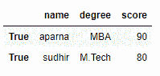

#### 使用[访问带有布尔索引的数据帧。iloc[]](https://www.geeksforgeeks.org/python-extracting-rows-using-pandas-iloc/)

以便使用。iloc[]，我们必须传递一个布尔值(真或假)，但是 iloc[]函数只接受整数作为参数，因此它会抛出一个错误，因此当我们在 iloc[]函数
**中传递一个整数时，我们只能访问一个数据帧代码#1:**

## 蟒蛇 3

```
# importing pandas as pd
import pandas as pd

# dictionary of lists
dict = {'name':["aparna", "pankaj", "sudhir", "Geeku"],
        'degree': ["MBA", "BCA", "M.Tech", "MBA"],
        'score':[90, 40, 80, 98]}

# creating a dataframe with boolean index 
df = pd.DataFrame(dict, index = [True, False, True, False])

# accessing a dataframe using .iloc[] function
print(df.iloc[True])
```

**输出:**

```
TypeError
```

**代码#2:**

## 蟒蛇 3

```
# importing pandas as pd
import pandas as pd

# dictionary of lists
dict = {'name':["aparna", "pankaj", "sudhir", "Geeku"],
        'degree': ["MBA", "BCA", "M.Tech", "MBA"],
        'score':[90, 40, 80, 98]}

# creating a dataframe with boolean index 
df = pd.DataFrame(dict, index = [True, False, True, False])

# accessing a dataframe using .iloc[] function
print(df.iloc[1])
```

**输出:**

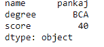

#### 使用[访问带有布尔索引的数据帧。ix[]](https://www.geeksforgeeks.org/python-pandas-dataframe-ix/)

以便使用。ix[]，我们必须将布尔值(True 或 False)和整数值传递给。因为我们知道。ix[]函数是。loc[]和。iloc[]函数。
**代码#1:**

## 蟒蛇 3

```
# importing pandas as pd
import pandas as pd

# dictionary of lists
dict = {'name':["aparna", "pankaj", "sudhir", "Geeku"],
        'degree': ["MBA", "BCA", "M.Tech", "MBA"],
        'score':[90, 40, 80, 98]}

# creating a dataframe with boolean index
df = pd.DataFrame(dict, index = [True, False, True, False])

# accessing a dataframe using .ix[] function
print(df.ix[True])
```

**输出:**

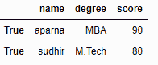

**代码#2:**

## 计算机编程语言

```
# importing pandas as pd
import pandas as pd

# dictionary of lists
dict = {'name':["aparna", "pankaj", "sudhir", "Geeku"],
        'degree': ["MBA", "BCA", "M.Tech", "MBA"],
        'score':[90, 40, 80, 98]}

# creating a dataframe with boolean index
df = pd.DataFrame(dict, index = [True, False, True, False])

# accessing a dataframe using .ix[] function
print(df.ix[1])
```

**输出:**

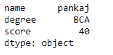

**对数据帧应用布尔掩码:**
在数据帧中，我们可以应用布尔掩码，为此，我们可以使用 __getitems__ 或[]访问器。我们可以通过给出与数据帧中包含的长度相同的“真”和“假”列表来应用布尔掩码。当我们应用布尔掩码时，它将只打印我们传递布尔值“真”的数据帧。要下载“***NBA 1.1***”CSV 文件点击这里。
**代码#1:**

## 蟒蛇 3

```
# importing pandas as pd
import pandas as pd

# dictionary of lists
dict = {'name':["aparna", "pankaj", "sudhir", "Geeku"],
        'degree': ["MBA", "BCA", "M.Tech", "MBA"],
        'score':[90, 40, 80, 98]}

df = pd.DataFrame(dict, index = [0, 1, 2, 3])

print(df[[True, False, True, False]])
```

**输出:**

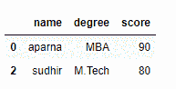

**代码#2:**

## 蟒蛇 3

```
# importing pandas package
import pandas as pd

# making data frame from csv file
data = pd.read_csv("nba1.1.csv")

df = pd.DataFrame(data, index = [0, 1, 2, 3, 4, 5, 6,
                                 7, 8, 9, 10, 11, 12])

df[[True, False, True, False, True,
    False, True, False, True, False,
                True, False, True]]
```

**输出:**

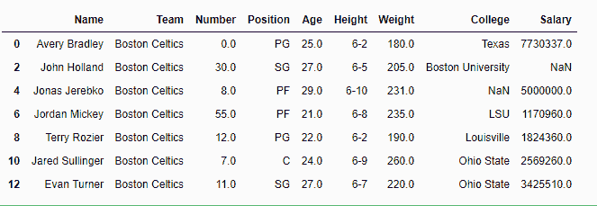

**基于列值屏蔽数据:**
在数据框中，我们可以基于列值过滤数据为了过滤数据，我们可以使用不同的运算符对数据框应用某些条件，如==，>，<，< =，> =。当我们将这些运算符应用于数据帧时，它会产生一系列“真”和“假”。要下载“NBA . CSV”CSV，请点击此处。
**代码#1:**

## 计算机编程语言

```
# importing pandas as pd
import pandas as pd

# dictionary of lists
dict = {'name':["aparna", "pankaj", "sudhir", "Geeku"],
        'degree': ["BCA", "BCA", "M.Tech", "BCA"],
        'score':[90, 40, 80, 98]}

# creating a dataframe
df = pd.DataFrame(dict)

# using a comparison operator for filtering of data
print(df['degree'] == 'BCA')
```

**输出:**

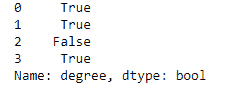

**代码#2:**

## 计算机编程语言

```
# importing pandas package
import pandas as pd

# making data frame from csv file
data = pd.read_csv("nba.csv", index_col ="Name")

# using greater than operator for filtering of data
print(data['Age'] > 25)
```

**输出:**

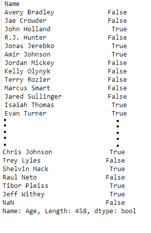

**根据索引值屏蔽数据:**
在数据框中，我们可以根据列值过滤数据为了过滤数据，我们可以使用不同的运算符，如==、>、<等，根据索引值创建一个屏蔽。要下载“***NBA 1.1***”CSV 文件点击这里。
**代码#1:**

## 蟒蛇 3

```
# importing pandas as pd
import pandas as pd

# dictionary of lists
dict = {'name':["aparna", "pankaj", "sudhir", "Geeku"],
        'degree': ["BCA", "BCA", "M.Tech", "BCA"],
        'score':[90, 40, 80, 98]}

df = pd.DataFrame(dict, index = [0, 1, 2, 3])

mask = df.index == 0

print(df[mask])
```

**输出:**

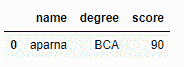

**代码#2:**

## 蟒蛇 3

```
# importing pandas package
import pandas as pd

# making data frame from csv file
data = pd.read_csv("nba1.1.csv")

# giving a index to a dataframe
df = pd.DataFrame(data, index = [0, 1, 2, 3, 4, 5, 6,
                                 7, 8, 9, 10, 11, 12])

# filtering data on index value
mask = df.index > 7

df[mask]
```

**输出:**

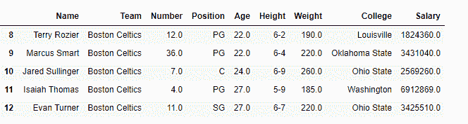