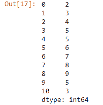
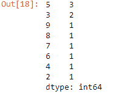
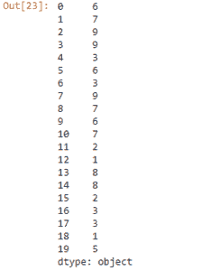
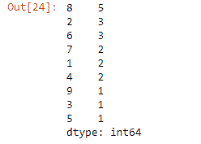
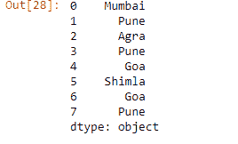
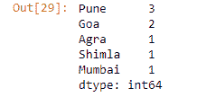

# 计算熊猫系列每个唯一值的频率计数

> 原文:[https://www . geeksforgeeks . org/计算熊猫每个独特价值的频率计数系列/](https://www.geeksforgeeks.org/calculate-the-frequency-counts-of-each-unique-value-of-a-pandas-series/)

让我们看看如何找到熊猫系列的每个唯一值的频率计数。我们将使用 [value_counts()](https://www.geeksforgeeks.org/python-pandas-series-value_counts/) 函数来执行此任务。

**例 1 :**

```py
# importing the module
import pandas as pd

# creating the series
s = pd.Series(data = [2, 3, 4, 5, 5, 6, 
                      7, 8, 9, 5, 3])

# displaying the series
print(s)

# finding the unique count
print(s.value_counts())
```

**输出:**


**输出:**


**例 2 :**

```py
# importing the module
import pandas as pd

# creating the series
s = pd.Series(np.take(list('0123456789'), 
              np.random.randint(10, size = 40)))

# displaying the series
print(s)

# finding the unique count
s.value_counts()
```

**输出:**


**输出:**


**例 3 :**

```py
# importing pandas as pd 
import pandas as pd 

# creating the Series 
sr = pd.Series(['Mumbai', 'Pune', 'Agra', 'Pune', 
                'Goa', 'Shimla', 'Goa', 'Pune']) 

# displaying the series 
print(sr) 

# finding the unique count
sr.value_counts()
```

**输出:**


