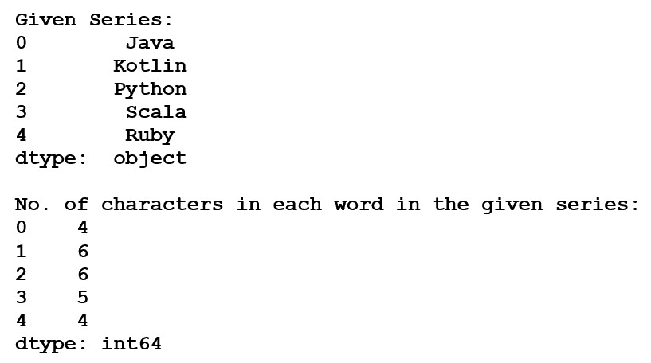
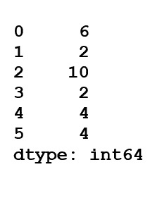
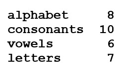

# 计算熊猫系列中每个单词的字符数

> 原文:[https://www . geeksforgeeks . org/计算熊猫系列中每个单词的字符数/](https://www.geeksforgeeks.org/calculate-the-number-of-characters-in-each-word-in-a-pandas-series/)

为了计算字符的数量，我们使用 **Series.str.len()** 。该函数返回一系列单词中每个单词的字符数。

> **语法:** Series.str.len()
> 
> **返回类型:**整数值系列。根据调用者系列，也可能存在空值。

另一种方法是通过使用 **len()** 函数(包裹在地图函数中)来查找字符数，这样给定的序列通过使用 **[pandas.series()](https://www.geeksforgeeks.org/python-pandas-series/)** 将一系列数据作为输入来替换长度值。

让我们看一些例子:

**示例 1:** 我们在 **[Series.map()](https://www.geeksforgeeks.org/python-pandas-map/)** 的帮助下输入单词并统计单词的每个字符，该系列使用名为 calc 的函数替换值并给出输出。

```py
# Import pandas library
import pandas as pd

# Input series of words
words = pd.Series(['Java', 'Kotlin',
                   'Python', 'Scala',
                    'Ruby'])
print("Given Series:")
print(words)

# Substituting values using map
rst = words.map(lambda calc: len(calc))
print("No. of characters in each word in the given series:")
print(rst)
```

**输出:**


**示例 2:** 我们使用 **[Series.map()](https://www.geeksforgeeks.org/python-pandas-map/)** 输入一系列单词并替换值，使用 **[Series.apply()](https://www.geeksforgeeks.org/python-pandas-series-apply/)** 获取单个值。

```py
# Import pandas library
import pandas as pd

# Input series of words
words = pd.Series(['Number', 'Of', 'Characters',
                   'In', 'Each', 'Word'])[len(count)
                   for count in words]

# Substituting values using a map
words.map(len)

# For single values
words.apply(len)
```

**输出:**


**例 3:** 用特定格式的单词及其长度打印。

```py
# Import pandas library
import pandas as pd

# Input series of words
words = pd.Series(['alphabet', 'consonants', 
                   'vowels', 'letters'])

# Display length of words
# along with words
for i in range(len(words)):
    print(words[i], words.str.len()[i])     
```

**输出:**
