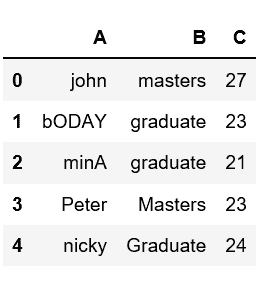
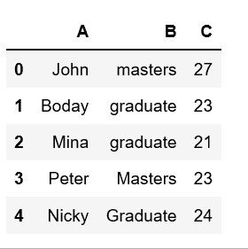
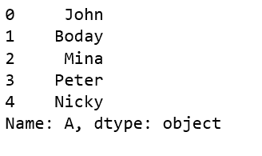

# 将熊猫数据框中一列的第一个字母大写

> 原文:[https://www . geeksforgeeks . org/大写-熊猫柱首字母-dataframe/](https://www.geeksforgeeks.org/capitalize-first-letter-of-a-column-in-pandas-dataframe/)

分析真实世界的数据有些困难，因为我们需要考虑各种因素。除了从大型数据集中获取有用的数据之外，将数据保持在所需的格式也非常重要。

人们可能会遇到这样的情况:我们需要将给定数据框中的任何特定列大写。让我们看看如何大写熊猫[数据框](https://www.geeksforgeeks.org/python-pandas-dataframe/)中一列的第一个字母。

让我们从列表字典中创建一个数据框架。

```py
# Create a simple dataframe

# importing pandas as pd
import pandas as pd

# creating a dataframe
df = pd.DataFrame({'A': ['john', 'bODAY', 'minA', 'Peter', 'nicky'],
                  'B': ['masters', 'graduate', 'graduate',
                                   'Masters', 'Graduate'],
                  'C': [27, 23, 21, 23, 24]})

df
```

**输出:**


有一些方法我们可以改变/修改熊猫数据框中列的大小写。让我们看看如何使用`capitalize()`方法将列的第一个字母大写。

**方法#1:**

```py
# Create a simple dataframe

# importing pandas as pd
import pandas as pd

# creating a dataframe
df = pd.DataFrame({'A': ['john', 'bODAY', 'minA', 'Peter', 'nicky'],
                  'B': ['masters', 'graduate', 'graduate',
                                   'Masters', 'Graduate'],
                  'C': [27, 23, 21, 23, 24]})

df['A'] = df['A'].str.capitalize()

df
```

**输出:**


**方法#2:** 使用带大写()的 lambda 方法

```py
# Create a simple dataframe

# importing pandas as pd
import pandas as pd

# creating a dataframe
df = pd.DataFrame({'A': ['john', 'bODAY', 'minA', 'Peter', 'nicky'],
                  'B': ['masters', 'graduate', 'graduate',
                                   'Masters', 'Graduate'],
                  'C': [27, 23, 21, 23, 24]})

df['A'].apply(lambda x: x.capitalize())
```

**输出:**
