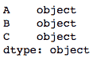
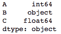
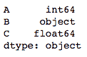
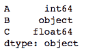

# 更改熊猫数据框中一列或多列的数据类型

> 原文:[https://www . geesforgeks . org/change-data-type-for-in-pandas-data frame/](https://www.geeksforgeeks.org/change-data-type-for-one-or-more-columns-in-pandas-dataframe/)

让我们看看改变熊猫数据框中一列或多列的数据类型的不同方法。

**方法#1:** 使用[数据框. astype()](https://www.geeksforgeeks.org/python-pandas-dataframe-astype/)

我们可以传递任何 Python、Numpy 或 Pandas 数据类型来将数据框的所有列更改为该类型，或者我们可以传递以列名作为键、以数据类型作为值的字典来更改所选列的类型。

```py
# importing pandas as pd
import pandas as pd

# sample dataframe
df = pd.DataFrame({
    'A': [1, 2, 3, 4, 5],
    'B': ['a', 'b', 'c', 'd', 'e'],
    'C': [1.1, '1.0', '1.3', 2, 5] })

# converting all columns to string type
df = df.astype(str)
print(df.dtypes)
```

**输出:**


```py
# importing pandas as pd
import pandas as pd

# sample dataframe
df = pd.DataFrame({
    'A': [1, 2, 3, 4, 5],
    'B': ['a', 'b', 'c', 'd', 'e'],
    'C': [1.1, '1.0', '1.3', 2, 5] })

# using dictionary to convert specific columns
convert_dict = {'A': int,
                'C': float
               }

df = df.astype(convert_dict)
print(df.dtypes)
```

**输出:**


**方法#2:** 使用 [DataFrame.apply()](https://www.geeksforgeeks.org/python-pandas-apply/)

我们可以将 pandas.to_numeric、pandas.to_datetime 和 pandas.to_timedelta 作为参数传递给`apply()`函数，将一列或多列的数据类型分别更改为 numeric、datetime 和 timedelta。

```py
# importing pandas as pd
import pandas as pd

# sample dataframe
df = pd.DataFrame({
    'A': [1, 2, 3, '4', '5'],
    'B': ['a', 'b', 'c', 'd', 'e'],
    'C': [1.1, '2.1', 3.0, '4.1', '5.1'] })

# using apply method
df[['A', 'C']] = df[['A', 'C']].apply(pd.to_numeric)
print(df.dtypes)
```

**输出:**


**方法#3:** 使用[data frame . expert _ objects()](https://www.geeksforgeeks.org/python-pandas-dataframe-infer_objects/)
该方法通过推断“对象”类型列的数据类型来尝试软转换。非对象和不可转换的列保持不变。

```py
# importing pandas as pd
import pandas as pd

# sample dataframe
df = pd.DataFrame({
    'A': [1, 2, 3, 4, 5],
    'B': ['a', 'b', 'c', 'd', 'e'],
    'C': [1.1, 2.1, 3.0, 4.1, 5.1]
     }, dtype ='object')

# converting datatypes
df = df.infer_objects()
print(df.dtypes)
```

**输出:**
