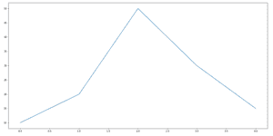
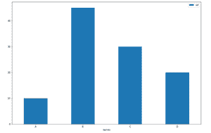
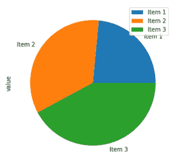

# 改变熊猫-蟒蛇的体型

> 原文:[https://www . geesforgeks . org/change-figure-size-in-pandas-python/](https://www.geeksforgeeks.org/change-figure-size-in-pandas-python/)

**先决条件:**T2】熊猫

可以通过将所需维度作为元组传递给 plot()方法的 figsize 参数来修改图的大小。它用于确定图形对象的大小。

**语法:**

```py
figsize=(width, height)
```

其中尺寸应以英寸为单位。

### 方法

*   进口熊猫。
*   创建或加载数据
*   调用带有 figsize 参数和尺寸的 plot()函数。

**例 1**

## 蟒蛇 3

```py
import pandas as pd  # import the pandas module

# python list of numbers
data1 = [10, 20, 50, 30, 15]

# convert the list to a pandas series
s1 = pd.Series(data1)  

# creates a figure of size 20 inches wide and 10 inches high
s1.plot(figsize=(20, 10))
```

**输出:**



**例 2**

## 蟒蛇 3

```py
# import the pandas module
import pandas as pd  

# Creating a pandas dataframe
df = pd.DataFrame({'names': ['A', 'B', 'C', 'D'], 'val': [10, 45, 30, 20]})

# creates a bar graph of size 15 inches wide and 10 inches high
df.plot.bar(x='names', y='val', rot=0, figsize=(15, 10))
```

**输出:**



**例 3**

## 蟒蛇 3

```py
# import the pandas module
import pandas as pd

# Creating a pandas dataframe with index
df = pd.DataFrame({'value': [3.330, 4.87, 5.97]},
                  index=['Item 1', 'Item 2', 'Item 3'])

df.plot.pie(y='value', figsize=(5, 5))
```

**输出:**

