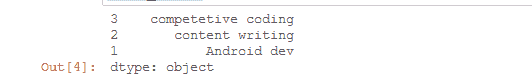

# 更改熊猫中一个系列的索引顺序

> 原文:[https://www . geeksforgeeks . org/更改熊猫系列索引的顺序/](https://www.geeksforgeeks.org/change-the-order-of-index-of-a-series-in-pandas/)

假设我们想要改变系列索引的顺序，那么我们必须使用 pandas 模块的 **Series.reindex()** 方法来执行这个任务。

**系列**，这是一个一维标记的数组，可以保存任何数据。

> **语法:**熊猫。系列(数据、索引、数据类型、副本)
> 
> **参数:**
> 
> *   **数据**取 ndarrys，list，常量。
> *   **指数**值。
> *   **数据类型**为数据类型。
> *   **复制**数据，默认为假。

想了解更多熊猫系列[点击这里](https://www.geeksforgeeks.org/python-pandas-series/)。

**Series.reindex()** 方法在指标的基础上改变数据。

> **语法:** Series.reindex(标签=无，索引=无，列=无，轴=无，方法=无，复制=真，级别=无，fill_value=nan，限制=无，容差=无)

想了解更多熊猫系列. reindex()方法[点击这里](https://www.geeksforgeeks.org/python-pandas-dataframe-reindex/)。

让我们创建一个系列:

## 蟒蛇 3

```
# import required library
import pandas as pd
import numpy as np

# create numpy array
data = np.array(["Android dev",
                 "content writing",
                 "competetive coding"])
#create a series
total_series = pd.Series(data,
                         index = [1, 2, 3])

# show the series
total_series
```

**输出:**


系列

**例 1:**

## 蟒蛇 3

```
# import required library
import pandas as pd
import numpy as np

# create numpy array
data = np.array(["Android dev",
                 "content writing",
                 "competetive coding"])
# create a series
total_series = pd.Series(data,
                         index = [1, 2, 3])
# reindexing of series
total_series = total_series.reindex(index 
                                    = [3, 2, 1])
# show the series
total_series
```

**输出:**



**例 2:**

## 蟒蛇 3

```
# import required library
import pandas as pd
import numpy as np

# create numpy array
data = np.array(["Android dev",
                 "content writing",
                 "competetive coding"])
# create a series
total_series = pd.Series(data,
                         index = [1, 2, 3])
# reindexing of series
total_series = total_series.reindex([2, 3, 1])

# show the series
total_series
```

**输出:**

