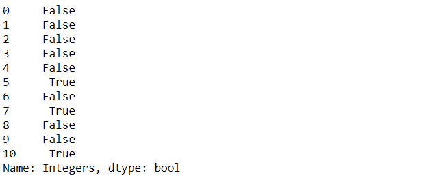
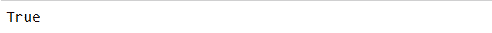

# 检查熊猫数据框中的 NAn

> 原文:[https://www . geesforgeks . org/check-for-nan-in-pandas-data frame/](https://www.geeksforgeeks.org/check-for-nan-in-pandas-dataframe/)

NaN 代表 Not A Number，是表示数据中缺失值的常用方法之一。它是一个特殊的浮点值，不能转换为除浮点以外的任何其他类型。NaN 值是数据分析中的主要问题之一。为了得到预期的结果，与 NaN 打交道是非常必要的。


检查熊猫数据框中 NaN 的方法如下:

*   在单个数据框列下检查 NaN:
*   计算单个数据框列下的 NaN:
*   检查整个数据框下的 NaN:
*   计算整个数据框下的 NaN:

**方法 1:使用 isnull().values.any()方法**
**示例:**

## 蟒蛇 3

```py
# importing libraries
import pandas as pd
import numpy as np

num = {'Integers': [10, 15, 30, 40, 55, np.nan,
                    75, np.nan, 90, 150, np.nan]}

# Create the dataframe
df = pd.DataFrame(num, columns=['Integers'])

# Applying the method
check_nan = df['Integers'].isnull().values.any()

# printing the result
print(check_nan)
```

**输出:**


也有可能获得存在 NaN 值的确切位置。我们可以通过从 isnull()中移除. values.any()来实现。

## 蟒蛇 3

```py
check_nan = df['Integers'].isnull()
```

**输出:**



**方法二:使用 isnull()。求和()方法**T2**例:**

## 蟒蛇 3

```py
# importing libraries
import pandas as pd
import numpy as np

num = {'Integers': [10, 15, 30, 40, 55, np.nan,
                    75, np.nan, 90, 150, np.nan]}

# Create the dataframe
df = pd.DataFrame(num, columns=['Integers'])

# applying the method
count_nan = df['Integers'].isnull().sum()

# printing the number of values present
# in the column
print('Number of NaN values present: ' + str(count_nan))
```

**输出:**


**方法 3:使用 isnull().values.any()方法**

**示例:**

## 蟒蛇 3

```py
# importing libraries
import pandas as pd
import numpy as np

nums = {'Integers_1': [10, 15, 30, 40, 55, np.nan, 75,
                       np.nan, 90, 150, np.nan],
        'Integers_2': [np.nan, 21, 22, 23, np.nan, 24, 25,
                       np.nan, 26, np.nan, np.nan]}

# Create the dataframe
df = pd.DataFrame(nums, columns=['Integers_1', 'Integers_2'])

# applying the method
nan_in_df = df.isnull().values.any()

# Print the dataframe
print(nan_in_df)
```

**输出:**



为了获得 NaN 值存在的确切位置，我们可以通过从 isnull()中移除. values.any()来实现。

**方法 4:使用 isnull()。总和()。求和()方法**T2**例:**

## 蟒蛇 3

```py
# importing libraries
import pandas as pd
import numpy as np

nums = {'Integers_1': [10, 15, 30, 40, 55, np.nan, 75,
                       np.nan, 90, 150, np.nan],
        'Integers_2': [np.nan, 21, 22, 23, np.nan, 24, 25,
                       np.nan, 26, np.nan, np.nan]}

# Create the dataframe
df = pd.DataFrame(nums, columns=['Integers_1', 'Integers_2'])

# applying the method
nan_in_df = df.isnull().sum().sum()

# printing the number of values present in
# the whole dataframe
print('Number of NaN values present: ' + str(nan_in_df))
```

**输出:**

