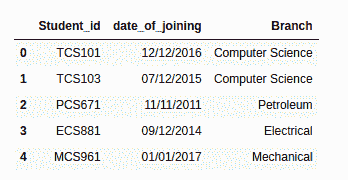
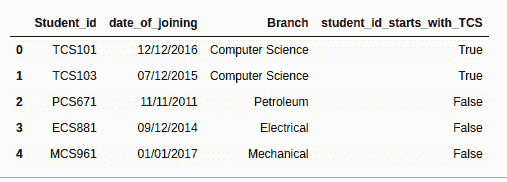

# 检查 Pandas DataFrame 中某列是否以给定字符串开头？

> 原文:[https://www . geesforgeks . org/check-if-a-column-以给定的熊猫字符串开头-dataframe/](https://www.geeksforgeeks.org/check-if-a-column-starts-with-given-string-in-pandas-dataframe/)

在这个程序中，我们试图检查给定数据框中的指定列是否以指定的字符串开头。让我们试着用一个例子来理解这一点，假设我们有一个名为 student_id，date _ of _ joining，branch 的数据集。
**例:**

## 蟒蛇 3

```py
#importing library pandas as pd
import pandas as pd

#creating data frame for student
df = pd.DataFrame({
    'Student_id': ['TCS101','TCS103', 'PCS671', 
                   'ECS881', 'MCS961'],

    'date_of_joining': ['12/12/2016','07/12/2015',
                        '11/11/2011','09/12/2014',
                        '01/01/2017'],

    'Branch': ['Computer Science','Computer Science',
               'Petroleum','Electrical','Mechanical']
})

# printing the given data frame
df
```

**输出:**



现在我们想知道 student_id 是否以 TCS 开头。现在让我们尝试使用 Python 来实现这一点

## 蟒蛇 3

```py
#importing library pandas as pd
import pandas as pd

#creating data frame for student
df = pd.DataFrame({
    'Student_id': ['TCS101','TCS103', 'PCS671', 
                   'ECS881', 'MCS961'],

    'date_of_joining': ['12/12/2016','07/12/2015',
                        '11/11/2011','09/12/2014',
                        '01/01/2017'],

    'Branch': ['Computer Science','Computer Science',
               'Petroleum','Electrical','Mechanical']
})

# joining new column in dataframe 
# .startswith function used to check
df['student_id_starts_with_TCS'] = list(
    map(lambda x: x.startswith('TCS'), df['Student_id'])) 

# printing new data frame
df
```

**输出:**



在上面的代码中，我们使用了 [**。函数检查列中的值是否以给定的字符串开始。**。Python 中的 startswith()** 方法返回 **True** 如果字符串以指定值开始，如果不是则返回 **False** 。**](https://www.geeksforgeeks.org/python-string-startswith/)